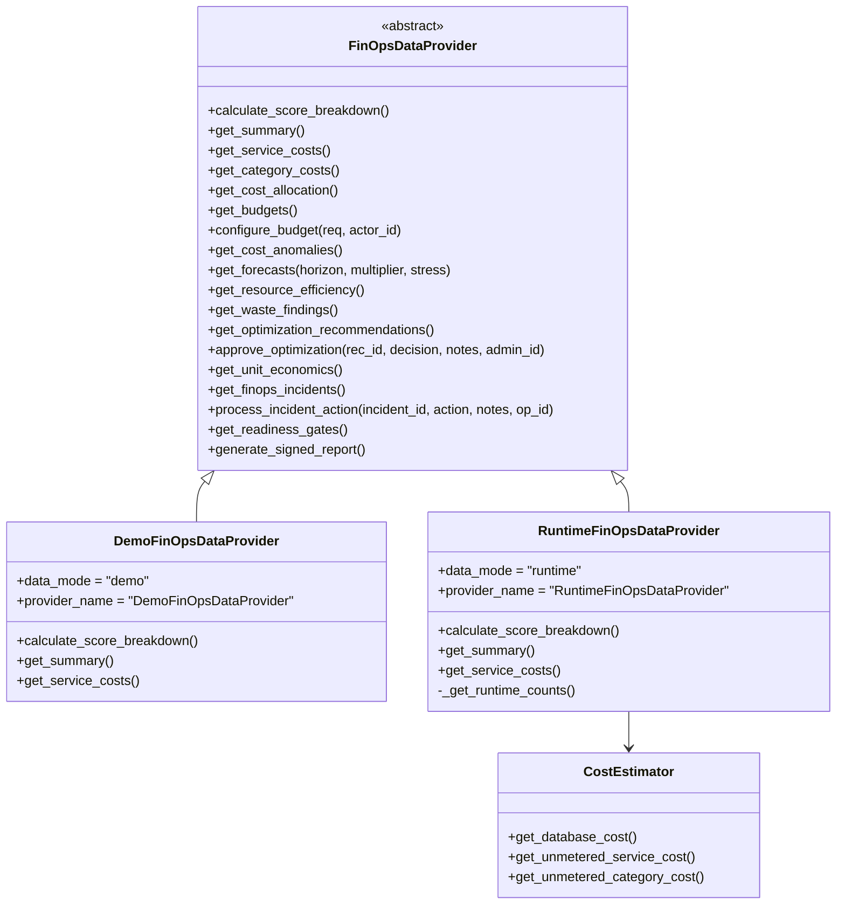

# RecoverIQ FinOps Runtime Architecture & Data Provider Specification

## Executive Overview
The RecoverIQ FinOps Control Plane has been upgraded from a static, hardcoded simulation to a clean, multi-provider architectural pattern with full support for **live database telemetry** in local and production environments, while strictly maintaining zero AWS fabrication and absolute financial isolation.

---

## 1. Provider Pattern Architecture



### Providers

1. **`RuntimeFinOpsDataProvider`** (Default for local development & production):
   - Queries live relational database state (`Payment`, `RecoveryCase`, `RecoveryAction`, `PaymentAttempt`, `MLPrediction`, `AuditLog`).
   - Measures actual database file size dynamically on disk via `CostEstimator`.
   - Computes unit economics strictly from observed volume and actual financial recovery amounts.
   - Marks unmetered cloud components (Redis clusters, NVIDIA T4 GPUs, CloudWatch/OpenSearch/S3, Kubernetes HPA) explicitly as `UNAVAILABLE` or `NOT_CONNECTED`.
   - Generates forecasts with `ForecastState.INSUFFICIENT_DATA` when history is under 14 days rather than fabricating trends.
   - Evaluates the 20 FinOps Readiness Gates dynamically against actual infrastructure state.

2. **`DemoFinOpsDataProvider`** (Baseline simulation for isolated demos and regression testing):
   - Preserves 100% of the original deterministic mock baseline.
   - Used by the existing test suite (`test_finops.py`, `test_finops_financial_isolation.py`) via `finops_data_mode="demo"`.

3. **`CostEstimator`**:
   - Safely measures SQLite database file size on disk (gracefully handling in-memory testing engines).
   - Provides honest disclaimers and `CostSource.UNAVAILABLE` / `CostSource.NOT_CONNECTED` provenance markers for unmetered infrastructure.

---

## 2. Dynamic Metric Provenance Matrix

| Metric Area | Runtime Source | Classification | Provenance Marker |
| :--- | :--- | :--- | :--- |
| **Payment Transactions** | `SELECT count(*) FROM payments` | Real Telemetry | `CostSource.RUNTIME_DATABASE` |
| **Successful Transactions**| `SELECT count(*) FROM payments WHERE status = 'CAPTURED'` | Real Telemetry | `CostSource.RUNTIME_DATABASE` |
| **Recovery Cases** | `SELECT count(*) FROM recovery_cases` | Real Telemetry | `CostSource.RUNTIME_DATABASE` |
| **Resolved Recoveries** | `SELECT count(*) FROM recovery_cases WHERE status = 'RECOVERED'` | Real Telemetry | `CostSource.RUNTIME_DATABASE` |
| **Recovered Revenue** | `SELECT sum(recovered_amount) FROM recovery_cases` | Real Telemetry | `CostSource.RUNTIME_DATABASE` |
| **Recovery Actions** | `SELECT count(*) FROM recovery_actions` | Real Telemetry | `CostSource.RUNTIME_DATABASE` |
| **ML Inference Volume** | `SELECT count(*) FROM ml_predictions` | Real Telemetry | `CostSource.RUNTIME_DATABASE` |
| **Audit Log Volume** | `SELECT count(*) FROM audit_logs` | Real Telemetry | `CostSource.RUNTIME_DATABASE` |
| **Database Storage Size** | `os.path.getsize('recoveriq.db')` | Real Telemetry | `CostSource.RUNTIME_DATABASE` / `LOCAL_ESTIMATED` |
| **Cost / Recovery Case** | `total_incurred_cost / total_cases` | Deterministically Derived | `Derived (safe 0.0 on 0 volume)` |
| **Cost / Resolved Case** | `total_incurred_cost / resolved_cases` | Deterministically Derived | `Derived (safe 0.0 on 0 volume)` |
| **Cost / ML Prediction** | `ml_spend / total_predictions` | Deterministically Derived | `Derived (safe 0.0 on 0 volume)` |
| **Redis Cache Utilization** | Local unmetered | Unavailable | `ResourceEfficiencyState.NOT_CONNECTED` |
| **NVIDIA T4 GPU** | Local unmetered | Unavailable | `ResourceEfficiencyState.NOT_CONNECTED` |
| **Kubernetes HPA Replicas** | Local unmetered | Unavailable | `ResourceEfficiencyState.NOT_CONNECTED` |
| **CloudWatch / OpenSearch** | Local unmetered | Unavailable | `CostSource.UNAVAILABLE` |
| **Forecasting (<14 Days)** | Dynamic check on oldest record | Real Telemetry State | `ForecastState.INSUFFICIENT_DATA` |
| **Readiness Gates** | Evaluated against live connection & data | Dynamic Evaluation | Real PASS / WARN / NOT_APPLICABLE |

---

## 3. Configuration & Mode Switching

### Environment / Config
In `.env` or application config:
```bash
FINOPS_DATA_MODE=runtime  # Options: 'runtime' or 'demo'
```

### Runtime Query Parameter Override
Every FinOps REST endpoint in `/api/recovery/intelligence/finops` supports an optional `?mode=` query parameter:
```http
GET /api/recovery/intelligence/finops/summary?mode=runtime
GET /api/recovery/intelligence/finops/summary?mode=demo
GET /api/recovery/intelligence/finops/report?mode=runtime
GET /api/recovery/intelligence/finops/unit-economics?mode=runtime
```

---

## 4. Invariants & Financial Isolation Guarantees

1. **Delta RecoveryAction = 0**: Zero recovery actions created, modified, or dispatched.
2. **Delta Payment = 0**: Zero payment transactions or attempts mutated.
3. **Delta RecoveryCase = 0**: Zero cases created or statuses updated.
4. **ActionDispatcher Calls = 0**: Complete decoupling from execution engines.
5. **HMAC-SHA256 Governance**: Signed reports generated in both runtime and demo modes with SHA-256 HMAC cryptographic signatures.
