# RecoverIQ — How It Works: Complete System Guide

This document explains **how RecoverIQ operates from end to end**, tracing what happens under the hood from the millisecond a customer's payment fails until the funds are safely recovered and reconciled.

---

## 1. High-Level Summary

When an end-customer tries to buy something online and their payment fails (due to a network drop, bank timeout, or insufficient balance), the merchant typically loses that sale.

**RecoverIQ intercepts that failure in real time** and acts as an autonomous digital recovery agent. Instead of blindly retrying or bombarding the customer with generic error messages, RecoverIQ:
1. **Analyzes why the payment failed** using deterministic policies and machine learning.
2. **Calculates the statistical probability of recovery** ($p_{\text{recover}}$).
3. **Picks the single most effective recovery action** (e.g., smart silent retry, cascading to an alternative payment gateway, sending an instant 1-click WhatsApp payment link, or dispatching a UPI collect request).
4. **Executes the action with safety controls** (idempotency, circuit breakers, rate limits).
5. **Reconciles the outcome**, tracks the exact cost of recovery (FinOps), and logs a cryptographically verifiable audit trail.

---

## 2. Step-by-Step Lifecycle of a Failed Payment

```mermaid
sequenceDiagram
    autonumber
    actor Customer
    participant Gateway as Payment Gateway (Razorpay/Stripe)
    participant Webhook as RecoverIQ Webhook Ingestion
    participant Engine as Recovery Engine & DB
    participant ML as ML Inference Engine
    participant Policy as Policy & Risk Guardrails
    participant Worker as Autonomous Execution Worker
    participant Provider as SMS / WhatsApp / Gateway Adapter

    Customer->>Gateway: Initiates Payment (e.g. ₹5,000 via UPI)
    Gateway-->>Customer: Payment Fails (e.g. Bank Downtime)
    Gateway->>Webhook: Sends webhook `payment.failed` with HMAC signature
    
    rect rgb(20, 30, 45)
        Note over Webhook,Engine: Step 1 & 2: Ingestion & Case Creation
        Webhook->>Webhook: Verify HMAC-SHA256 signature
        Webhook->>Engine: Record raw transaction in Ledger
        Engine->>Engine: Create RecoveryCase (Status: OPEN)
    end

    rect rgb(30, 45, 30)
        Note over Engine,Policy: Step 3 & 4: Assessment & Decisioning
        Engine->>ML: Evaluate features (Amount, Bank, Hour, History)
        ML-->>Engine: Returns p_recover = 0.88 (Calibrated)
        Engine->>Policy: Evaluate Guardrails (Max attempts, cooling-off period)
        Policy-->>Engine: Action APPROVED: CUSTOMER_LINK_WHATSAPP
    end

    rect rgb(45, 30, 45)
        Note over Engine,Provider: Step 5 & 6: Autonomous Execution
        Engine->>Worker: Enqueue RecoveryAction
        Worker->>Provider: Send interactive WhatsApp 1-Click Pay Link
        Provider-->>Customer: WhatsApp Notification received
    end

    rect rgb(20, 40, 50)
        Note over Customer,Engine: Step 7: Recovery & Reconciliation
        Customer->>Gateway: Clicks link & completes payment via alternate bank
        Gateway->>Webhook: Sends webhook `payment.captured`
        Webhook->>Engine: Match transaction & update case (Status: RECOVERED)
        Engine->>Engine: Record FinOps cost & append SHA-256 Audit Log
    end
```



---

### Step 1: Ingestion & Security Validation
1. When a transaction fails, the payment gateway (Razorpay, Stripe, Cashfree, or internal banking switch) sends an HTTP POST request to `/api/webhooks/{gateway}`.
2. RecoverIQ's webhook middleware immediately computes the HMAC-SHA256 hash of the request body using the merchant's secret key.
3. If the signature does not match, the request is rejected with `401 Unauthorized` and logged as a security anomaly.
4. If valid, the gateway transaction ID is checked against an idempotency cache to prevent processing duplicate webhook deliveries.

---

### Step 2: Transaction Ledger & Case Creation
1. The raw payload is persisted into the `transactions` table.
2. A new `RecoveryCase` is initialized with:
   - `case_status`: `OPEN`
   - `attempt_count`: `0`
   - `max_attempts`: Typically 3 to 5 (governed by merchant risk policy)
   - `amount_paise`: e.g. `500000` (₹5,000.00)
   - `failure_reason`: Extracted and standardized (e.g., `ISSUING_BANK_DOWN`, `INSUFFICIENT_FUNDS`, `NETWORK_TIMEOUT`).

---

### Step 3: Machine Learning Probability Inference
RecoverIQ queries the ML Inference Engine with the transaction features:
* **Transaction Amount**: Higher amounts justify more proactive communication.
* **Payment Rail**: UPI vs Credit Card vs Netbanking have completely different retry profiles.
* **Bank Routing Code**: If the issuing bank's switch is currently experiencing an outage, a retry is delayed until recovery telemetry indicates health.
* **Time of Day**: Retries during early morning hours are scheduled differently than business hours.
* **Customer Historical Propensity**: Previous successful recovery patterns.

The calibrated Gradient Boosted Decision Tree (LightGBM) outputs $p_{\text{recover}}$ (a number between 0.0 and 1.0).

---

### Step 4: Policy Guardrails & Regulatory Compliance
Before any action can touch an external system, it must pass through the **Deterministic Policy Engine**:
* **Anti-Harassment Limits**: Maximum 2 SMS/WhatsApp messages per customer per 24 hours.
* **Quiet Hours**: No non-essential customer communication between 9:00 PM and 8:00 AM local time.
* **Cooling-Off Delays**: Exponential backoff with random jitter (e.g., attempt 1 after 5 min, attempt 2 after 30 min, attempt 3 after 2 hours) to allow banking systems to recover.
* **Financial Cap**: An action is suppressed if its cost exceeds the expected recovery yield.

---

### Step 5: Autonomous Action Selection & Execution
Based on the failure reason and probability score, RecoverIQ selects an optimal action:

| Failure Cause | Selected Action | Why This Action? |
| :--- | :--- | :--- |
| **Transient Gateway Timeout** | `SMART_RETRY` | Silent background retry after a 120-second backoff; frictionless for customer. |
| **Gateway Outage / Degradation** | `GATEWAY_CASCADE` | Re-route the authorized charge to a secondary healthy payment gateway. |
| **Customer Drop-off / Cart Abandon** | `CUSTOMER_LINK_WHATSAPP` | Send a rich WhatsApp message with a 1-click pre-filled checkout link. |
| **Insufficient Balance** | `UPI_COLLECT` (Delayed) | Schedule a UPI collect request 2 hours later (e.g., post-salary or end of day). |
| **High-Value Anomaly (> ₹1,00,000)** | `ESCALATE_HUMAN_REVIEW` | Route to the Human Review Queue for merchant authorization. |

The action is dispatched asynchronously through the worker queue.

---

### Step 6: Outcome Ingestion & Reconciliation
1. When the customer completes the payment through the recovery link or retry, the gateway triggers a `payment.captured` or `payment.authorized` webhook.
2. RecoverIQ reconciles the payment against the open recovery case:
   - Case status transitions to `RECOVERED`.
   - Time to recover is computed.
   - Any scheduled future actions for this case are automatically cancelled.
   - The net recovery amount and micro-costs incurred are logged to the FinOps telemetry engine.

---

## 3. Human-in-the-Loop (HITL) Workflow

While 95%+ of recoveries happen autonomously, enterprise financial safety requires human intervention for high-risk decisions.

```
[Failed Transaction]
        │
        ▼
Is amount > ₹1,00,000 OR High Fraud Risk?
        │
       ├── YES ──► Route to /review (Human Review Queue)
       │               │
       │               ├── Operator Reviews Case Details
       │               ├── Approves Action OR Rejects/Overrides
       │               └── Action Executed with Dual-Signed Audit Stamp
       │
       └── NO ───► Autonomous Execution Engine Executes Action
```

* **Review Interface**: Available at `/review` in the Web UI.
* **Dual Authorization**: Strategy changes (e.g. increasing max retry limits or deploying a new ML model) require approval by a second authorized user (`4-eyes principle`).

---

## 4. FinOps & Cost Intelligence

RecoverIQ treats recovery operations as a financial balance sheet:

* **Micro-Costs Tracked**:
  - Payment Gateway API charges (~₹0.50 to ₹2.00 per attempt).
  - WhatsApp Business API utility conversation charges (~₹0.35 per message).
  - SMS notification charges (~₹0.15 per message).
  - Compute & infrastructure overhead.
* **The Golden Metric — Cost Per Recovered Rupee (CPRR)**:
  $$\text{CPRR} = \frac{\text{Total Operational Cost}}{\text{Total Amount Recovered}}$$
  *Example*: Spending ₹150 in SMS, WhatsApp, and API calls to recover ₹25,000 results in a CPRR of **₹0.006** (6 paise spent to recover every ₹100 of revenue — a 166x ROI).
* **Dual Provider Architecture**:
  - `RuntimeFinOpsDataProvider`: Queries live database tables (`transactions`, `recovery_cases`, `recovery_actions`) for exact, deterministic metrics.
  - `DemoFinOpsDataProvider`: Generates realistic multi-region enterprise simulations for offline demonstrations and executive reporting.

---

## 5. Developer Quickstart: Running & Testing

### 1. Starting the Backend
```powershell
cd d:\RecoverIQ\backend
.\.venv\Scripts\Activate.ps1
uvicorn app.main:app --reload --host 0.0.0.0 --port 8000
```
* Interactive API Documentation: `http://localhost:8000/docs`

### 2. Starting the Frontend
```powershell
cd d:\RecoverIQ\frontend
npm run dev
```
* Web Application: `http://localhost:3000`
* Autonomous Intelligence Control Center: `http://localhost:3000/intelligence`

### 3. Running Automated Tests
```powershell
# Backend unit and integration test suite
cd d:\RecoverIQ\backend
pytest -v

# Frontend TypeScript & ESLint validation
cd d:\RecoverIQ\frontend
npx tsc --noEmit
npm run lint
```

---

## 6. Frontend Navigation Map

| Route | Page Name | Primary Purpose |
| :--- | :--- | :--- |
| `/` | Landing / Welcome | Overview of platform capabilities and quick links. |
| `/dashboard` | Operational Dashboard | Real-time recovery rates, revenue saved today, and active volume. |
| `/cases` | Recovery Cases | Search, inspect, and filter individual payment failure cases. |
| `/review` | Human Review Queue | Review escalated transactions requiring manual operator sign-off. |
| `/audit` | Audit Ledger | Cryptographically verified record of all actions taken by the platform. |
| `/intelligence` | Autonomous Control Center | 22-tab mission control covering FinOps, Zero-Trust, ML models, and SRE. |
