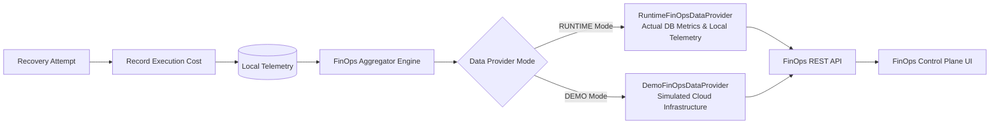

# RecoverIQ — Technical Documentation & System Specification

## 1. Executive & Technical Overview

**RecoverIQ** is an enterprise-grade Autonomous Payment Recovery, Financial Intelligence, and Governance Control Plane. It operates as an intelligent overlay on top of modern payment gateways (e.g., Razorpay, Stripe, Cashfree) and banking payment rails (UPI, Card Networks, Netbanking).

### Core Problem Solved
In high-volume digital commerce, payment failures average between 8% and 25% due to transient network drops, gateway rate-limits, banking server downtimes, fraud false-positives, and insufficient funds. Conventional recovery consists of blind retries or static cron jobs, which:
1. Frustrate end-users with duplicate notifications or premature cancellations.
2. Incur high operational costs (SMS fees, gateway charge attempt fees, compute overload).
3. Risk compliance violations (customer contact harassment thresholds, regulatory data privacy mandates).
4. Suffer from suboptimal recovery timing (retrying while the issuing bank's core banking system is still offline).

### Technical Solution
RecoverIQ resolves payment failures through an intelligent closed-loop control system:
* **Deterministic Policy Engine**: Enforces strict financial limits, backoff rules, customer contact policies, and compliance guardrails.
* **Predictive ML Decision Engine**: Evaluates recovery probability ($p_{\text{recover}}$), expected value, and optimal communication channels.
* **Autonomous Execution Workers**: Orchestrates smart retries, gateway cascades, and direct merchant-to-customer links.
* **FinOps Control Plane**: Real-time telemetry tracking cost per recovered rupee (CPRR), gateway efficiency, and infrastructure costs.
* **Zero-Trust Security & Cryptographic Auditing**: Immutable audit trails, SHA-256 evidence trees, PII redaction, and digitally signed governance reports.

---

## 2. System Architecture

```mermaid
graph TD
    subgraph "External Ecosystem"
        PG[Payment Gateways<br/>Razorpay / Stripe / Bank Rails]
        Cust[End Customer]
    end

    subgraph "Ingestion & API Gateway"
        WH[Webhook Ingestion<br/>HMAC Signature Verification]
        REST[FastAPI REST Services<br/>JWT Auth / RBAC]
    end

    subgraph "RecoverIQ Core Engine"
        Ledger[(Relational Database<br/>SQLite / PostgreSQL)]
        StateMachine[Recovery Case State Machine]
        PolicyEngine[Rule & Policy Engine<br/>Guardrails & Cooling Off]
        MLEngine[ML Inference & Calibration<br/>LightGBM / Platt Scaling]
        Bandit[Contextual Bandit / Strategy Selector]
    end

    subgraph "Async Execution & Workers"
        Queue[(Redis Queue / Async Worker)]
        ExecEngine[Autonomous Execution Engine]
        Adapters[Gateway & Comm Adapters<br/>Twilio / WhatsApp / Direct API]
    end

    subgraph "Control Plane & Governance"
        FinOps[FinOps Control Plane<br/>Runtime Telemetry]
        ZeroTrust[Zero-Trust Security<br/>Audit Hash Trees]
        HITL[Human-In-The-Loop<br/>Dual Approval Review]
        WebUI[Next.js 16 Frontend<br/>Autonomous Control Center]
    end

    PG -->|Failure Webhook| WH
    WH -->|Idempotent Event| StateMachine
    REST --> StateMachine
    StateMachine --> Ledger
    StateMachine --> PolicyEngine
    PolicyEngine --> MLEngine
    MLEngine --> Bandit
    Bandit -->|Selected Action| Queue
    Queue --> ExecEngine
    ExecEngine --> Adapters
    Adapters -->|Retry / Cascade| PG
    Adapters -->|Payment Link| Cust
    Cust -->|Successful Pay| PG
    ExecEngine --> FinOps
    ExecEngine --> ZeroTrust
    PolicyEngine -->|High Value Risk| HITL
    WebUI <---> REST
```

---

## 3. Technology Stack

### Backend Stack
* **Language & Runtime**: Python 3.12+
* **Web Framework**: FastAPI (high-performance asynchronous ASGI)
* **ORM & Database**: SQLAlchemy 2.0 with Alembic database migrations
* **Database Engines**: SQLite with WAL mode for local dev/testing; PostgreSQL for production
* **Task Queue & Async Processing**: Background asyncio execution pipelines with Redis task queue abstractions
* **Validation & Serialization**: Pydantic v2 schemas with strict typing
* **Authentication**: JWT tokens, HMAC-SHA256 signature verification, Role-Based Access Control (`ADMIN`, `OPERATOR`, `AUDITOR`, `READ_ONLY`)

### Machine Learning & Data Science Stack
* **ML Algorithms**: Gradient Boosted Decision Trees (LightGBM, XGBoost) and Calibrated Logistic Classifiers
* **Calibration**: Isotonic Regression & Platt Scaling for well-calibrated confidence estimates
* **Counterfactual Inference**: Propensity Score Matching (PSM), Inverse Propensity Weighting (IPW), and Doubly Robust Estimators
* **Drift & Telemetry**: Population Stability Index (PSI) and Wasserstein distance for model drift detection

### Frontend Stack
* **Framework**: Next.js 16 (App Router) with Turbopack bundler
* **Language**: TypeScript 5+ (strict mode)
* **Styling**: Tailwind CSS with custom dark mode glassmorphism
* **Modular Architecture**: 22 domain-isolated tab components in `src/components/intelligence/`
* **Performance**: Modular decomposition keeping all files under Babel optimization thresholds (< 100 KB)

---

## 4. Database Schema & Data Models

The relational schema ensures ACID transactions, strict referential integrity, and immutable audit trails.

### Core Tables

#### 1. `transactions`
Records every raw payment attempt received from upstream gateways.
* `id` (UUID, Primary Key): Unique transaction identifier.
* `merchant_id` (String, Indexed): Merchant tenant identifier.
* `gateway` (String): Source payment gateway (`RAZORPAY`, `STRIPE`, `CASHFREE`).
* `gateway_transaction_id` (String, Unique): Upstream transaction ID.
* `amount_paise` (BigInteger): Transaction amount in smallest currency unit (paise/cents).
* `currency` (String): Currency code (e.g., `INR`, `USD`).
* `status` (Enum): `SUCCESS`, `FAILED`, `PENDING`, `REFUNDED`.
* `payment_method` (Enum): `UPI`, `CARD`, `NETBANKING`, `WALLET`, `EMI`.
* `failure_reason` (String): Normalized failure classification (`BANK_DOWNTIME`, `INSUFFICIENT_FUNDS`, `NETWORK_DROP`, etc.).
* `raw_payload` (JSONB/Text): Raw gateway webhook for forensics.
* `created_at` (DateTime): Timestamp of receipt.

#### 2. `recovery_cases`
Represents an ongoing recovery journey for a failed transaction.
* `id` (UUID, Primary Key): Unique case identifier.
* `transaction_id` (UUID, Foreign Key -> `transactions.id`): Originating failure.
* `case_status` (Enum): `OPEN`, `IN_PROGRESS`, `RECOVERED`, `FAILED`, `ESCALATED_HUMAN_REVIEW`, `ABANDONED`.
* `recovery_score` (Float): ML-calculated recovery probability ($0.00$ to $1.00$).
* `risk_tier` (Enum): `LOW`, `MEDIUM`, `HIGH`, `CRITICAL`.
* `attempt_count` (Integer): Total recovery attempts executed so far.
* `max_attempts` (Integer): Strict cap determined by policy.
* `next_action_due_at` (DateTime): Scheduled timestamp for next autonomous step.
* `recovered_at` (DateTime, Nullable): Timestamp of successful recovery.
* `total_cost_paise` (Integer): Cumulative FinOps expenditure incurred during recovery.
* `created_at`, `updated_at` (DateTime).

#### 3. `recovery_actions`
Immutable execution record for every action taken by RecoverIQ.
* `id` (UUID, Primary Key): Action identifier.
* `case_id` (UUID, Foreign Key -> `recovery_cases.id`): Associated recovery case.
* `action_type` (Enum): `SMART_RETRY`, `GATEWAY_CASCADE`, `CUSTOMER_LINK_SMS`, `CUSTOMER_LINK_WHATSAPP`, `UPI_COLLECT`, `MANUAL_CALL`.
* `execution_status` (Enum): `PENDING`, `EXECUTED`, `SUCCESS`, `FAILED`, `THROTTLED`.
* `target_gateway` (String, Nullable): Target gateway if cascading.
* `cost_incurred_paise` (Integer): Micro-cost of the action (gateway charge or message cost).
* `response_payload` (JSONB/Text): Response from external API.
* `executed_at` (DateTime): Precise execution timestamp.

#### 4. `audit_logs`
Cryptographically chained ledger for compliance and forensic accountability.
* `id` (UUID, Primary Key): Log identifier.
* `entity_type` (String): `CASE`, `ACTION`, `MODEL`, `POLICY`, `CONFIG`.
* `entity_id` (String): Referenced entity ID.
* `action` (String): Event description.
* `actor` (String): System agent or user ID.
* `previous_state` (JSONB/Text): State before change.
* `new_state` (JSONB/Text): State after change.
* `hash` (String): SHA-256 integrity hash chaining back to previous log entry.
* `created_at` (DateTime): Immutable timestamp.

---

## 5. API Architecture & Core Endpoints

The API is organized into domain routers documented via OpenAPI 3.1:

| Route Prefix | Router File | Domain Responsibility |
| :--- | :--- | :--- |
| `/api/webhooks` | `app/webhooks/` | Ingestion of payment gateway webhooks with HMAC validation |
| `/api/cases` | `app/api/cases.py` | Query, filter, and inspect recovery cases and histories |
| `/api/recovery` | `app/api/recovery.py` | Manual trigger, action orchestration, and escalation |
| `/api/review` | `app/api/review.py` | Human-in-the-Loop review and dual-approval queue |
| `/api/finops` | `app/api/finops.py` | FinOps telemetry, cost allocation, CPRR, and unit economics |
| `/api/security` | `app/api/security.py` | Zero-Trust posture, token revocation, SOC audit logs |
| `/api/compliance` | `app/api/compliance.py` | Regulatory readiness, DSAR erasure checks, compliance reports |
| `/api/ml` | `app/api/ml_governance.py` | ML models, scorecards, shadow deployments, continuous training |

---

## 6. Machine Learning Engine & Decision Science

RecoverIQ utilizes machine learning to maximize recovery efficiency while minimizing communication costs and customer annoyance.

### 1. Recovery Probability Estimator ($p_{\text{recover}}$)
Given feature vector $X = \{\text{amount}, \text{payment\_method}, \text{bank\_code}, \text{hour\_of\_day}, \text{day\_of\_week}, \text{failure\_code}, \text{customer\_history\_score}\}$:
$$\hat{p} = \sigma\left(f_{\text{GBDT}}(X)\right)$$
To ensure probabilities reflect real empirical recovery rates, raw outputs pass through an isotonic calibrator:
$$P(\text{Recovery} = 1 \mid \hat{p}) = \text{Calibrator}(\hat{p})$$

### 2. Expected Recovery Value (ERV)
For candidate action $a \in A$, the engine evaluates net expected value:
$$\text{ERV}(a) = \left(\hat{p}(a) \times \text{Amount}\right) - \text{Cost}(a) - \text{FrictionCost}(a)$$
An action is only permitted if $\text{ERV}(a) > 0$ and does not violate policy limits.

### 3. Counterfactual Simulation
The engine uses Doubly Robust Estimation to evaluate proposed policy changes against historical off-policy logs before deploying them to production.

---

## 7. FinOps Control Plane Architecture

The FinOps engine monitors the operational cost efficiency of every recovery:

### Metrics Computed:
* **Cost per Recovered Rupee (CPRR)**:
  $$\text{CPRR} = \frac{\text{Total Recovery Costs Incurred}}{\text{Total Money Recovered}}$$
* **Net Value Added (NVA)**:
  $$\text{NVA} = \text{Gross Recovered Amount} - \text{Total Operational Costs}$$
* **Efficiency Ratio (ROI Multiplier)**:
  $$\text{ROI} = \frac{\text{Gross Recovered Amount}}{\text{Total Operational Costs}}$$

---

## 8. Zero-Trust Security & Compliance Architecture

1. **Cryptographic Chaining**: Every recovery action is hashed with SHA-256 including the previous record's hash, preventing tampering.
2. **Deterministic Role-Based Access Control**:
   - `ADMIN`: Full authority, model deployment, token revocation.
   - `OPERATOR`: Manual case actions, human review approval.
   - `AUDITOR`: Read-only access to immutable compliance logs and reports.
3. **Data Protection & PII Scrubbing**: Payloads automatically redact credit card PANs, CVVs, phone numbers, and customer names before persisting logs.
4. **Digital Signatures**: Executive governance reports are signed with SHA-256 digests and downloadable for external audit compliance.
