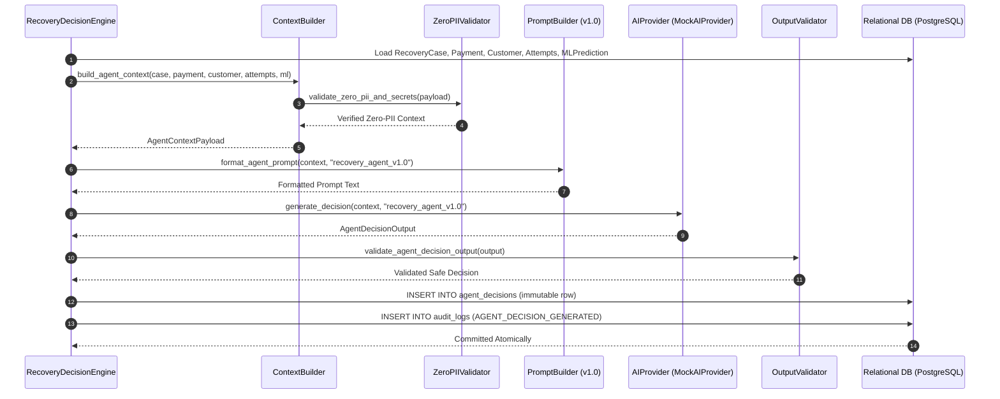

# Phase 6B — AI Recovery Decision Engine Implementation

## 1. Architecture & Decision Pipeline

The **AI Recovery Decision Engine** implements the advisory recommendation foundation of RecoverIQ. It evaluates an active `RecoveryCase` aggregate, synthesizes operational telemetry, applies Phase 5 `MLPrediction` probabilities, formats prompt context, queries the `AIProvider`, validates output safety, and commits an immutable `AgentDecision` and corresponding `AuditLog` entry.

### Architectural Invariant: The AI Agent is Strictly Advisory
- **Zero Financial Execution**: The AI engine never interacts directly with payment gateways, never creates `RecoveryAction` records, and never modifies payment or subscription state.
- **Enforced Separation of Concerns**: AI recommendations must subsequently be evaluated and authorized by the deterministic Policy Engine (Phase 6C) before any operational action can be scheduled.



---

## 2. Components & Modules

### 2.1 AIProvider Abstraction & MockAIProvider
- **Interface**: [`backend/app/agent/provider.py`](file:///d:/MEDIFLOW/RecoverIQ/backend/app/agent/provider.py) defines the `AIProvider` Protocol:
  ```python
  async def generate_decision(
      self,
      context: AgentContextPayload,
      prompt_version: str = "recovery_agent_v1.0",
  ) -> AgentDecisionOutput
  ```
- **Deterministic MockAIProvider**:
  - Used for local development, CI/CD, and regression testing.
  - Generates deterministic recommendations based on error taxonomy, ML prediction probabilities, retry thresholds, and transaction amount.
  - Uses zero randomness and zero external network calls.

### 2.2 Prompt Versioning (`recovery_agent_v1.0`)
- [`backend/app/agent/prompts.py`](file:///d:/MEDIFLOW/RecoverIQ/backend/app/agent/prompts.py) defines the system prompt and structured JSON schema instruction for prompt version `recovery_agent_v1.0`.
- System instructions enforce JSON-only output, bounded confidence ($[0.0, 1.0]$), bounded delay ($0$ to $168$ hours), strict `RecoveryActionType` choices, and zero PII.

### 2.3 Output Safety & Schema Validation
- [`backend/app/agent/validators.py`](file:///d:/MEDIFLOW/RecoverIQ/backend/app/agent/validators.py) performs deep, recursive validation of all AI outputs before persistence:
  - Validates `proposed_action_type` in `RecoveryActionType`.
  - Validates `confidence_score` and `recommended_delay_hours` bounds.
  - Inspects `reasoning_summary` and `suggested_payload` for forbidden sensitive keys (`email`, `phone`, `card_number`, `cvv`, `pin`, `api_key`, `secret`, `bearer`, `password`, `webhook_secret`, `razorpay_key`, `razorpay_secret`).
  - Employs regex guards against credit card numbers (13–19 digits), email patterns, and secret token prefixes.
  - Fails closed with `UnsafeAIOutputError` or `InvalidAIOutputError`.

### 2.4 Decision Engine
- [`backend/app/agent/decision_engine.py`](file:///d:/MEDIFLOW/RecoverIQ/backend/app/agent/decision_engine.py) orchestrates the end-to-end inference lifecycle:
  - Method: `generate_decision(db, recovery_case_id, ai_provider=None, prompt_version="recovery_agent_v1.0")`.
  - Loads entity aggregates, constructs context, invokes provider, validates output, and writes to `agent_decisions` and `audit_logs`.

---

## 3. Relational Database Mapping & Audit Trail

### 3.1 `agent_decisions`
Every inference run creates an immutable record mapping:
- `recovery_case_id`: Associated `RecoveryCase` UUID.
- `ml_prediction_id`: Latest `MLPrediction` UUID (nullable).
- `agent_name`: `"RecoveryOrchestrator"` / `"MockRecoveryOrchestrator"`.
- `agent_version`: `"v1.0"`.
- `prompt_template_version`: `"recovery_agent_v1.0"`.
- `proposed_action_type`: String matching `RecoveryActionType` (`RETRY_PAYMENT`, `SEND_PAYMENT_LINK`, `SEND_NOTIFICATION`, `ESCALATE_HUMAN`, `HALT_SUBSCRIPTION`, `CLOSE_CASE`).
- `confidence_score`: Decimal (Numeric(5, 4)).
- `reasoning_summary`: Concise explanation text.
- `suggested_payload`: JSON dictionary with action parameters and `recommended_delay_hours`.
- `token_usage`: Token telemetry snapshot (nullable).
- `decided_at`: UTC timestamp.

### 3.2 `audit_logs`
An audit record is created in the same database transaction:
- `event_type`: `"AGENT_DECISION_GENERATED"`
- `actor_type`: `AuditActorType.AI_AGENT.value` (`"AI_AGENT"`)
- `actor_id`: `"RecoverIQ-Agent-v1"`
- `recovery_case_id`: Target case UUID
- `entity_type`: `"agent_decisions"`
- `entity_id`: Created `AgentDecision` UUID
- `action`: `"PROPOSE_ACTION"`

---

## 4. Transaction Boundaries & Error Handling

- **Atomicity**: `AgentDecision` and `AuditLog` are flushed and committed in a single atomic transaction.
- **Rollback Guarantee**: If provider inference fails, schema/safety validation fails, or database commit crashes, the entire session is rolled back with zero orphaned rows.
- **Domain Exceptions**:
  - `RecoveryCaseNotFoundError`: Case or required linked entity missing.
  - `InvalidAIOutputError`: Schema violation or invalid enum action.
  - `UnsafeAIOutputError`: PII or credential detected in AI output.
  - `AIProviderError`: Inference service failure or timeout.
  - `DecisionPersistenceError`: Database commit crash.

---

## 5. Future Real LLM Provider Integration

To integrate live LLM providers (e.g. Anthropic Claude, Google Gemini, OpenAI):
1. Implement the `AIProvider` Protocol in a dedicated class (e.g. `AnthropicAIProvider` / `GeminiAIProvider`).
2. Pass the provider instance to `recovery_decision_engine.generate_decision(db, case_id, ai_provider=live_provider)`.
3. The context builder, zero-PII validator, output safety validator, database persistence, and audit logging layers remain 100% unchanged.
