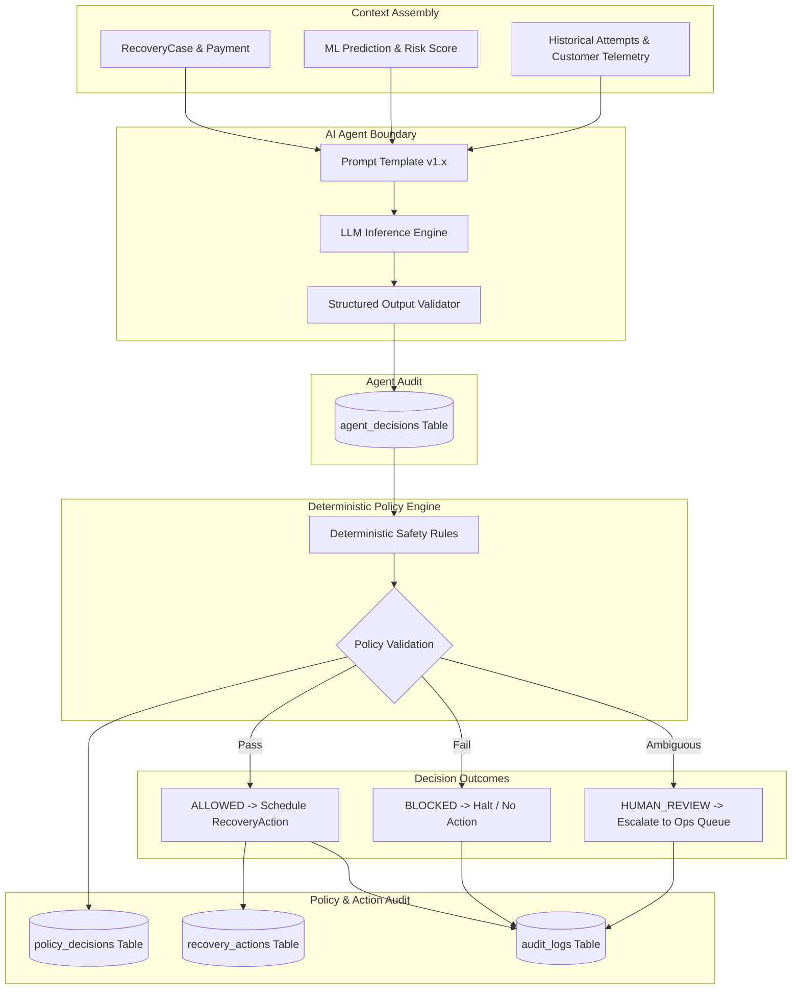
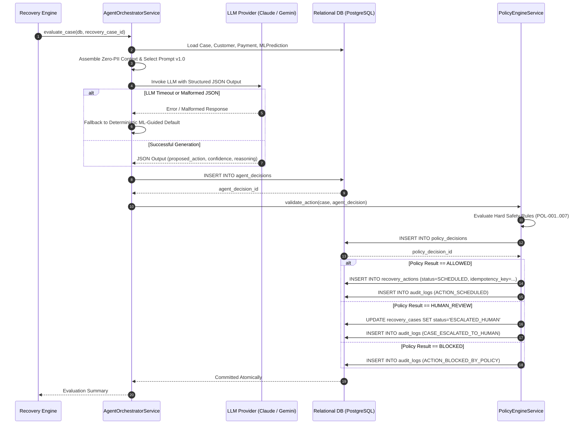

# Phase 6 — AI Recovery Decision Engine Specification

## 1. Executive Summary & Objective

The **AI Recovery Decision Engine** forms the autonomous intelligence and recommendation layer of RecoverIQ. Following the deterministic recovery case lifecycle (Phase 4) and statistical recovery probability scoring (Phase 5), the AI Agent synthesizes transactional telemetry, customer history, error taxonomy, and ML predictions to recommend the single optimal recovery strategy for each active `RecoveryCase`.

### Core Architectural Mandate: Strict Decoupling
To ensure bank-grade reliability, safety, and compliance:
1. **The AI Agent is an advisory recommendation engine only**. It **NEVER** executes financial operations directly, triggers Razorpay APIs, or directly creates `RecoveryAction` records.
2. **The Deterministic Policy Engine is authoritative**. Every recommendation emitted by the AI Agent must pass deterministic, rule-based policy validation (`ALLOWED`, `BLOCKED`, or `HUMAN_REVIEW`) before an action can be scheduled in `recovery_actions`.
3. **Immutable Persistence & Full Auditability**. Agent reasoning, token usage, policy evaluation, and audit records are permanently persisted in relational storage before execution dispatch.

---

## 2. Architecture & Decision Pipeline



---

## 3. Context Window & Input Data Specification

The AI Agent receives a sanitized, structured JSON context window containing only information established at or prior to the decision point.

### 3.1 Input Context Schema
```json
{
  "recovery_case": {
    "case_id": "9b1deb4d-3b7d-4bad-9bdd-2b0d7b3dcb6d",
    "status": "OPEN",
    "recovery_stage": "INITIAL_FAILURE",
    "amount_at_risk": 299900,
    "currency": "INR",
    "total_attempts_count": 1,
    "max_allowed_attempts": 3,
    "opened_at": "2026-08-28T20:15:00Z",
    "latest_failure_reason": "insufficient_funds"
  },
  "payment": {
    "payment_id": "c3a1e2d4-5b6f-7a8b-9c0d-1e2f3a4b5c6d",
    "amount": 299900,
    "currency": "INR",
    "is_subscription": true,
    "billing_cadence": "MONTHLY"
  },
  "customer_profile": {
    "customer_id": "a1b2c3d4-e5f6-7a8b-9c0d-1e2f3a4b5c6d",
    "risk_tier": "STANDARD",
    "total_payments_count": 8,
    "successful_payments_count": 7,
    "failed_payments_count": 1,
    "historical_success_rate": 0.875
  },
  "ml_prediction": {
    "prediction_id": "d4e5f6a7-b8c9-0d1e-2f3a-4b5c6d7e8f9a",
    "model_name": "recovery_probability",
    "model_version": "v1.0",
    "recovery_probability": 0.8245,
    "risk_score": 0.1755,
    "confidence": 0.85,
    "priority": "HIGH_RECOVERY_POTENTIAL",
    "predicted_channel": "SMART_RETRY",
    "predicted_delay_hours": 2
  },
  "attempt_history": [
    {
      "attempt_number": 1,
      "amount": 299900,
      "status": "FAILED",
      "error_code": "BAD_REQUEST_ERROR",
      "error_source": "bank",
      "error_step": "payment_authorization",
      "error_reason": "insufficient_funds",
      "error_description": "Payment failed due to insufficient funds in account",
      "initiated_at": "2026-08-28T20:14:55Z"
    }
  ]
}
```

### 3.2 Zero-PII & Secret Exclusion Mandate
The context builder must strictly enforce zero-PII transmission:
- **Forbidden Fields**: Customer email, mobile phone number, customer full name, primary account number (PAN), CVV/CVC, UPI PIN, authentication passwords, Razorpay API secrets, or webhook keys.
- **Allowed Identifiers**: UUIDs, masked error codes, ISO currency codes, minor unit integers, and anonymized risk tiers.

---

## 4. Allowed Action Space

The AI Agent must select **exactly one** action from the five canonical operational actions defined in `app.models.enums.RecoveryActionType`:

| Action Code (`RecoveryActionType`) | Target Objective | Applicable Triggers & Scenarios |
| :--- | :--- | :--- |
| `RETRY_PAYMENT` | Request automated payment retry through gateway. | Soft / transient errors (`insufficient_funds`, `network_timeout`, `bank_technical_error`) with high recovery potential ($\ge 0.75$). |
| `SEND_PAYMENT_LINK` | Generate and dispatch an authenticated alternate payment link. | Medium recovery potential, card limit issues, or customer friction (`payment_authentication`, `otp_timeout`). |
| `SEND_NOTIFICATION` | Dispatch non-disruptive reminder notification to customer. | Low recovery probability, expired cards, or customer awareness required before retry. |
| `ESCALATE_HUMAN` | Route recovery case to human operations review queue. | High-value at risk ($\ge ₹50,000$), suspicious failure patterns, or conflicting customer state. |
| `HALT_SUBSCRIPTION` | Formally pause recurring subscription billing to prevent churn. | Maximum attempts exhausted ($= 3$), permanent payment failure (`account_closed`, `card_blocked`). |

*(Note: `CLOSE_CASE` is reserved for terminal closure upon complete recovery or manual operator resolution).*

---

## 5. Structured JSON Output Contract

The AI Agent is prompted to respond strictly with a valid JSON object satisfying the following schema:

```json
{
  "$schema": "http://json-schema.org/draft-07/schema#",
  "title": "AgentRecoveryDecision",
  "type": "object",
  "required": [
    "proposed_action_type",
    "confidence_score",
    "reasoning_summary",
    "suggested_payload",
    "recommended_delay_hours"
  ],
  "properties": {
    "proposed_action_type": {
      "type": "string",
      "enum": [
        "RETRY_PAYMENT",
        "SEND_PAYMENT_LINK",
        "SEND_NOTIFICATION",
        "ESCALATE_HUMAN",
        "HALT_SUBSCRIPTION"
      ]
    },
    "confidence_score": {
      "type": "number",
      "minimum": 0.0,
      "maximum": 1.0
    },
    "reasoning_summary": {
      "type": "string",
      "minLength": 20,
      "maxLength": 1000
    },
    "suggested_payload": {
      "type": "object",
      "required": ["channel", "target_recipient_type"],
      "properties": {
        "channel": {
          "type": "string",
          "enum": ["GATEWAY_API", "WHATSAPP", "EMAIL", "SMS", "INTERNAL_QUEUE"]
        },
        "target_recipient_type": {
          "type": "string",
          "enum": ["GATEWAY", "CUSTOMER", "OPS_AGENT"]
        },
        "custom_message_template": { "type": "string" },
        "payment_link_expiry_hours": { "type": "integer", "minimum": 1 }
      }
    },
    "recommended_delay_hours": {
      "type": "integer",
      "minimum": 0,
      "maximum": 168
    }
  },
  "additionalProperties": false
}
```

---

## 6. Prompt Versioning & Architecture

Prompt templates are treated as immutable, versioned code artifacts stored in `backend/app/agent/prompts/`:

- **Version Format**: `recovery_agent_v{major}.{minor}` (e.g. `recovery_agent_v1.0`).
- **System Prompt**: Defines persona, legal/financial guardrails, operational goals, action taxonomy, and JSON-only output constraints.
- **Few-Shot Exemplars**: Includes canonical failure cases demonstrating correct prioritization and channel selection.
- **Traceability**: `agent_decisions.prompt_template_version` records the exact prompt version utilized during every inference run.

---

## 7. Deterministic Policy Engine & Hard Safety Rules

The Policy Engine (`app/services/policy_engine_service.py`) acts as the zero-trust validator between AI recommendations and execution. It evaluates hard mathematical rules and returns `PolicyEvaluationResult` (`ALLOWED`, `BLOCKED`, or `HUMAN_REVIEW`).

### 7.1 Hard Safety Rules Matrix

| Rule Code | Rule Name | Description / Logic | Enforcement Outcome |
| :--- | :--- | :--- | :--- |
| `POL-MAX-ATTEMPTS` | Max Attempts Ceiling | If `RecoveryCase.total_attempts_count >= RecoveryCase.max_allowed_attempts` and action is `RETRY_PAYMENT`. | `BLOCKED` &rarr; Force `HALT_SUBSCRIPTION` or `ESCALATE_HUMAN` |
| `POL-RATE-LIMIT` | Cool-Down Period Guard | If less than 2 hours have elapsed since the previous payment attempt for this payment. | `BLOCKED` (Prevents card network hammering) |
| `POL-PERM-FAIL` | Permanent Failure Guard | If `latest_failure_reason` is `card_blocked`, `account_closed`, or `fraud_suspected` and action is `RETRY_PAYMENT`. | `BLOCKED` &rarr; Force `SEND_PAYMENT_LINK` or `ESCALATE_HUMAN` |
| `POL-HIGH-VALUE` | High-Value Human Gate | If `amount_at_risk >= 5000000` (₹50,000) and action is automated retry. | `HUMAN_REVIEW` (Requires operator confirmation) |
| `POL-RISK-TIER` | Blocked Customer Gate | If `Customer.risk_tier == 'BLOCKED'`. | `BLOCKED` (Zero money movement permitted) |
| `POL-CASE-RESOLVED`| Terminal Case Guard | If `RecoveryCase.status` is already `RECOVERED` or `CLOSED`. | `BLOCKED` (Prevents duplicate charging) |
| `POL-CONF-FLOOR` | Low Confidence Gate | If AI `confidence_score < 0.40`. | `HUMAN_REVIEW` |

---

## 8. Relational Database Mapping

The specification maps directly to the existing Phase 2 schema without adding or modifying any database columns:

### 8.1 `agent_decisions`
- `id`: `UUID` (Primary Key)
- `recovery_case_id`: `UUID` (Foreign Key &rarr; `recovery_cases.id`)
- `ml_prediction_id`: `UUID` (Foreign Key &rarr; `ml_predictions.id`, nullable)
- `agent_name`: `String(64)` (Default: `"RecoveryOrchestrator"`)
- `agent_version`: `String(32)` (e.g. `"v1.0"`)
- `prompt_template_version`: `String(32)` (e.g. `"recovery_agent_v1.0"`)
- `proposed_action_type`: `String(64)` (Matches `RecoveryActionType`)
- `confidence_score`: `Numeric(5, 4)` (e.g. `0.8500`)
- `reasoning_summary`: `Text` (Explanation of selected strategy)
- `suggested_payload`: `JSONB` / `JSON` (Structured action parameters)
- `token_usage`: `JSONB` / `JSON` (`prompt_tokens`, `completion_tokens`, `total_tokens`)
- `decided_at`: `DateTime(timezone=True)`

### 8.2 `policy_decisions`
- `id`: `UUID` (Primary Key)
- `recovery_case_id`: `UUID` (Foreign Key &rarr; `recovery_cases.id`)
- `agent_decision_id`: `UUID` (Foreign Key &rarr; `agent_decisions.id`)
- `evaluation_result`: `String(32)` (`ALLOWED`, `BLOCKED`, `HUMAN_REVIEW`)
- `policy_engine_version`: `String(32)` (e.g. `"policy_v1.0"`)
- `triggered_rule_code`: `String(64)` (e.g. `"POL-MAX-ATTEMPTS"`, nullable)
- `rule_name`: `String(128)` (e.g. `"Max Attempts Ceiling"`, nullable)
- `evaluation_details`: `JSONB` / `JSON` (Evaluated parameter snapshot)
- `decision_reason`: `Text` (Audit rationale for decision)
- `decided_at`: `DateTime(timezone=True)`

### 8.3 `recovery_actions`
- `id`: `UUID` (Primary Key)
- `recovery_case_id`: `UUID` (Foreign Key &rarr; `recovery_cases.id`)
- `policy_decision_id`: `UUID` (Foreign Key &rarr; `policy_decisions.id`)
- `action_idempotency_key`: `String(255)` (Unique hash: `sha256(case_id + attempt_seq + action_type)`)
- `action_type`: `String(64)` (`RecoveryActionType`)
- `status`: `String(32)` (`PENDING`, `SCHEDULED`, `EXECUTING`, `COMPLETED`, `FAILED`, `CANCELLED`)
- `scheduled_for`: `DateTime(timezone=True)` (Now + `recommended_delay_hours`)
- `action_payload`: `JSONB` / `JSON` (Validated operational payload)
- `created_at` / `updated_at`: `DateTime(timezone=True)`

---

## 9. Sequence of Operations



---

## 10. Failure Modes & Deterministic Fallbacks

| Failure Scenario | Fallback Behavior |
| :--- | :--- |
| **LLM Provider Outage / Timeout** | Catch exception; log `llm_provider_unavailable`; invoke fallback deterministic policy using `MLPrediction.priority` (`HIGH` &rarr; `RETRY_PAYMENT`, `MEDIUM` &rarr; `SEND_PAYMENT_LINK`, `LOW` &rarr; `SEND_NOTIFICATION`). |
| **Malformed JSON / Schema Mismatch** | Reject response; record raw text in error log; fallback to ML-guided baseline recommendation. |
| **Policy Violation (`BLOCKED`)** | Agent proposal is discarded; `policy_decisions` records the triggered rule; no `recovery_actions` record is created. |
| **Database Failure on Decision Write** | Transaction rolls back atomically; `RecoveryCase` remains in its current state; no partial action is scheduled. |

---

## 11. Idempotency & Action Deduplication

- **Unique Action Idempotency Key**:
  $$\text{action\_idempotency\_key} = \text{SHA256}(\text{recovery\_case\_id} + \text{total\_attempts\_count} + \text{action\_type})$$
- The unique database constraint `uq_recovery_actions_idempotency_key` ensures that multiple invocations of the agent for the same failure attempt cannot schedule duplicate actions.

---

## 12. Testing & Verification Strategy

When Phase 6 is implemented, test coverage must verify:
1. **Context Assembly**: Proves zero PII or credentials enter the prompt context.
2. **Schema Conformance**: Validates mock and live LLM responses against `AgentRecoveryDecision` Pydantic model.
3. **Policy Rule Enforcement**: Unit tests for all 7 hard safety rules (`POL-MAX-ATTEMPTS`, `POL-RATE-LIMIT`, `POL-PERM-FAIL`, `POL-HIGH-VALUE`, etc.).
4. **Idempotent Scheduling**: Verifies duplicate agent evaluations for the same attempt sequence do not duplicate `recovery_actions`.
5. **Fallback Safety**: Confirms LLM timeouts cleanly fallback to deterministic ML-guided baseline actions with full audit logs.
