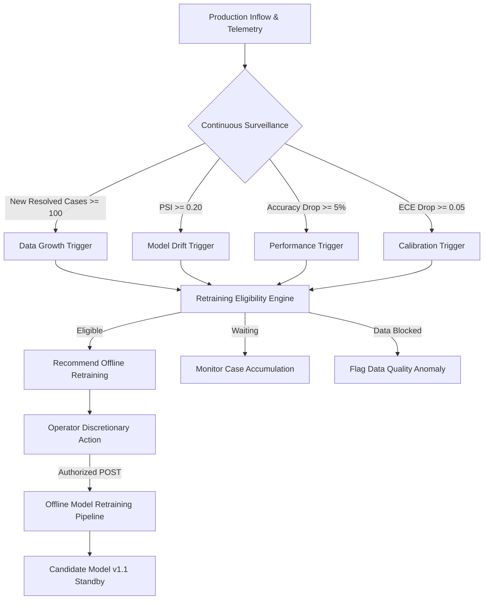

# RecoverIQ — Governed Continuous Learning, Automated Retraining Monitoring & Safe Model Evolution (Phase 9K)

## 1. Executive Summary & Core Philosophy

RecoverIQ Phase 9K introduces a **governed Continuous Learning, Retraining Monitoring, and Safe Model Evolution layer** that continuously evaluates whether RecoverIQ has accumulated sufficient new historical recovery data or exhibited sufficient model degradation/drift to justify an offline retraining cycle.

### Non-Negotiable Invariants & Financial Safety Guarantees

> **1. The system must NEVER automatically deploy a newly trained model.**
> All newly trained models enter the registry strictly as `CANDIDATE` versions on standby. Production promotion requires explicit human review and subsequent Phase 9J shadow/canary validation.
>
> **2. The system must NEVER bypass PolicyEngine.**
> The ML model is an advisory probability estimator. Retraining or learning logic never dictates or overrides policy rules.
>
> **3. The system must NEVER directly create RecoveryAction records.**
> Model training and learning diagnostics are strictly observational and offline.
>
> **4. The system must NEVER modify Payment or RecoveryCase financial state.**
> Dataset extraction, trigger evaluation, and training run execution produce exactly zero database mutations on financial entities (`Payment`, `RecoveryCase`, `Customer`, `Subscription`, `RecoveryAction`).
>
> **5. The system must NEVER call RazorpayActionProvider or ActionDispatcher from the learning layer.**
> 
> **6. 0 Database Migrations (Zero Migration Guarantee).**
> Continuous learning artifacts (dataset versions, training runs, lineage nodes) are event-sourced on the immutable `AuditLog` table.

---

## 2. Training Dataset Construction & Labeling Correctness

The `TrainingDatasetBuilder` extracts historical dunning records strictly from fully resolved recovery cases to prevent data leakage and label ambiguity.

### Binary Label Definition
| Resolution State | Canonical Criteria | Binary Label ($y$) | Rationale |
| :--- | :--- | :---: | :--- |
| **Positive Outcome** | `RecoveryCase.status == RECOVERED` AND `Payment.status == CAPTURED` | **`1`** | Represents a successful recovery following dunning action. |
| **Negative Outcome** | `RecoveryCase.status == CLOSED` AND `Payment.status == FAILED` | **`0`** | Represents a defaulted/unrecovered invoice after exhaustive dunning. |
| **Unresolved Cases** | `RecoveryCase.status IN (IN_RECOVERY, OPEN, ACTION_REQUIRED)` | **EXCLUDED** | In-progress recovery cycles cannot be reliably labeled without introducing survivorship or observation bias. |

### Feature Representation & Zero-PII Compliance
Extracted dataset rows consist exclusively of mathematical and categorical telemetry:
- `payment_amount`: Numeric transaction amount in integer paise / INR.
- `currency`: 3-letter currency code (`INR`).
- `attempt_number`: Sequential failure attempt counter ($1, 2, 3$).
- `customer_total_payments`: Historical completed payments count.
- `customer_successful_payments`: Historical captured count.
- `customer_failed_payments`: Historical failure count.
- `customer_success_rate`: Ratio of successful payments ($\in [0.0, 1.0]$).
- `error_code`, `error_source`, `error_step`, `error_reason`: Standardized gateway failure taxonomy.
- `subscription_age_days`: Contract duration prior to invoice failure.

*Zero PII Guarantee: Customer names, unmasked emails, phone numbers, merchant credentials, and Razorpay API secrets are strictly stripped and never enter the feature vector.*

### Deterministic SHA-256 Dataset Hashing
To ensure auditable provenance and reproducibility, every dataset version is assigned a deterministic checksum:
$$\text{Dataset Hash} = \text{SHA-256}\left(\bigoplus_{i=1}^N \text{CanonicalJSON}(x_i, y_i)\right)$$

---

## 3. Retraining Surveillance & Multi-Signal Triggers

RecoverIQ continuously evaluates four quantitative trigger signals against production telemetry:



### Trigger Definitions & Default Thresholds
| Trigger Type | Metric Code | Threshold | Evaluation Mechanism |
| :--- | :--- | :---: | :--- |
| **`NEW_RESOLVED_CASES`** | Case Volume Delta | $\Delta N \ge 100$ | Resolved recovery cases since the last completed training run. |
| **`MODEL_DRIFT`** | Population Stability Index | $\text{PSI} \ge 0.20$ | 7-day prediction probability distribution vs baseline training distribution. |
| **`PERFORMANCE_DEGRADATION`** | Rolling Accuracy Delta | $\Delta \text{Acc} \le -0.05$ | 14-day recovery prediction accuracy vs validation baseline. |
| **`CALIBRATION_DEGRADATION`** | Expected Calibration Error | $\Delta \text{ECE} \ge 0.05$ | Mean calibration error across 5 probability bins ($[0-0.2], \dots, [0.8-1.0]$). |
| **`SCHEDULED_INTERVAL`** | Cadence Interval | $\ge 30 \text{ days}$ | Time-based periodic governance trigger. |

---

## 4. 14 Deterministic Continuous Learning Safety Gates

Prior to registering any retrained candidate model into the governed model registry, the learning service evaluates 14 deterministic safety gates:

| # | Gate Code | Evaluation Condition | Purpose & Safety Guarantee |
| :-: | :--- | :---: | :--- |
| **1** | `MIN_DATASET_SIZE` | $N \ge 100$ | Prevents training on trivial or unrepresentative sample sizes. |
| **2** | `DATA_QUALITY` | Missing Features $= 0$ | Ensures all rows contain valid feature representations without nulls. |
| **3** | `FEATURE_SCHEMA_COMPATIBILITY` | Schema Version $== \text{"v1"}$ | Rejects breaking feature schema modifications. |
| **4** | `DATASET_CHECKSUM` | $\text{len}(\text{SHA-256}) == 64$ | Enforces immutable dataset snapshot integrity. |
| **5** | `MODEL_ARTIFACT_CHECKSUM` | $\text{len}(\text{SHA-256}) == 64$ | Enforces immutable serialized model artifact integrity. |
| **6** | `VALIDATION_SAMPLE_SIZE` | $N_{\text{val}} \ge 30$ | Ensures statistically reliable validation holdout evaluation. |
| **7** | `ACCURACY_NON_REGRESSION` | $\text{Acc}_{\text{challenger}} \ge \text{Acc}_{\text{champion}} - 0.03$ | Protects against significant accuracy regression. |
| **8** | `F1_NON_REGRESSION` | $\text{F1}_{\text{challenger}} \ge \text{F1}_{\text{champion}} - 0.03$ | Protects against F1 score collapse on positive recoveries. |
| **9** | `BRIER_NON_REGRESSION` | $\text{Brier}_{\text{challenger}} \le \text{Brier}_{\text{champion}} + 0.05$ | Guarantees probabilistic probability accuracy. |
| **10** | `CALIBRATION` | $\text{ECE} \le 0.1500$ | Enforces reliability curve alignment. |
| **11** | `DRIFT` | $\text{PSI} < 0.2500$ | Verifies stability against production population drift. |
| **12** | `CAUSAL_EVIDENCE` | Status $\in \{\text{SUFFICIENT}, \text{LIMITED}\}$ | Verifies empirical evidence backing the scorecard. |
| **13** | `HUMAN_REVIEW_REQUIRED` | Status $== \text{REVIEW\_REQUIRED}$ | **Strict Mandate**: Candidate models cannot auto-promote. |
| **14** | `DEPLOYMENT_SEPARATION` | Is Offline Standby $== \text{True}$ | **Strict Mandate**: Training layer is decoupled from deployment. |

---

## 5. Model Lineage & Provenance Progression DAG

RecoverIQ records full provenance tracking linking every production model to its exact historical origin:

```
[Dataset Snapshot (dataset-v2.25)] ──> SHA-256: e3b0c442...
                │
                ▼
   [Training Run (run-20260829-01)] ──> Algorithm: CalibratedLogisticRegression
                │
                ▼
   [Model Artifact (v1.1-candidate)] ──> Artifact SHA-256: d7065d42...
                │
                ▼
   [Offline Validation & 14 Gates] ──> Passed: 14/14, Decision: REVIEW_REQUIRED
                │
                ▼
   [Governed Model Registry] ──> Lifecycle: REVIEW_REQUIRED (Standby)
                │
                ▼ (Requires Phase 9J Shadow Validation)
   [Shadow Deployment (dep-20260829-01)] ──> 100% Shadow Traffic Mode
```

---

## 6. REST API Endpoints & Role-Based Access Control (RBAC)

| Method | Endpoint | Allowed Roles | Description |
| :--- | :--- | :--- | :--- |
| `GET` | `/api/recovery/intelligence/continuous-learning` | `VIEWER`, `OPERATOR`, `ADMIN` | Returns summary of active champion, dataset metrics, retraining triggers, and evolution decision. |
| `GET` | `/api/recovery/intelligence/continuous-learning/datasets` | `VIEWER`, `OPERATOR`, `ADMIN` | Returns paginated list of immutable dataset versions with SHA-256 hashes. |
| `GET` | `/api/recovery/intelligence/continuous-learning/training-runs` | `VIEWER`, `OPERATOR`, `ADMIN` | Returns paginated list of offline training runs and validation metrics. |
| `GET` | `/api/recovery/intelligence/continuous-learning/lineage` | `VIEWER`, `OPERATOR`, `ADMIN` | Returns model provenance progression DAG. |
| `GET` | `/api/recovery/intelligence/continuous-learning/readiness` | `VIEWER`, `OPERATOR`, `ADMIN` | Returns evaluation of all 14 Continuous Learning safety gates. |
| `POST` | `/api/recovery/intelligence/continuous-learning/trigger-training` | `OPERATOR`, `ADMIN` (403 for `VIEWER`) | Triggers an offline candidate retraining run. |

---

## 7. Operational Runbook: Retraining and Evolution Lifecycle

1. **Trigger Surveillance**: Monitor the Continuous Learning Tab in the RecoverIQ Intelligence Dashboard.
2. **Eligibility Evaluation**: When $\Delta N \ge 100$ or $\text{PSI} \ge 0.20$, the Retraining Monitor signals `ELIGIBLE` or `DRIFT_TRIGGERED`.
3. **Discretionary Retraining Trigger**: An Operator or Admin initiates an offline retraining run via `POST /intelligence/continuous-learning/trigger-training`.
4. **Validation & Candidate Registration**: The training service splits the resolved dataset, fits `CalibratedLogisticRegression`, logs metrics, and registers `v1.1-candidate` in `REVIEW_REQUIRED` standby state.
5. **Phase 9J Shadow Validation**: The operator creates a Shadow Deployment (`POST /intelligence/models/deployments`) to evaluate the candidate on live traffic in parallel without financial risk.
6. **Canary & Active Promotion**: Upon passing shadow validation gates, the candidate progresses through controlled canary rollout to production champion.
