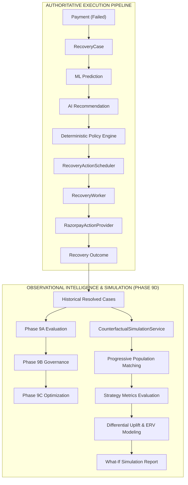

# RecoverIQ — Phase 9D: Counterfactual Recovery Simulation & What-If Intelligence

## 1. Executive Summary & Purpose

Phase 9D implements the **Counterfactual Recovery Simulation & What-If Intelligence Engine** for RecoverIQ.

The counterfactual simulator answers the empirical question:
> *"Based on historically comparable recovery cases, what might have happened if an alternative recovery strategy had been used?"*

Operating strictly as an observational analytics layer:
- **Zero Autonomous Execution**: The simulation engine never creates or schedules actions, nor does it interact with payment gateways.
- **Zero Financial State Mutations**: Zero database writes or status transitions for `Payment`, `RecoveryCase`, `PolicyDecision`, `RecoveryAction`, or `ActionResult`.
- **Zero Schema Migrations**: Derived entirely on-demand from existing indexed relational models.
- **Zero PII Exposure**: Complete redaction of personal customer data, credentials, and payment card details.
- **Strict Role-Based Access Control**: Protected by FastAPI JWT authentication (`require_viewer`).

> [!IMPORTANT]
> **Observational Constraint**: Counterfactual simulation is observational and does not establish causal effects or guarantee future recovery.

---

## 2. Recommendation & Simulation Architecture



---

## 3. Comparable Population Methodology

To avoid naive global comparisons, the simulation engine filters the reference dataset across four operational dimensions:
1. **Customer Risk Tier**: `LOW`, `STANDARD`, `HIGH`, `BLOCKED`.
2. **Failure Reason**: Normalized error code (e.g. `insufficient_funds`, `transient_network_error`, `card_inactive`).
3. **Attempt Number**: Sequential attempt count (`1`, `2`, `3`, `4+`).
4. **Principal Amount Band**: `< ₹1,000`, `₹1,000–₹5,000`, `₹5,000–₹10,000`, `₹10,000–₹50,000`, `> ₹50,000`.

### Progressive Fallback Segmentation
- **`EXACT_MATCH`**: Used when the exact segment contains sufficient historical observations ($N \ge 10$).
- **`RELAXED_MATCH`**: If exact segment $N < 10$, relaxes secondary filters (`amount_band`, `attempt_number`) while preserving primary features (`risk_tier`, `failure_reason`).
- **`GLOBAL_BASELINE`**: If relaxed segment still has $N < 10$, utilizes the full resolved population and logs diagnostic note `GLOBAL_BASELINE_FALLBACK`.

---

## 4. Mathematical Formulation & Monetary Precision

### A. Authoritative Recovery Outcome Definition
- **Recovered**: `RecoveryCase.status == "RECOVERED"` (or `Payment.status == "CAPTURED"` or `recovered_amount > 0`).
- **Failed**: `RecoveryCase.status in ("CLOSED", "EXHAUSTED")` without recovery.

### B. Expected Recovery Value (ERV)
$$\text{Expected Recovery Value (paise)} = \text{round}(\text{Principal Amount at Risk (paise)} \times \text{Average Recovery Probability})$$
- Represented internally and exposed in JSON responses as **integer minor units (paise)**.

### C. Strategy Recovery Rate & Financial Yield
- **Observed Recovery Rate**: $\text{Recovery Rate} = \frac{\text{Recovered Cases}}{N_{\text{strategy}}}$
- **Financial Recovery Yield**: $\text{Financial Yield} = \frac{\text{Amount Recovered (paise)}}{\text{Amount at Risk (paise)}}$

### D. Estimated Differential Uplift
- **Absolute Recovery Rate Delta**: $\Delta_{\text{rate}} = \text{Recovery Rate}_{\text{alt}} - \text{Recovery Rate}_{\text{cur}}$
- **Relative Uplift Percentage**: $\text{Relative Uplift \%} = \frac{\text{Recovery Rate}_{\text{alt}} - \text{Recovery Rate}_{\text{cur}}}{\text{Recovery Rate}_{\text{cur}}} \times 100\%$ *(Safely returns `null` if current rate is 0)*.
- **Estimated Incremental ERV**: $\Delta_{\text{ERV}} = \text{ERV}_{\text{alt}} - \text{ERV}_{\text{cur}}$ (integer paise).

### E. Reliability Classifications
| Sample Size ($N$) | Classification | Evidence Strength |
| :--- | :--- | :--- |
| $N \ge 30$ | `SUFFICIENT` | Statistically reliable for comparative decision support |
| $10 \le N < 30$ | `LIMITED` | Emerging comparative signal; below significance threshold |
| $N < 10$ | `INSUFFICIENT_DATA` | Insufficient data; estimates suppressed or flagged |

---

## 5. Counterfactual Language & Causal Inference Boundaries

The simulation API and user interface adhere strictly to non-causal observational terminology:
- **Allowed Terms**: *estimated*, *observational*, *historical evidence*, *counterfactual estimate*, *historical comparison*.
- **Forbidden Terms**: *guaranteed*, *will recover*, *caused*, *proven*, *certain*.

---

## 6. API Endpoint Specification

| Endpoint | Method | Required Role | Request Body | Response Model |
| :--- | :--- | :--- | :--- | :--- |
| `/api/recovery/intelligence/simulation` | `POST` | `viewer` | `SimulationRequest` | `CounterfactualSimulationResponse` |

### Example Request
```json
{
  "current_action_type": "RETRY_PAYMENT",
  "current_delay_hours": 12,
  "alternative_action_type": "SEND_PAYMENT_LINK",
  "alternative_delay_hours": 4,
  "risk_tier": "STANDARD",
  "failure_reason": "insufficient_funds",
  "amount_at_risk_paise": 1000000
}
```

---

## 7. Frontend Integration

A dedicated **Strategy Simulation** tab is accessible on the Intelligence dashboard (`/intelligence`):
- **Segment Selectors**: Interactive dropdowns for Risk Tier, Failure Reason, Attempt Number, and Amount Bands.
- **Hypothetical Principal**: Real-time ERV modeling in INR.
- **Side-by-Side Comparison**: Direct card comparison between Baseline and Alternative strategies with reliability badges.
- **Estimated Uplift Card**: Rate Delta, Relative %, Yield Delta, and Incremental ERV.
- **Mandatory Warning Banner**: Persistent observational disclaimer.
