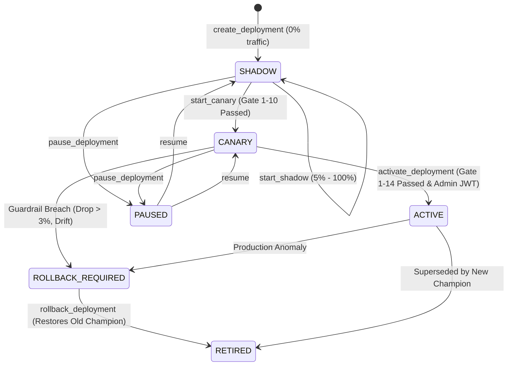

# RecoverIQ — Governed Model Deployment, Shadow Mode & Champion–Challenger Production Validation (Phase 9J)

## 1. Executive Summary & Core Philosophy

RecoverIQ Phase 9J introduces **governed multi-stage model deployment**, **passive shadow mode validation**, and **controlled canary rollouts** for machine learning models within the RecoverIQ automated debt recovery and dunning intelligence platform.

### Non-Negotiable Architectural Invariant
> **ML Model → Prediction → Decision Intelligence → PolicyEngine → RecoveryAction → Execution**
> 
> The ML model is strictly an advisory probability scoring component. Challenger models evaluated in shadow mode or canary rollout **NEVER** possess the authority to independently mutate financial records, initiate Razorpay webhooks, dispatch communications, or bypass the `PolicyEngine` authoritative financial gatekeeper.

---

## 2. Multi-Stage Deployment Lifecycle

### Supported Status Transitions
| Status | Description | Live Operational Effect |
| :--- | :--- | :--- |
| `SHADOW` | Model scores live production cases asynchronously in parallel with Champion. | **0% operational impact**. Predictions stored in telemetry only. |
| `CANARY` | Model serves live predictions for a deterministic whitelisted cohort. | Gated live routing (`5%`, `10%`, `25%`, `50%`, `100%`) through PolicyEngine. |
| `ACTIVE` | Model promoted to authoritative 100% production Champion. | Serves all operational prediction requests. Old champion retired. |
| `PAUSED` | Deployment temporarily halted for operator inspection. | Traffic immediately routed 100% to Champion. |
| `ROLLBACK_REQUIRED` | Automated guardrail breach detected (regression/drift). | Blocks promotion, flags system for immediate reversion. |
| `RETIRED` | Deployment concluded or rolled back. | Archived in event-sourced audit ledger. |

---

## 3. Deterministic Traffic Partitioning

To ensure reproducible cohort assignment without stateful database locks or cookie manipulation, RecoverIQ uses deterministic SHA-256 modular hashing:

$$\text{hash\_val} = \text{SHA-256}(\text{deployment\_id} + ":" + \text{case\_id}) \pmod{10000}$$

$$\text{assigned} \iff \text{hash\_val} < (\text{percentage} \times 100)$$

### Whitelisted Traffic Allocations
To prevent arbitrary micro-rollouts and ensure statistically meaningful sample distributions, only the following percentages are permitted:
$$\text{Allowed Allocations} \in \{0, 5, 10, 25, 50, 100\}$$

---

## 4. 14 Deterministic Deployment Readiness Safety Gates

Promotion from `SHADOW` $\to$ `CANARY` and `CANARY` $\to$ `ACTIVE` requires passing 14 deterministic gates evaluated over empirical telemetry:

| # | Gate Code | Evaluation Condition | Purpose |
| :- | :--- | :--- | :--- |
| **1** | `PHASE_9I_VALIDATION_PASSED` | Challenger status is `PROMOTION_READY` or `APPROVED` | Ensures candidate cleared offline cross-validation. |
| **2** | `MIN_SHADOW_SAMPLE` | Evaluated live shadow sample size $N \ge 100$ | Prevents premature evaluation on noisy sample sizes. |
| **3** | `RECOVERY_RATE_NON_REGRESSION` | $\text{Rate}_{\text{challenger}} - \text{Rate}_{\text{champion}} \ge -0.01$ | Prevents empirical recovery yield drops $\ge 1\%$. |
| **4** | `MIN_PRACTICAL_UPLIFT` | Mean probability uplift $\ge 1\%$ or accuracy non-regression | Validates tangible predictive gain. |
| **5** | `CONFIDENCE_INTERVAL_UPPER` | Challenger 95% Wilson CI upper bound $\ge$ Champion lower bound | Ensures statistical plausibility of non-inferiority. |
| **6** | `BRIER_NON_REGRESSION` | $\text{Brier}_{\text{challenger}} \le \text{Brier}_{\text{champion}} + 0.02$ | Limits mean squared error regression to $<0.02$. |
| **7** | `F1_NON_REGRESSION` | $\text{F1}_{\text{challenger}} \ge \text{F1}_{\text{champion}} - 0.02$ | Restricts classification degradation to $<2\%$. |
| **8** | `CALIBRATION_ACCEPTABLE` | Challenger $\text{ECE} \le 0.15$ and $\Delta\text{ECE} \le 0.03$ | Protects probabilistic calibration reliability. |
| **9** | `DATA_QUALITY_CLEAN` | Live feature extraction corruption rate $= 0.0\%$ | Guards against pipeline schema changes and corrupt inputs. |
| **10** | `MODEL_GOVERNANCE_HEALTHY` | Live model drift index $< 0.25$ (LOW or MODERATE) | Blocks candidates during anomalous live feature distribution shift. |
| **11** | `NO_ROLLBACK_ALERT` | Rollback guardrail diagnostics clean (no critical regression) | Validates absence of critical telemetry alerts. |
| **12** | `ARTIFACT_HASH_VERIFIED` | SHA-256 model weights hash matches registry metadata | Guarantees model artifact integrity and immutability. |
| **13** | `FEATURE_SCHEMA_COMPATIBLE` | Candidate uses feature schema `v1` | Ensures zero missing feature columns during inference. |
| **14** | `EXPLICIT_ADMIN_APPROVAL` | Promotion request initiated with verified Admin JWT | Enforces human-in-the-loop executive signoff. |

---

## 5. Statistical Rigor: Calibration & Significance Testing

### 5-Bucket Reliability & Expected Calibration Error (ECE)
Live shadow predictions are partitioned into 5 decile buckets:
$$B_k = [0.0, 0.2), [0.2, 0.4), [0.4, 0.6), [0.6, 0.8), [0.8, 1.0]$$

Weighted Expected Calibration Error is computed as:
$$\text{ECE} = \sum_{k=1}^5 \frac{|B_k|}{N} \left| \bar{p}_k - \bar{y}_k \right|$$

### Statistical Hypothesis Testing
- **Two-Proportion Pooled Z-Test**: Computes pooled standard error and two-tailed $p$-value for outcome comparison.
- **Wilson Score Interval**: Computes asymmetric binomial confidence intervals $[L_{\text{wilson}}, U_{\text{wilson}}]$ for both champion and challenger recovery rates at 95% confidence ($\alpha = 0.05$).
- **Newcombe Hybrid Score Difference Interval**: Calculates the 95% difference interval $[\theta_L, \theta_U]$ for the rate differential $(\hat{p}_2 - \hat{p}_1)$.

---

## 6. Zero Database Migration Architecture

Phase 9J achieves enterprise-grade persistence with **0 schema migrations** by leveraging the append-only `AuditLog` table with:
- `entity_type = "model_deployment"`
- `entity_id = UUID(deployment_id)`
- Event types: `DEPLOYMENT_CREATED`, `SHADOW_STARTED`, `SHADOW_EVALUATED`, `DEPLOYMENT_PAUSED`, `CANARY_STARTED`, `CANARY_UPDATED`, `DEPLOYMENT_ACTIVATED`, `DEPLOYMENT_ROLLED_BACK`.

---

## 7. Security, RBAC & Financial Isolation

- **Role-Based Access Control (RBAC)**:
  - `VIEWER`: Read-only telemetry inspection.
  - `OPERATOR`: Create deployments, adjust shadow traffic, initiate canary rollouts, pause deployments.
  - `ADMIN`: Authoritative production activation and emergency rollback execution.
- **Strict Financial Isolation**:
  - Model deployment, evaluation, canary, activation, and rollback APIs modify **zero** rows in `payments`, `recovery_cases`, or `recovery_actions`.
  - Zero external payment gateways (Razorpay) or communication dispatchers are invoked during deployment lifecycle changes.

---

## 8. Continuous Learning & Retraining Integration (Phase 9K)

Phase 9J deployment operates symbiotically with Phase 9K Continuous Learning:
1. Continuous learning monitors production cases and triggers offline candidate retraining runs.
2. Newly trained models are placed on standby as `CANDIDATE` versions.
3. Candidate models undergo Phase 9J passive shadow deployment on live production traffic before any consideration for canary or active champion promotion.
4. Full provenance is tracked in the Model Lineage DAG (`docs/analytics/CONTINUOUS_LEARNING.md`).

