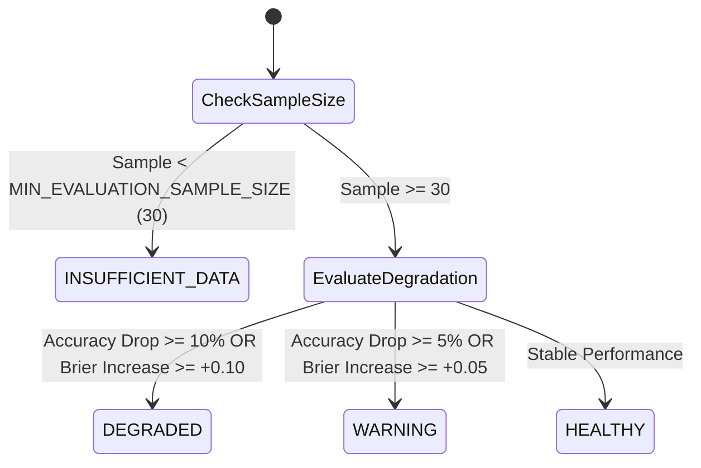

# RecoverIQ — Phase 9B: Model Governance, Drift Monitoring & Intelligence Health

## 1. Executive Summary

Phase 9B implements the **Model Governance, Drift Monitoring & Intelligence Health Engine** for RecoverIQ.

The governance engine operates as an observational, read-only layer answering the fundamental operational question:
> **"Is the current recovery prediction model still behaving reliably on recent recovery cases?"**

### Core Governance Guarantees
- **Zero Automatic Modifications**: The system never automatically retrains, deploys, replaces, or activates any model.
- **Zero Financial State Mutations**: Zero database mutations, zero action scheduling, zero gateway calls, and zero payment state mutations.
- **Zero Migration Requirement**: Utilizes existing indexed relational schemas across `recovery_cases`, `ml_predictions`, and `payments`.
- **Zero PII Exposure**: Full exclusion of customer contact information, credentials, and payment card details.
- **Strict Role-Based Access Control**: Protected by existing FastAPI JWT authentication (`require_viewer`).

---

## 2. Health Statuses & Minimum Sample-Size Policy

### Deterministic Threshold Constants
| Parameter | Default Value | Description |
| :--- | :--- | :--- |
| `MIN_EVALUATION_SAMPLE_SIZE` | `30` | Minimum resolved cases required to draw conclusive health status |
| `RECENT_WINDOW_DAYS` | `30` | Default recent operational evaluation window |
| `MODEL_WARNING_DEGRADATION` | `0.05` (5%) | Drop in accuracy or F1 triggering `WARNING` status |
| `MODEL_DEGRADED_DEGRADATION` | `0.10` (10%) | Drop in accuracy or F1 triggering `DEGRADED` status |
| `BRIER_WARNING_DELTA` | `0.05` | Increase in Brier MSE error triggering `WARNING` status |
| `BRIER_DEGRADED_DELTA` | `0.10` | Increase in Brier MSE error triggering `DEGRADED` status |
| `PSI_WARNING_THRESHOLD` | `0.10` | Moderate population stability shift |
| `PSI_CRITICAL_THRESHOLD` | `0.25` | Significant population stability shift |

---

## 3. Drift Monitoring & Population Stability Index (PSI)

### Population Stability Index Formula
$$\text{PSI} = \sum_{j=1}^k (Q_j - P_j) \times \ln\left(\frac{Q_j + \epsilon}{P_j + \epsilon}\right)$$
Where:
- $P_j$: Reference population proportion in bin $j$.
- $Q_j$: Recent population proportion in bin $j$.
- $\epsilon = 10^{-4}$: Epsilon constant preventing undefined log values.

### Monitored Drift Dimensions
1. **Numerical Feature Drift**: `payment_amount`, `customer_success_rate`, `hours_since_failure`, `attempt_number`.
2. **Categorical Feature Drift**: `error_reason`, `error_code`, `error_source`.
3. **Prediction Distribution Drift**: Probability bins $[0.0-0.2, 0.2-0.4, 0.4-0.6, 0.6-0.8, 0.8-1.0]$.
4. **Outcome Drift**: Macro recovery rate shift between historical and recent periods.
5. **Calibration Drift**: Error delta across discrete probability intervals.

> **Important Monitoring Distinction**:
> - *Model governance metrics indicate monitoring signals and do not establish causality.*
> - *Drift does not necessarily mean model failure; changes in traffic, customer behavior, payment providers, failure reasons, or other external factors can produce distribution shifts.*

---

## 4. API Specification

| Endpoint | Method | Required Role | Response Model | Description |
| :--- | :--- | :--- | :--- | :--- |
| `/api/recovery/intelligence/governance` | `GET` | `viewer` | `ModelGovernanceResponse` | Read-only model health, rolling performance windows, feature/prediction drift, version footprint, and data quality. |

---

## 5. Architectural Invariants Verified

1. **Advisory ML & AI**: Predictions remain strictly advisory; governance has no authority to alter execution flow.
2. **Authoritative Policy Engine**: PolicyEngine guardrails remain the sole gatekeeper for recovery actions.
3. **Strictly Read-Only**: Governance service executes zero database writes, commits, or flushes.
4. **No Autonomous Deployment**: All model management remains observational; no automatic retraining or threshold shifting occurs.
5. **Zero-PII**: Strict prevention of personal customer information across all diagnostic endpoints.
