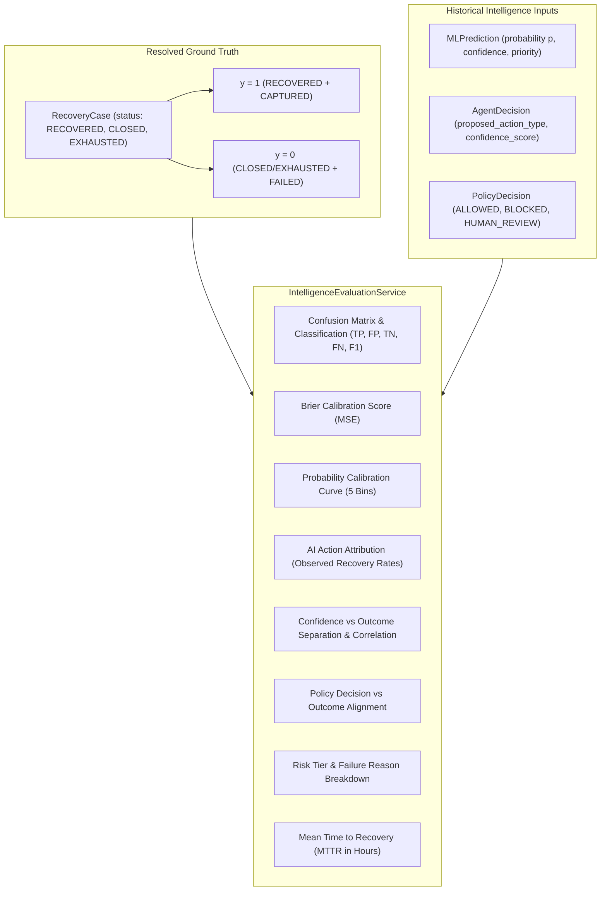

# RecoverIQ — Phase 9A: Recovery Intelligence & Outcome Evaluation Engine

## 1. Executive Summary

Phase 9A implements the **Recovery Intelligence & Outcome Evaluation Engine** for RecoverIQ.

The evaluation engine provides a strictly observational, read-only analytics measurement layer to evaluate how effectively the machine learning predictions, advisory AI recommendations, and deterministic Policy Engine guardrails translate into real-world payment recovery outcomes:
- **Zero Model Tampering**: Observes and evaluates the existing calibrated Logistic Regression model (`v1.0`) without retraining or weights modification.
- **Zero Financial Mutation**: Zero database mutations, zero action scheduling, zero gateway calls, and zero payment state mutations.
- **Zero Migration Requirement**: Fully backed by existing indexed relational linkages across `recovery_cases`, `ml_predictions`, `agent_decisions`, `policy_decisions`, `recovery_actions`, and `payments`.
- **Zero PII Exposure**: Full exclusion of email, phone, credentials, and customer personal data.
- **Strict Role-Based Access Control**: Protected by existing FastAPI JWT authentication (`require_viewer`).

---

## 2. Mathematical Metrics & Evaluation Architecture

---

## 3. Evaluation Modules Specification

### A. Binary Classification & Confusion Matrix
- **Decision Boundary**: Threshold $\tau = 0.50$ ($p \ge 0.50 \implies \hat{y} = 1$, $p < 0.50 \implies \hat{y} = 0$).
- **True Positive (TP)**: Predicted recovery ($\hat{y} = 1$) & actually recovered ($y = 1$).
- **False Positive (FP)**: Predicted recovery ($\hat{y} = 1$) & failed to recover ($y = 0$).
- **True Negative (TN)**: Predicted failure ($\hat{y} = 0$) & failed to recover ($y = 0$).
- **False Negative (FN)**: Predicted failure ($\hat{y} = 0$) & actually recovered ($y = 1$).
- **Accuracy**: $\frac{\text{TP} + \text{TN}}{N}$
- **Precision**: $\frac{\text{TP}}{\text{TP} + \text{FP}}$ (returns `null` if $\text{TP} + \text{FP} = 0$)
- **Recall**: $\frac{\text{TP}}{\text{TP} + \text{FN}}$ (returns `null` if $\text{TP} + \text{FN} = 0$)
- **F1 Score**: $2 \times \frac{\text{Precision} \times \text{Recall}}{\text{Precision} + \text{Recall}}$ (returns `null` if denominator is $0$)

### B. Brier Score & Probability Calibration
- **Brier Score**: $\text{BS} = \frac{1}{N} \sum_{i=1}^{N} (p_i - y_i)^2$ (mean squared error of probabilities, lower is better).
- **Calibration Buckets**: Discrete intervals $[0.0 - 0.2, 0.2 - 0.4, 0.4 - 0.6, 0.6 - 0.8, 0.8 - 1.0]$.
- **Calibration Error**: $|\bar{p}_{\text{bucket}} - \text{RecoveryRate}_{\text{bucket}}|$.

### C. AI Action Attribution (Observational Correlation)
Measures recovery success rate and average confidence across proposed recovery channels without making causal claims:
- `RETRY_PAYMENT`
- `SEND_PAYMENT_LINK`
- `SEND_NOTIFICATION`
- `ESCALATE_HUMAN`
- `HALT_SUBSCRIPTION`
- `CLOSE_CASE`

### D. AI Confidence vs Outcome Correlation
- Evaluates separation: $\Delta = \bar{c}_{\text{recovered}} - \bar{c}_{\text{failed}}$.
- Point-Biserial Pearson Correlation: $\rho = \frac{\sum (c_i - \bar{c})(y_i - \bar{y})}{\sqrt{\sum (c_i - \bar{c})^2 \sum (y_i - \bar{y})^2}}$.

### E. Mean Time to Recovery (MTTR)
- Calculated strictly on recovered cases: $\Delta t = \frac{\text{resolved\_at} - \text{opened\_at}}{3600}$ hours.
- Computes overall mean, overall median, and latency segmented by action type and ML priority.

---

## 4. API Endpoint Specification

| Endpoint | Method | Required Role | Response Model | Description |
| :--- | :--- | :--- | :--- | :--- |
| `/api/recovery/intelligence/evaluation` | `GET` | `viewer` | `IntelligenceEvaluationResponse` | Read-only aggregation of model accuracy, calibration, attribution, and MTTR. |

---

## 5. Architectural Invariants Verified

1. **Advisory ML & AI**: ML prediction and AI recommendation remain strictly non-authoritative.
2. **Authoritative Policy Engine**: All actions still require explicit deterministic policy clearance before execution.
3. **Observational Safety**: Evaluation service executes zero database writes, zero gateway calls, and zero background worker modifications.
4. **Strict Zero-PII**: Zero email, phone, credentials, or secrets in responses.
5. **Zero Migrations**: All aggregations use existing relational keys and indexes.
