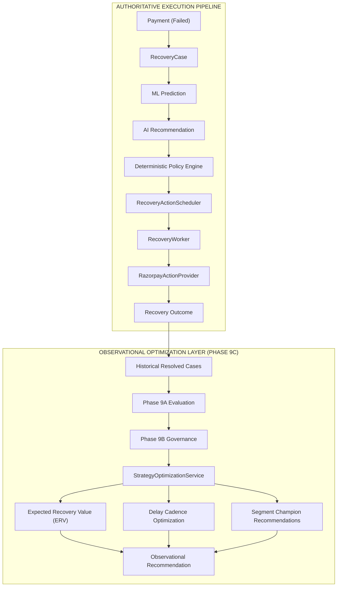

# RecoverIQ — Phase 9C: Intelligent Recovery Strategy Optimization & Expected Recovery Value

## 1. Executive Summary

Phase 9C implements the **Intelligent Recovery Strategy Optimization & Expected Recovery Value (ERV) Engine** for RecoverIQ.

Operating strictly as an observational recommendation and decision-support layer, Phase 9C transforms historical recovery outcomes and model telemetry into empirical strategy rankings without possessing any authority to execute, schedule, or mutate financial state:
- **Zero Autonomous Execution**: The optimization engine never executes actions, creates actions, or calls payment providers.
- **Zero Financial State Mutations**: Zero database mutations, zero changes to `Payment.status` or `RecoveryCase.status`.
- **Zero Migration Requirement**: Fully powered by existing indexed relational schemas across `recovery_cases`, `payments`, `ml_predictions`, and `agent_decisions`.
- **Zero PII Exposure**: Complete omission of customer contact information, credentials, and payment card details.
- **Strict Role-Based Access Control**: Protected by FastAPI JWT authentication (`require_viewer`).

---

## 2. Recommendation Architecture

---

## 3. Mathematical Models & Formulation

### A. Expected Recovery Value (ERV)
$$\text{Expected Recovery Value (paise)} = \text{round}(\text{Amount at Risk (paise)} \times \text{Recovery Probability})$$
- Represented internally and exposed externally as **integer minor units (paise)**.
- Guaranteed zero floating-point arithmetic on currency conversions.

### B. Strategy Performance & Financial Yield
- **Observed Recovery Rate**: $\frac{\text{Recovered Cases}}{N_{\text{strategy}}}$
- **Financial Amount Recovery Yield**: $\frac{\text{Amount Recovered (paise)}}{\text{Amount at Risk (paise)}}$

### C. Sample Size Reliability Classification
| Sample Size ($N$) | Reliability Classification | Operational Interpretation |
| :--- | :--- | :--- |
| $N \ge 30$ | `SUFFICIENT` | Statistically reliable for champion strategy nomination |
| $10 \le N < 30$ | `LIMITED` | Emerging empirical signal; below significance threshold |
| $N < 10$ | `INSUFFICIENT_DATA` | Insufficient data; purely tentative observation |

### D. Deterministic Champion Selection Hierarchy
Candidate action strategies are evaluated using a strict, deterministic hierarchy:
1. **Sample Reliability**: `SUFFICIENT` (Rank 3) $>$ `LIMITED` (Rank 2) $>$ `INSUFFICIENT_DATA` (Rank 1).
2. **Observed Recovery Rate** (descending).
3. **Financial Yield Rate** (descending).
4. **Expected Recovery Value (paise)** (descending).
5. **Average Confidence Score** (descending).
6. **Action Type Identifier** (alphabetical tie-breaker).

---

## 4. Multi-Dimensional Segment Optimization

The engine calculates segment-specific champion strategies and retry cadences across four key operational dimensions:
1. **Customer Risk Tier**: `LOW`, `STANDARD`, `HIGH`, `BLOCKED`.
2. **Failure Reason**: Normalized error codes (e.g. `insufficient_funds`, `transient_network_error`, `card_inactive`).
3. **Attempt Number**: `Attempt 1`, `Attempt 2`, `Attempt 3`, `Attempt 4+`.
4. **Principal Amount Bands**: `< ₹1,000`, `₹1,000–₹5,000`, `₹5,000–₹10,000`, `₹10,000–₹50,000`, `> ₹50,000`.

---

## 5. API Endpoint Specification

| Endpoint | Method | Required Role | Response Model | Description |
| :--- | :--- | :--- | :--- | :--- |
| `/api/recovery/intelligence/optimization` | `GET` | `viewer` | `StrategyOptimizationResponse` | Read-only strategy rankings, champion action recommendation, delay cadences, segment strategies, and ERV. |

---

## 6. Architectural Invariants Verified

1. **Observational Exclusivity**: Optimization recommendations are observational analytics and do not possess authority to execute or schedule financial actions.
2. **Deterministic Authoritative Authority**: `PolicyEngine` remains the sole arbiter of recovery clearances.
3. **Strict Zero-PII**: Zero personal customer data in responses.
4. **Financial Immutability**: Zero changes to payment records, case statuses, actions, or provider balances.
