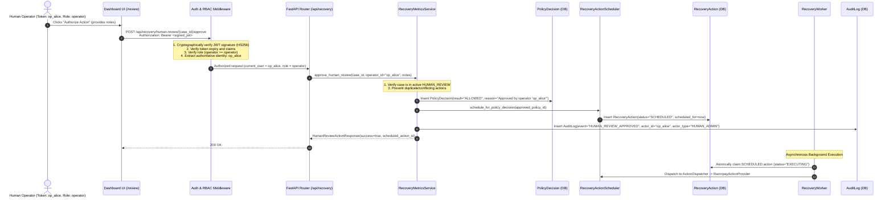

# RecoverIQ — Recovery Dashboard, Security & RBAC Specification

## 1. Executive Summary

Phase 8C and the Security Remediation establish the **RecoverIQ Recovery Dashboard, Metrics API, Human Review Queue, RBAC Security Engine, and Immutable Audit Trail**.

The system provides real-time operational visibility and safe human-in-the-loop oversight while enforcing strict architectural trust boundaries:
- **Authentication & RBAC**: Every operational endpoint is guarded by cryptographically signed JWT Bearer tokens or API Keys with hierarchical role-based permissions (`viewer`, `operator`, `admin`).
- **Authoritative Identity**: The operator identity is derived directly from verified authentication tokens, removing client-supplied identity from the trust boundary.
- **Deterministic Policy Safety**: Human operator approvals create authoritative `ALLOWED` `PolicyDecision` records that strictly delegate to `RecoveryActionScheduler`.
- **Zero Gateway Bypass**: Approvals schedule actions (`RecoveryAction(status="SCHEDULED")`) for asynchronous pickup by the background worker. No direct gateway or dispatcher calls occur on the web thread.
- **Strict Zero-PII**: Customer email, phone, PAN, CVV, and raw credentials are 100% excluded and redacted from all dashboard APIs and database representations.

---

## 2. Security Architecture & Role-Based Access Control (RBAC)

### RBAC Hierarchy

| Role | Hierarchy Level | Permissions |
| :--- | :--- | :--- |
| `viewer` | Level 1 | Read-only access to metrics, case lists, case details, review queues, audit logs, worker health telemetry. |
| `operator` | Level 2 | All `viewer` permissions + authority to approve or dismiss flagged cases in the Human Review Queue. |
| `admin` | Level 3 | All `operator` permissions + administrative system configuration and maintenance. |

### API Endpoint Security Matrix

| Endpoint | Method | Required Role | Auth Scheme | Trust Model |
| :--- | :--- | :--- | :--- | :--- |
| `/api/auth/token` | `POST` | Public | None | Issues signed HS256 JWT access tokens. |
| `/api/auth/me` | `GET` | `viewer` | Bearer JWT | Returns verified identity and role claims. |
| `/api/recovery/metrics` | `GET` | `viewer` | Bearer JWT / API Key | Read-only aggregation. |
| `/api/recovery/cases` | `GET` | `viewer` | Bearer JWT / API Key | Read-only paginated cases. |
| `/api/recovery/cases/{id}` | `GET` | `viewer` | Bearer JWT / API Key | Read-only lifecycle timeline. |
| `/api/recovery/human-review` | `GET` | `viewer` | Bearer JWT / API Key | Read-only pending review queue. |
| `/api/recovery/human-review/{id}/approve` | `POST` | `operator` | Bearer JWT / API Key | **Authoritative approval**. Operator identity derived from verified token context. |
| `/api/recovery/human-review/{id}/dismiss` | `POST` | `operator` | Bearer JWT / API Key | **Authoritative dismissal**. Operator identity derived from verified token context. |
| `/api/recovery/audit-logs` | `GET` | `viewer` | Bearer JWT / API Key | Read-only immutable audit trail. |
| `/health/worker` | `GET` | `viewer` | Bearer JWT / API Key | Authenticated worker telemetry. |
| `/health` | `GET` | Public | None | Service liveness probe. |

---

## 3. Human Review & Security Boundary Sequence Diagram

---

## 4. Zero-PII and Zero-Secret Invariants

1. **Total Exclusion of Direct Identifiers**: Customer email and phone fields are omitted from all dashboard schemas and API responses (`CustomerSummary`).
2. **Authoritative Identity Derivation**: Any client-supplied `operator_id` in request payloads is non-authoritative and ignored in favor of the cryptographic token subject (`current_user.id`).
3. **Secret Isolation**: Secrets, bearer tokens, API keys, webhook signatures, and password fields are never persisted in `metadata_json` or returned in API responses.
4. **Integer Currency Precision**: All financial amounts are processed in integer paise (`₹100.00` = `10000` paise).
5. **Strict Append-Only Immutability**: All decisions, actions, execution results, and audit trails remain permanently append-only.

---

## 5. Verification & Test Suite

- **Total Backend Tests**: 225 passing tests (`pytest backend/tests/`).
- **Linter Status**: 0 errors (`ruff check app/ tests/`).
- **Frontend Type Safety**: Clean compilation (`npx tsc --noEmit`).
- **Next.js Production Build**: 0 errors (`npm run build`).
