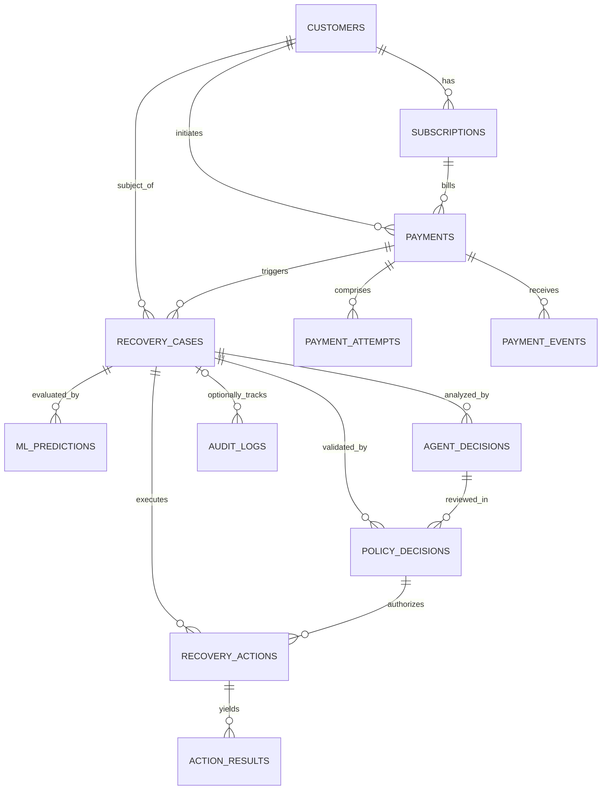

# RecoverIQ — Canonical Database Design (Phase 2)

## 1. Executive Summary & Design Principles

RecoverIQ is an autonomous AI revenue recovery agent designed to identify, analyze, and recover failed payments within recurring billing and transaction workflows (initially integrating with Razorpay). The architecture strictly decouples payment states from recovery states and enforces deterministic policy guardrails before any automated action is executed.

### Core Architectural Tenets
1. **Event-Driven & Append-Only History**: Payments and recovery workflows produce sequences of state changes. Historical events, ML predictions, AI recommendations, policy evaluations, and audit logs are never overwritten.
2. **Strict Idempotency**: Gateway webhooks, scheduled jobs, and recovery actions can be delivered or triggered multiple times. Idempotency keys and unique database constraints guarantee exactly-once execution.
3. **Decoupled Payment vs. Recovery State**: A payment order represents merchant transaction intent. A recovery case represents the multi-step lifecycle of diagnosing and resolving a payment failure.
4. **Deterministic Policy Precedence**: The AI agent proposes recovery strategies, but a deterministic policy engine validates every decision against hard financial and business rules. The LLM is never the final execution authority.
5. **Zero-Trust Security & PCI-DSS Compliance**: Sensitive payment credentials (PAN, CVV, passwords, API secrets) are **never** stored. All financial transactions reference external provider tokens (`pay_xxx`, `order_xxx`, `plink_xxx`, `sub_xxx`).
6. **Financial Precision**: All monetary values are stored as integers representing the smallest currency unit (e.g., INR paise, USD cents as `BIGINT`) to prevent floating-point inaccuracies. All timestamps are in UTC (`TIMESTAMPTZ`).

---

## 2. Entity Evaluation & Overview

We evaluated the 12 conceptual entities identified for the RecoverIQ ecosystem. Below is the architectural justification for why each entity exists within the canonical relational model.

| # | Conceptual Entity | Decision | Justification |
|---|---|---|---|
| 1 | **`customers`** | **Retained** | Stores merchant customer identities, contact references (safe/tokenized), lifetime transaction aggregates, and risk metadata needed by the ML model. |
| 2 | **`subscriptions`** | **Retained** | Manages recurring billing contracts, billing cadences, and subscription statuses (`active`, `past_due`, `halted`, `cancelled`), which are the primary source of involuntary churn. |
| 3 | **`payments`** | **Retained** | Represents the high-level financial transaction/order/invoice intent. Maintains canonical business status and financial amounts. |
| 4 | **`payment_attempts`** | **Retained** | A single payment order can fail multiple times across different methods (UPI, Card, Netbanking). Each attempt stores granular gateway error codes and gateway transaction IDs (`pay_xxx`). |
| 5 | **`payment_events`** | **Retained** | Immutable ledger of all inbound webhooks and gateway signals. Provides idempotency deduplication and event replay capabilities. |
| 6 | **`recovery_cases`** | **Retained** | Central entity for RecoverIQ. Initiated upon payment failure; tracks recovery lifecycle, total amount at risk, current workflow stage, and recovery outcomes. |
| 7 | **`ml_predictions`** | **Retained** | Append-only inference records containing recovery probability scores, optimal recovery channel predictions, and feature snapshots used during inference. |
| 8 | **`agent_decisions`** | **Retained** | Append-only record of AI LLM reasoning, recommendations, confidence scores, and structured action payloads. Preserves complete AI decision history. |
| 9 | **`policy_decisions`** | **Retained** | Immutable record of deterministic safety evaluations (`ALLOWED`, `BLOCKED`, `HUMAN_REVIEW`), enforcing constraints on AI suggestions before execution. |
| 10 | **`recovery_actions`** | **Retained** | Concrete operational actions dispatched by the system (e.g., `RETRY_PAYMENT`, `SEND_PAYMENT_LINK`, `SEND_NOTIFICATION`, `ESCALATE_HUMAN`, `HALT_SUBSCRIPTION`) with unique action idempotency keys. |
| 11 | **`action_results`** | **Retained** | Granular execution results and telemetry returned by downstream providers (e.g., Razorpay API response, communication delivery status, error codes). |
| 12 | **`audit_logs`** | **Retained** | Global, immutable append-only audit trail logging all state transitions, system actors, manual overrides, and operational mutations across both case-bound and pre-case system events. |

---

## 3. Mermaid Entity-Relationship (ER) Diagram



---

## 4. Detailed Table Specifications

### 4.1. `customers`
* **Purpose**: Represents the end-customer associated with recurring payments. Provides historical context (risk score, total recovery count) to the ML and AI models.

| Column Name | Data Type | Nullable | Constraints & Defaults | Description |
|---|---|---|---|---|
| `id` | `UUID` | No | `PRIMARY KEY`, default `gen_random_uuid()` | Internal surrogate identifier |
| `external_customer_id` | `VARCHAR(128)` | No | `UNIQUE` | Merchant customer identifier |
| `razorpay_customer_id` | `VARCHAR(128)` | Yes | `UNIQUE` | Razorpay customer reference (`cust_xxx`) |
| `email_masked` | `VARCHAR(255)` | Yes | | Masked email for display (e.g., `j***@example.com`) |
| `phone_masked` | `VARCHAR(64)` | Yes | | Masked phone for display |
| `risk_tier` | `VARCHAR(32)` | No | Default `'STANDARD'` | Risk category: `'LOW'`, `'STANDARD'`, `'HIGH'`, `'BLOCKED'` |
| `total_payments_count` | `INTEGER` | No | Default `0` | Aggregate lifetime payment count |
| `failed_payments_count` | `INTEGER` | No | Default `0` | Aggregate lifetime failed payment count |
| `recovered_payments_count`| `INTEGER` | No | Default `0` | Aggregate lifetime recovered payment count |
| `metadata` | `JSONB` | No | Default `'{}'::jsonb` | Extensible non-sensitive customer metadata |
| `created_at` | `TIMESTAMPTZ` | No | Default `NOW()` | Record creation timestamp |
| `updated_at` | `TIMESTAMPTZ` | No | Default `NOW()` | Record last modification timestamp |

* **Indexes**:
  - `idx_customers_ext_id` ON `external_customer_id`
  - `idx_customers_rzp_id` ON `razorpay_customer_id`

---

### 4.2. `subscriptions`
* **Purpose**: Tracks recurring subscription contracts, billing plans, and current subscription lifecycle status.

| Column Name | Data Type | Nullable | Constraints & Defaults | Description |
|---|---|---|---|---|
| `id` | `UUID` | No | `PRIMARY KEY`, default `gen_random_uuid()` | Internal surrogate identifier |
| `customer_id` | `UUID` | No | `FOREIGN KEY (customers.id) ON DELETE RESTRICT` | Associated customer |
| `external_subscription_id` | `VARCHAR(128)` | Yes | | Merchant subscription identifier |
| `razorpay_subscription_id` | `VARCHAR(128)` | Yes | `UNIQUE` | Razorpay subscription ID (`sub_xxx`) |
| `plan_name` | `VARCHAR(128)` | No | | Subscription plan name |
| `billing_cadence` | `VARCHAR(32)` | No | | Cadence: `'MONTHLY'`, `'QUARTERLY'`, `'YEARLY'` |
| `recurring_amount` | `BIGINT` | No | | Scheduled charge in smallest currency unit |
| `currency` | `VARCHAR(3)` | No | Default `'INR'` | ISO 4217 currency code |
| `status` | `VARCHAR(32)` | No | Default `'ACTIVE'` | `'ACTIVE'`, `'AUTHENTICATED'`, `'PAST_DUE'`, `'HALTED'`, `'CANCELLED'`, `'COMPLETED'` |
| `current_period_start` | `TIMESTAMPTZ` | Yes | | Current billing cycle start |
| `current_period_end` | `TIMESTAMPTZ` | Yes | | Current billing cycle end |
| `cancel_at_period_end` | `BOOLEAN` | No | Default `FALSE` | Cancellation intent flag |
| `metadata` | `JSONB` | No | Default `'{}'::jsonb` | Subscription metadata |
| `created_at` | `TIMESTAMPTZ` | No | Default `NOW()` | Creation timestamp |
| `updated_at` | `TIMESTAMPTZ` | No | Default `NOW()` | Last modification timestamp |

* **Indexes**:
  - `idx_subscriptions_customer_id` ON `customer_id`
  - `idx_subscriptions_rzp_id` ON `razorpay_subscription_id`
  - `idx_subscriptions_status` ON `status`

---

### 4.3. `payments`
* **Purpose**: Represents the high-level payment invoice or order intent. Separates financial accounting from tactical retry attempts.

| Column Name | Data Type | Nullable | Constraints & Defaults | Description |
|---|---|---|---|---|
| `id` | `UUID` | No | `PRIMARY KEY`, default `gen_random_uuid()` | Internal surrogate identifier |
| `customer_id` | `UUID` | No | `FOREIGN KEY (customers.id) ON DELETE RESTRICT` | Associated customer |
| `subscription_id` | `UUID` | Yes | `FOREIGN KEY (subscriptions.id) ON DELETE SET NULL` | Linked subscription (if recurring) |
| `external_order_id` | `VARCHAR(128)` | Yes | | Merchant internal order identifier |
| `razorpay_order_id` | `VARCHAR(128)` | Yes | `UNIQUE` | Razorpay order ID (`order_xxx`) |
| `razorpay_invoice_id` | `VARCHAR(128)` | Yes | `UNIQUE` | Razorpay invoice ID (`inv_xxx`) |
| `amount` | `BIGINT` | No | | Gross transaction amount in smallest currency unit |
| `currency` | `VARCHAR(3)` | No | Default `'INR'` | Currency code (e.g., `'INR'`, `'USD'`) |
| `status` | `VARCHAR(32)` | No | Default `'CREATED'` | `'CREATED'`, `'AUTHORIZED'`, `'CAPTURED'`, `'FAILED'`, `'REFUNDED'`, `'DISPUTED'` |
| `due_date` | `TIMESTAMPTZ` | Yes | | Payment due date (if invoiced) |
| `captured_at` | `TIMESTAMPTZ` | Yes | | Timestamp when payment was successfully captured |
| `metadata` | `JSONB` | No | Default `'{}'::jsonb` | Payment metadata |
| `created_at` | `TIMESTAMPTZ` | No | Default `NOW()` | Creation timestamp |
| `updated_at` | `TIMESTAMPTZ` | No | Default `NOW()` | Last update timestamp |

* **Indexes**:
  - `idx_payments_customer_id` ON `customer_id`
  - `idx_payments_subscription_id` ON `subscription_id`
  - `idx_payments_rzp_order_id` ON `razorpay_order_id`
  - `idx_payments_status_created` ON `(status, created_at)`

---

### 4.4. `payment_attempts`
* **Purpose**: Records each physical attempt to process a payment, capturing specific gateway errors and payment methods.

| Column Name | Data Type | Nullable | Constraints & Defaults | Description |
|---|---|---|---|---|
| `id` | `UUID` | No | `PRIMARY KEY`, default `gen_random_uuid()` | Internal surrogate identifier |
| `payment_id` | `UUID` | No | `FOREIGN KEY (payments.id) ON DELETE CASCADE` | Associated payment |
| `attempt_number` | `INTEGER` | No | | Sequence index (1, 2, 3...) |
| `razorpay_payment_id` | `VARCHAR(128)` | Yes | `UNIQUE` | Razorpay transaction ID (`pay_xxx`) |
| `payment_method` | `VARCHAR(32)` | Yes | | `'CARD'`, `'UPI'`, `'NETBANKING'`, `'WALLET'`, `'EMI'` |
| `payment_method_sub_type`| `VARCHAR(64)`| Yes | | e.g., `'GOOGLE_PAY'`, `'HDFC'`, `'VISA_DEBIT'` |
| `amount` | `BIGINT` | No | | Amount attempted |
| `status` | `VARCHAR(32)` | No | | `'INITIATED'`, `'SUCCESS'`, `'FAILED'`, `'PENDING'` |
| `error_code` | `VARCHAR(64)` | Yes | | Razorpay error code (e.g., `'BAD_REQUEST_ERROR'`, `'GATEWAY_ERROR'`) |
| `error_source` | `VARCHAR(64)` | Yes | | e.g., `'customer'`, `'bank'`, `'gateway'` |
| `error_step` | `VARCHAR(64)` | Yes | | e.g., `'payment_authentication'`, `'payment_authorization'` |
| `error_reason` | `VARCHAR(128)` | Yes | | e.g., `'insufficient_funds'`, `'card_expired'`, `'authentication_failed'` |
| `error_description` | `TEXT` | Yes | | Detailed gateway response message |
| `initiated_at` | `TIMESTAMPTZ` | No | Default `NOW()` | Attempt initiation timestamp |
| `completed_at` | `TIMESTAMPTZ` | Yes | | Completion timestamp |

* **Constraints & Indexes**:
  - `uq_payment_attempt_seq` UNIQUE (`payment_id`, `attempt_number`)
  - `idx_payment_attempts_rzp_id` ON `razorpay_payment_id`
  - `idx_payment_attempts_payment_id` ON `payment_id`
  - `idx_payment_attempts_error_reason` ON `error_reason`

---

### 4.5. `payment_events`
* **Purpose**: Immutable ledger of all inbound webhooks and system events. Serves as the primary idempotency and auditing buffer for webhook ingestion.

| Column Name | Data Type | Nullable | Constraints & Defaults | Description |
|---|---|---|---|---|
| `id` | `UUID` | No | `PRIMARY KEY`, default `gen_random_uuid()` | Internal surrogate identifier |
| `idempotency_key` | `VARCHAR(255)` | No | `UNIQUE` | Deduplication key (e.g., `rzp_evt_xxx` or payload hash) |
| `payment_id` | `UUID` | Yes | `FOREIGN KEY (payments.id) ON DELETE SET NULL` | Linked payment (if resolved) |
| `source` | `VARCHAR(32)` | No | Default `'RAZORPAY_WEBHOOK'` | `'RAZORPAY_WEBHOOK'`, `'POLLING_JOB'`, `'INTERNAL_AGENT'` |
| `event_type` | `VARCHAR(128)` | No | | e.g., `'payment.failed'`, `'payment.captured'`, `'subscription.halted'` |
| `razorpay_event_id` | `VARCHAR(128)` | Yes | `UNIQUE` | Razorpay webhook event ID (`event_xxx`) |
| `payload` | `JSONB` | No | | Full raw JSON event payload for audit/replay |
| `processing_status` | `VARCHAR(32)` | No | Default `'RECEIVED'` | `'RECEIVED'`, `'PROCESSED'`, `'IGNORED'`, `'FAILED'` |
| `processing_error` | `TEXT` | Yes | | Error message if ingestion processing fails |
| `received_at` | `TIMESTAMPTZ` | No | Default `NOW()` | Webhook receipt timestamp |
| `processed_at` | `TIMESTAMPTZ` | Yes | | Processing completion timestamp |

* **Indexes**:
  - `idx_payment_events_idempotency` ON `idempotency_key`
  - `idx_payment_events_rzp_event_id` ON `razorpay_event_id`
  - `idx_payment_events_type_status` ON `(event_type, processing_status)`
  - `idx_payment_events_payment_id` ON `payment_id`

---

### 4.6. `recovery_cases`
* **Purpose**: The central operational aggregate of RecoverIQ. Opened upon payment failure; orchestrates ML scoring, AI diagnosis, policy validation, and recovery action dispatch.

| Column Name | Data Type | Nullable | Constraints & Defaults | Description |
|---|---|---|---|---|
| `id` | `UUID` | No | `PRIMARY KEY`, default `gen_random_uuid()` | Internal surrogate identifier |
| `payment_id` | `UUID` | No | `FOREIGN KEY (payments.id) ON DELETE RESTRICT` | The failed payment being recovered |
| `customer_id` | `UUID` | No | `FOREIGN KEY (customers.id) ON DELETE RESTRICT` | The associated customer |
| `status` | `VARCHAR(32)` | No | Default `'OPEN'` | `'OPEN'`, `'ANALYZING'`, `'ACTION_PENDING'`, `'IN_RECOVERY'`, `'RECOVERED'`, `'EXHAUSTED'`, `'ESCALATED_HUMAN'`, `'CLOSED'` |
| `recovery_stage` | `VARCHAR(32)` | No | Default `'INITIAL_FAILURE'` | Workflow phase: `'INITIAL_FAILURE'`, `'SMART_RETRY'`, `'COMMUNICATION'`, `'ESCALATION'` |
| `amount_at_risk` | `BIGINT` | No | | Amount requiring recovery in smallest currency unit |
| `recovered_amount` | `BIGINT` | No | Default `0` | Amount successfully recovered |
| `total_attempts_count` | `INTEGER` | No | Default `0` | Number of automated recovery actions attempted |
| `max_allowed_attempts` | `INTEGER` | No | Default `3` | Policy-enforced maximum recovery actions |
| `latest_failure_reason`| `VARCHAR(128)` | Yes | | Categorized root cause of failure |
| `opened_at` | `TIMESTAMPTZ` | No | Default `NOW()` | Case creation timestamp |
| `next_action_due_at` | `TIMESTAMPTZ` | Yes | | Scheduled time for subsequent recovery action |
| `resolved_at` | `TIMESTAMPTZ` | Yes | | Timestamp when recovery was achieved or case closed |
| `closed_reason` | `VARCHAR(64)` | Yes | | `'PAYMENT_RECOVERED'`, `'MAX_ATTEMPTS_EXCEEDED'`, `'MANUALLY_OVERRIDDEN'`, `'CUSTOMER_CANCELLED'` |
| `metadata` | `JSONB` | No | Default `'{}'::jsonb` | Contextual metadata |
| `created_at` | `TIMESTAMPTZ` | No | Default `NOW()` | Creation timestamp |
| `updated_at` | `TIMESTAMPTZ` | No | Default `NOW()` | Last update timestamp |

* **Indexes**:
  - `idx_recovery_cases_payment_id` ON `payment_id`
  - `idx_recovery_cases_customer_id` ON `customer_id`
  - `idx_recovery_cases_status_next_action` ON `(status, next_action_due_at)`
  - `idx_recovery_cases_opened_at` ON `opened_at`

---

### 4.7. `ml_predictions`
* **Purpose**: Immutable history of Machine Learning recovery likelihood estimations and optimal recovery strategy predictions.

| Column Name | Data Type | Nullable | Constraints & Defaults | Description |
|---|---|---|---|---|
| `id` | `UUID` | No | `PRIMARY KEY`, default `gen_random_uuid()` | Internal surrogate identifier |
| `recovery_case_id` | `UUID` | No | `FOREIGN KEY (recovery_cases.id) ON DELETE CASCADE` | Associated recovery case |
| `model_name` | `VARCHAR(64)` | No | | Model identifier (e.g., `'recoveriq-xgb-classifier'`) |
| `model_version` | `VARCHAR(32)` | No | | Semantic version of trained model (e.g., `'v1.2.0'`) |
| `recovery_probability` | `NUMERIC(5,4)`| No | `CHECK (recovery_probability BETWEEN 0.0000 AND 1.0000)` | Predicted probability of recovery |
| `predicted_channel` | `VARCHAR(32)` | Yes | | Recommended channel: `'AUTO_RETRY'`, `'PAYMENT_LINK'`, `'WHATSAPP'`, `'EMAIL'` |
| `predicted_delay_hours`| `INTEGER` | Yes | | Optimal delay before retry (e.g., `4`, `24`, `72`) |
| `feature_vector_snapshot`| `JSONB` | No | | Feature inputs used at inference (for auditability) |
| `predicted_at` | `TIMESTAMPTZ` | No | Default `NOW()` | Inference execution timestamp |

* **Indexes**:
  - `idx_ml_predictions_case_id` ON `recovery_case_id`
  - `idx_ml_predictions_model_version` ON `(model_name, model_version)`

---

### 4.8. `agent_decisions`
* **Purpose**: Immutable record of LLM reasoning, recommendations, and suggested actions. Preserves multi-turn reasoning and agent versioning without overwriting history.

| Column Name | Data Type | Nullable | Constraints & Defaults | Description |
|---|---|---|---|---|
| `id` | `UUID` | No | `PRIMARY KEY`, default `gen_random_uuid()` | Internal surrogate identifier |
| `recovery_case_id` | `UUID` | No | `FOREIGN KEY (recovery_cases.id) ON DELETE CASCADE` | Associated recovery case |
| `ml_prediction_id` | `UUID` | Yes | `FOREIGN KEY (ml_predictions.id) ON DELETE SET NULL` | ML prediction context passed to agent |
| `agent_name` | `VARCHAR(64)` | No | Default `'RecoveryOrchestrator'` | Agent identifier |
| `agent_version` | `VARCHAR(32)` | No | | Semantic agent version (e.g., `'v1.0.0'`) |
| `prompt_template_version`| `VARCHAR(32)`| No | | System/prompt template version |
| `proposed_action_type` | `VARCHAR(64)` | No | | Suggested action: `'RETRY_PAYMENT'`, `'SEND_PAYMENT_LINK'`, `'ESCALATE_HUMAN'`, `'STOP'` |
| `confidence_score` | `NUMERIC(5,4)`| No | `CHECK (confidence_score BETWEEN 0.0000 AND 1.0000)` | Agent self-reported confidence |
| `reasoning_summary` | `TEXT` | No | | Concise rationalization of why action was proposed |
| `suggested_payload` | `JSONB` | No | Default `'{}'::jsonb` | Action parameters (e.g., delay, channel, template ID) |
| `token_usage` | `JSONB` | Yes | | Token consumption metrics (`prompt_tokens`, `completion_tokens`) |
| `decided_at` | `TIMESTAMPTZ` | No | Default `NOW()` | Decision timestamp |

* **Indexes**:
  - `idx_agent_decisions_case_id` ON `recovery_case_id`
  - `idx_agent_decisions_action_type` ON `proposed_action_type`
  - `idx_agent_decisions_decided_at` ON `decided_at`

---

### 4.9. `policy_decisions`
* **Purpose**: Immutable record of deterministic safety evaluations that validate every agent recommendation against compliance, frequency, and financial rules.

| Column Name | Data Type | Nullable | Constraints & Defaults | Description |
|---|---|---|---|---|
| `id` | `UUID` | No | `PRIMARY KEY`, default `gen_random_uuid()` | Internal surrogate identifier |
| `recovery_case_id` | `UUID` | No | `FOREIGN KEY (recovery_cases.id) ON DELETE CASCADE` | Associated recovery case |
| `agent_decision_id` | `UUID` | Yes | `FOREIGN KEY (agent_decisions.id) ON DELETE SET NULL` | Evaluated agent decision |
| `evaluation_result` | `VARCHAR(32)` | No | | Result: `'ALLOWED'`, `'BLOCKED'`, `'HUMAN_REVIEW'` |
| `policy_engine_version`| `VARCHAR(32)`| No | | Policy engine version (e.g., `'v1.1.0'`) |
| `triggered_rule_code` | `VARCHAR(64)` | Yes | | Code of rule deciding outcome (e.g., `'MAX_RETRY_LIMIT_EXCEEDED'`) |
| `rule_name` | `VARCHAR(128)` | Yes | | Human-readable rule name |
| `evaluation_details` | `JSONB` | No | Default `'{}'::jsonb` | Evaluated constraints and thresholds |
| `decision_reason` | `TEXT` | No | | Explanation of safety determination |
| `decided_at` | `TIMESTAMPTZ` | No | Default `NOW()` | Policy evaluation timestamp |

* **Indexes**:
  - `idx_policy_decisions_case_id` ON `recovery_case_id`
  - `idx_policy_decisions_agent_decision_id` ON `agent_decision_id`
  - `idx_policy_decisions_result` ON `evaluation_result`
  - `idx_policy_decisions_rule_code` ON `triggered_rule_code`

---

### 4.10. `recovery_actions`
* **Purpose**: Represents an authorized, discrete operational task scheduled or dispatched to recover revenue. Enforces action-level idempotency to prevent duplicate executions.

| Column Name | Data Type | Nullable | Constraints & Defaults | Description |
|---|---|---|---|---|
| `id` | `UUID` | No | `PRIMARY KEY`, default `gen_random_uuid()` | Internal surrogate identifier |
| `recovery_case_id` | `UUID` | No | `FOREIGN KEY (recovery_cases.id) ON DELETE RESTRICT` | Associated recovery case |
| `policy_decision_id` | `UUID` | No | `FOREIGN KEY (policy_decisions.id) ON DELETE RESTRICT`| Authorizing policy decision |
| `action_idempotency_key`| `VARCHAR(255)`| No | `UNIQUE` | Deduplication key (e.g., `act_case123_retry_2`) |
| `action_type` | `VARCHAR(64)` | No | | `'RETRY_PAYMENT'`, `'SEND_PAYMENT_LINK'`, `'SEND_NOTIFICATION'`, `'ESCALATE_HUMAN'`, `'HALT_SUBSCRIPTION'`, `'CLOSE_CASE'` |
| `status` | `VARCHAR(32)` | No | Default `'PENDING'` | `'PENDING'`, `'SCHEDULED'`, `'EXECUTING'`, `'COMPLETED'`, `'FAILED'`, `'CANCELLED'` |
| `scheduled_for` | `TIMESTAMPTZ` | No | Default `NOW()` | Target execution timestamp |
| `dispatched_at` | `TIMESTAMPTZ` | Yes | | When task was picked up by worker |
| `completed_at` | `TIMESTAMPTZ` | Yes | | When task finished execution |
| `action_payload` | `JSONB` | No | Default `'{}'::jsonb` | Specific execution parameters |
| `created_at` | `TIMESTAMPTZ` | No | Default `NOW()` | Creation timestamp |
| `updated_at` | `TIMESTAMPTZ` | No | Default `NOW()` | Last update timestamp |

* **Indexes**:
  - `idx_recovery_actions_idempotency` ON `action_idempotency_key`
  - `idx_recovery_actions_case_id` ON `recovery_case_id`
  - `idx_recovery_actions_status_scheduled` ON `(status, scheduled_for)`

---

### 4.11. `action_results`
* **Purpose**: Telemetry and execution outcome record returned by external providers or internal executors for an attempted recovery action.

| Column Name | Data Type | Nullable | Constraints & Defaults | Description |
|---|---|---|---|---|
| `id` | `UUID` | No | `PRIMARY KEY`, default `gen_random_uuid()` | Internal surrogate identifier |
| `recovery_action_id` | `UUID` | No | `FOREIGN KEY (recovery_actions.id) ON DELETE CASCADE` | Associated recovery action |
| `execution_status` | `VARCHAR(32)` | No | | `'SUCCESS'`, `'FAILED'`, `'TIMED_OUT'`, `'RATE_LIMITED'` |
| `provider_reference_id`| `VARCHAR(128)`| Yes | | Provider entity ID (e.g., Razorpay payment link `plink_xxx`, payment `pay_xxx`) |
| `provider_status_code` | `VARCHAR(64)` | Yes | | HTTP or API error/status code |
| `failure_reason` | `VARCHAR(128)` | Yes | | Categorized failure category |
| `error_details` | `TEXT` | Yes | | Raw error message from provider |
| `response_payload_summary`| `JSONB` | Yes | | Sanitized provider response payload |
| `executed_at` | `TIMESTAMPTZ` | No | Default `NOW()` | Timestamp of execution |

* **Indexes**:
  - `idx_action_results_action_id` ON `recovery_action_id`
  - `idx_action_results_provider_ref` ON `provider_reference_id`
  - `idx_action_results_status` ON `execution_status`

---

### 4.12. `audit_logs`
* **Purpose**: Comprehensive, append-only security and compliance log that records every operational mutation, state change, and actor action across the platform. Explicitly supports a nullable `recovery_case_id` to log system events occurring prior to case creation or outside a specific case context.

| Column Name | Data Type | Nullable | Constraints & Defaults | Description |
|---|---|---|---|---|
| `id` | `BIGSERIAL` | No | `PRIMARY KEY` | Incrementing surrogate key |
| `event_type` | `VARCHAR(64)` | No | | Event classification (e.g., `'WEBHOOK_RECEIVED'`, `'PAYMENT_FAILED'`, `'CASE_OPENED'`, `'POLICY_EVALUATED'`, `'ACTION_DISPATCHED'`, `'MANUAL_OVERRIDE'`) |
| `actor_type` | `VARCHAR(32)` | No | | Origin of the actor: `'SYSTEM_EVENT'`, `'AI_AGENT'`, `'POLICY_ENGINE'`, `'ACTION_EXECUTOR'`, `'HUMAN_ADMIN'` |
| `actor_id` | `VARCHAR(128)` | No | | Identifier of actor (e.g., admin user ID, `'RecoverIQ-Agent-v1'`, `'webhook_handler'`) |
| `recovery_case_id` | `UUID` | Yes | `FOREIGN KEY (recovery_cases.id) ON DELETE SET NULL` | Linked recovery case (nullable for pre-case or general system events) |
| `entity_type` | `VARCHAR(64)` | No | | Primary entity table/category (`'payment_events'`, `'payments'`, `'recovery_cases'`, `'recovery_actions'`) |
| `entity_id` | `UUID` | Yes | | Identifier of the specific entity instance affected |
| `action` | `VARCHAR(64)` | No | | Specific action executed (e.g., `'INGEST_EVENT'`, `'EVALUATE_POLICY'`, `'DISPATCH_LINK'`, `'UPDATE_STATUS'`) |
| `previous_state` | `JSONB` | Yes | | State snapshot prior to mutation |
| `new_state` | `JSONB` | Yes | | State snapshot following mutation |
| `metadata` | `JSONB` | No | Default `'{}'::jsonb` | Additional diagnostic, trace, and context metadata |
| `created_at` | `TIMESTAMPTZ` | No | Default `NOW()` | Immutable audit timestamp |

* **Indexes**:
  - `idx_audit_logs_case_id` ON `recovery_case_id` WHERE recovery_case_id IS NOT NULL
  - `idx_audit_logs_entity` ON `(entity_type, entity_id)`
  - `idx_audit_logs_event_type` ON `event_type`
  - `idx_audit_logs_created_at` ON `created_at`

---

## 5. Primary and Foreign Key Architecture

```
customers (id)
  ▲
  ├── subscriptions.customer_id
  ├── payments.customer_id
  └── recovery_cases.customer_id

subscriptions (id)
  ▲
  └── payments.subscription_id

payments (id)
  ▲
  ├── payment_attempts.payment_id
  ├── payment_events.payment_id
  └── recovery_cases.payment_id

recovery_cases (id)
  ▲
  ├── ml_predictions.recovery_case_id
  ├── agent_decisions.recovery_case_id
  ├── policy_decisions.recovery_case_id
  ├── recovery_actions.recovery_case_id
  └── audit_logs.recovery_case_id (nullable)

ml_predictions (id)
  ▲
  └── agent_decisions.ml_prediction_id

agent_decisions (id)
  ▲
  └── policy_decisions.agent_decision_id

policy_decisions (id)
  ▲
  └── recovery_actions.policy_decision_id

recovery_actions (id)
  ▲
  └── action_results.recovery_action_id
```

### Foreign Key Integrity Rules
1. **Restricted Deletions (`ON DELETE RESTRICT`)**:
   - `customers` cannot be deleted if associated with active `subscriptions`, `payments`, or `recovery_cases`.
   - `payments` and `recovery_cases` cannot be deleted if referenced by downstream actions or decisions.
2. **Cascade Deletions for Pure Child Telemetry (`ON DELETE CASCADE`)**:
   - Deleting a `payment` cascades to its individual `payment_attempts`.
   - Deleting a `recovery_case` (e.g., during sandbox purge) cascades to `ml_predictions` and `agent_decisions`.
3. **Nullification on Association Severing (`ON DELETE SET NULL`)**:
   - Deleting a `subscription` preserves historical `payments` with `subscription_id = NULL`.
   - Deleting an `agent_decision` preserves the `policy_decision` record with `agent_decision_id = NULL`.
   - Deleting a `recovery_case` preserves historical `audit_logs` with `recovery_case_id = NULL`.

---

## 6. Indexing & Query Optimization Strategy

### High-Throughput Ingestion & Scheduling Indexes
1. **Webhook Ingestion Deduplication**:
   - `CREATE UNIQUE INDEX uq_payment_events_idempotency ON payment_events (idempotency_key);`
   - `CREATE UNIQUE INDEX uq_payment_events_rzp_id ON payment_events (razorpay_event_id) WHERE razorpay_event_id IS NOT NULL;`
2. **Action Dispatch Worker Polling**:
   - `CREATE INDEX idx_recovery_actions_dispatch ON recovery_actions (status, scheduled_for) WHERE status = 'SCHEDULED';`
   - Enables constant-time polling of pending recovery tasks ready for execution without sequential table scans.
3. **Active Recovery Case Scheduler**:
   - `CREATE INDEX idx_recovery_cases_active_queue ON recovery_cases (status, next_action_due_at) WHERE status IN ('OPEN', 'IN_RECOVERY', 'ACTION_PENDING');`
4. **Historical Analytics & Reporting**:
   - `CREATE INDEX idx_payments_analytics ON payments (status, created_at, amount);`
   - `CREATE INDEX idx_recovery_cases_analytics ON recovery_cases (status, opened_at, recovered_amount, amount_at_risk);`
5. **Audit Trail Retrieval by Case & Entity**:
   - `CREATE INDEX idx_audit_logs_case ON audit_logs (recovery_case_id, created_at DESC) WHERE recovery_case_id IS NOT NULL;`
   - `CREATE INDEX idx_audit_logs_entity ON audit_logs (entity_type, entity_id, created_at DESC);`

---

## 7. Idempotency & Concurrency Strategy

In distributed financial workflows, network retries and webhook duplications are inevitable. RecoverIQ enforces idempotency across three distinct layers:

### Layer 1: Inbound Webhook Idempotency (`payment_events`)
* **Mechanism**: Every incoming Razorpay webhook provides an `x-razorpay-event-id` header or `event_id` in the body (`event_xxx`).
* **Storage**: Stored in `payment_events.razorpay_event_id` and `payment_events.idempotency_key`.
* **Behavior**:
  - `INSERT INTO payment_events (...) ON CONFLICT (idempotency_key) DO NOTHING;`
  - If 0 rows are inserted, the API immediately returns `HTTP 200 OK` without re-triggering downstream recovery workflows.

### Layer 2: Action Execution Idempotency (`recovery_actions`)
* **Mechanism**: When an action is authorized by the policy engine, a deterministic `action_idempotency_key` is generated:
  - Format: `act_{case_id}_{action_type}_{attempt_number}` (e.g., `act_c8f1a2_RETRY_PAYMENT_1`).
* **Behavior**:
  - Prevents race conditions where parallel workers attempt to execute the same recovery step multiple times.
  - The database unique constraint `uq_recovery_actions_idempotency` rejects duplicate action records.

### Layer 3: External Gateway Idempotency (Razorpay API calls)
* **Gateway Calls**: Where the specific Razorpay API operation supports an official idempotency mechanism, use it as an additional downstream safeguard. The RecoverIQ database-level `action_idempotency_key` remains the authoritative application-level protection against duplicate execution.

---

## 8. Event Sourcing & State Transition Model

RecoverIQ maintains state by capturing discrete events in `payment_events` while projecting current operational states onto `payments` and `recovery_cases`.

```
[ Inbound Event: payment.failed ]
             │
             ▼
  ┌──────────────────────┐
  │ 1. payment_events    │ (Append raw JSON, idempotency verified)
  └──────────┬───────────┘
             │
             ▼
  ┌──────────────────────┐
  │ 2. payment_attempts  │ (Record attempt #N with error code 'insufficient_funds')
  └──────────┬───────────┘
             │
             ▼
  ┌──────────────────────┐
  │ 3. payments          │ (Update status -> 'FAILED')
  └──────────┬───────────┘
             │
             ▼
  ┌──────────────────────┐
  │ 4. recovery_cases    │ (Create new case or update existing case -> 'OPEN')
  └──────────────────────┘
```

### Supported Core Event Types
- `payment.created`: New order/invoice created.
- `payment.authorized`: Transaction authorized by issuer.
- `payment.captured`: Funds successfully captured.
- `payment.failed`: Transaction failed; triggers recovery case evaluation.
- `subscription.charged`: Recurring subscription payment attempt.
- `subscription.halted`: Subscription halted after repeated failures.
- `payment_link.paid`: Customer completed payment via smart link.
- `payment_link.expired`: Smart recovery link expired.

---

## 9. AI Decision & LLM Governance Model

To ensure transparency and reproduceability, RecoverIQ never overwrites AI evaluations and separates agent reasoning from execution authority.

```
┌─────────────────────────────────────────────────────────────┐
│                    recovery_cases (OPEN)                    │
└──────────────────────────────┬──────────────────────────────┘
                               │
                               ▼
┌─────────────────────────────────────────────────────────────┐
│                      ml_predictions                         │
│  - Model: 'recoveriq-xgb-v1.2'                              │
│  - Recovery Probability: 0.8420                             │
│  - Recommended Delay: 24h                                   │
└──────────────────────────────┬──────────────────────────────┘
                               │
                               ▼
┌─────────────────────────────────────────────────────────────┐
│                      agent_decisions                        │
│  - Agent: 'RecoveryOrchestrator' (v1.0.0)                   │
│  - Prompt Version: 'pt_recovery_v2'                         │
│  - Proposed Action: 'SEND_PAYMENT_LINK'                     │
│  - Confidence: 0.9200                                       │
│  - Reasoning: 'Soft decline; customer active; send link'    │
└──────────────────────────────┬──────────────────────────────┘
                               │
                               ▼
┌─────────────────────────────────────────────────────────────┐
│                     policy_decisions                        │
│  - Rule: 'DAILY_CUSTOMER_CONTACT_LIMIT'                     │
│  - Result: ALLOWED (or BLOCKED / HUMAN_REVIEW)              │
│  - Deterministic check: 0 messages sent in last 24h         │
└──────────────────────────────┬──────────────────────────────┘
                               │
                               ▼ (Only if ALLOWED)
┌─────────────────────────────────────────────────────────────┐
│                    recovery_actions                         │
│  - Action: 'SEND_PAYMENT_LINK'                              │
│  - Status: 'SCHEDULED' -> 'EXECUTING' -> 'COMPLETED'        │
└──────────────────────────────┬──────────────────────────────┘
                               │
                               ▼
┌─────────────────────────────────────────────────────────────┐
│                     action_results                          │
│  - Provider Ref: 'plink_MN872kL90'                          │
│  - Status: 'SUCCESS'                                        │
└─────────────────────────────────────────────────────────────┘
```

### Immutability & Audit Safety
1. If the AI agent re-analyzes a case due to new events, a **new row** is inserted into `agent_decisions` referencing the same `recovery_case_id`.
2. Model parameters, prompt versions, and token counts are stored for every single invocation.
3. No raw PII (such as unmasked card numbers or raw credit history) is passed to or stored within the agent decision records.

---

## 10. Deterministic Policy Guardrails

The Policy Engine serves as the non-negotiable safety layer between AI suggestions and real-world execution. Every policy evaluation is captured in `policy_decisions`.

### Policy Rule Matrix

| Rule Code | Category | Condition / Threshold | Decision if Violated |
|---|---|---|---|
| `MAX_RETRY_LIMIT_EXCEEDED` | Frequency | Attempt count > `max_allowed_attempts` (e.g., 3) | `BLOCKED` |
| `RETRY_INTERVAL_TOO_SHORT` | Timing | Time since last attempt < minimum cooldown (e.g., 4h) | `BLOCKED` |
| `TRANSACTION_AMOUNT_HIGH` | Risk | Recovery amount > limit (e.g., ₹50,000 / $1,000) | `HUMAN_REVIEW` |
| `CUSTOMER_RISK_BLOCKED` | Compliance | Customer `risk_tier` == `'BLOCKED'` | `BLOCKED` |
| `SUBSCRIPTION_CANCELLED` | Business | Linked subscription status == `'CANCELLED'` | `BLOCKED` |
| `AGENT_CONFIDENCE_LOW` | Quality | Agent `confidence_score` < 0.6000 | `HUMAN_REVIEW` |
| `UNSUPPORTED_ACTION_TYPE` | Safety | Action type not in explicit whitelist | `BLOCKED` |

---

## 11. Recovery Action Lifecycle

Recovery actions are managed as a strict state machine:

```
[ PENDING ] ──(Worker picks up)──▶ [ EXECUTING ] ──(Gateway Success)──▶ [ COMPLETED ]
     │                                    │
     │ (Cancelled by policy/user)         │ (Network/API failure)
     ▼                                    ▼
[ CANCELLED ]                        [ FAILED ]
```

### Action Types
- `RETRY_PAYMENT`: Dispatches automated invoice charge retry via Razorpay.
- `SEND_PAYMENT_LINK`: Generates and sends a hosted Razorpay payment link via SMS/WhatsApp/Email.
- `SEND_NOTIFICATION`: Dispatches reminder notification without creating a new payment link.
- `ESCALATE_HUMAN`: Creates a task in the human review queue.
- `HALT_SUBSCRIPTION`: Pauses the customer subscription to prevent service leakage.
- `CLOSE_CASE`: Closes recovery case when failure is permanent (e.g., account closed).

---

## 12. Audit Trail & Forensic Traceability

To answer *"What exactly happened to this failed payment?"*, the schema links every operational milestone via foreign keys and the unified `audit_logs` table:

```sql
-- Forensic Trace Query Example
SELECT 
    p.id AS payment_id,
    p.amount,
    pe.event_type AS initial_event,
    rc.id AS case_id,
    rc.status AS case_status,
    mp.recovery_probability,
    ad.proposed_action_type AS agent_recommendation,
    ad.reasoning_summary,
    pd.evaluation_result AS policy_status,
    pd.decision_reason AS policy_reason,
    ra.action_type AS executed_action,
    ar.execution_status AS action_outcome,
    ar.provider_reference_id
FROM payments p
JOIN payment_events pe ON pe.payment_id = p.id
JOIN recovery_cases rc ON rc.payment_id = p.id
LEFT JOIN ml_predictions mp ON mp.recovery_case_id = rc.id
LEFT JOIN agent_decisions ad ON ad.recovery_case_id = rc.id
LEFT JOIN policy_decisions pd ON pd.recovery_case_id = rc.id AND pd.agent_decision_id = ad.id
LEFT JOIN recovery_actions ra ON ra.policy_decision_id = pd.id
LEFT JOIN action_results ar ON ar.recovery_action_id = ra.id
WHERE p.id = 'YOUR-PAYMENT-UUID-HERE'
ORDER BY pe.received_at ASC, ad.decided_at ASC;
```

---

## 13. Analytics & KPI Calculations

All business metrics are derived directly from the normalized transactional tables, eliminating redundant data duplication while maintaining query performance through targeted indexes.

### Core Derived Metrics

| Metric | Calculation / SQL Formula |
|---|---|
| **Total Failed Revenue** | `SUM(amount) FROM payments WHERE status = 'FAILED'` |
| **Revenue at Risk** | `SUM(amount_at_risk) FROM recovery_cases WHERE status IN ('OPEN', 'IN_RECOVERY', 'ACTION_PENDING')` |
| **Actual Recovered Revenue** | `SUM(recovered_amount) FROM recovery_cases WHERE status = 'RECOVERED'` |
| **Recovery Rate (%)** | `(COUNT(CASE WHEN status = 'RECOVERED' THEN 1 END)::FLOAT / NULLIF(COUNT(*), 0)) * 100 FROM recovery_cases` |
| **Automated Recovery Rate (%)** | `(COUNT(CASE WHEN rc.status = 'RECOVERED' AND pd.evaluation_result = 'ALLOWED' THEN 1 END)::FLOAT / NULLIF(COUNT(*), 0)) * 100 FROM recovery_cases rc JOIN policy_decisions pd ON pd.recovery_case_id = rc.id` |
| **Human Escalation Rate (%)** | `(COUNT(CASE WHEN status = 'ESCALATED_HUMAN' THEN 1 END)::FLOAT / NULLIF(COUNT(*), 0)) * 100 FROM recovery_cases` |
| **Average Recovery Cycle Time**| `AVG(EXTRACT(EPOCH FROM (resolved_at - opened_at)) / 3600) FROM recovery_cases WHERE status = 'RECOVERED'` |

---

## 14. Security, Compliance & Data Minimization

1. **Zero Raw Cardholder Data (PCI-DSS Scope Minimization)**:
   - No Primary Account Numbers (PAN), CVVs, card expiration dates, PINs, or banking passwords are ever accepted, processed, or persisted.
   - All payment credentials remain strictly with Razorpay. RecoverIQ only references secure gateway tokens (`pay_xxx`, `cust_xxx`, `plink_xxx`).
2. **PII Masking**:
   - Customer contact fields are stored as `email_masked` and `phone_masked` to prevent accidental exposure in analytics, logging, or AI prompts.
3. **Database-Level Least Privilege**:
   - Application roles are separated into `web_app_user` (read/write on transactional tables, insert-only on audit tables) and `analytics_read_only` (read-only access).
4. **Environment-Driven Secrets**:
   - All database credentials, encryption keys, and Razorpay API secrets are configured via environment variables and never checked into version control.

---

## 15. Data Retention & Archival Strategy

1. **Transactional Data (`customers`, `subscriptions`, `payments`, `recovery_cases`)**:
   - Retained permanently or for the duration of the merchant contract (minimum 7 years for financial compliance).
2. **High-Frequency Ingestion Ledger (`payment_events`)**:
   - Partitioned by month on `received_at`.
   - Raw webhook payloads in `payload` column archived to cold object storage (S3/GCS) after 90 days; metadata and references retained in PostgreSQL.
3. **Audit Log Ledger (`audit_logs`)**:
   - Partitioned by calendar year on `created_at`.
   - Read-only table partitions archived after 3 years to ensure optimal performance.

---

## 16. Razorpay Field Compatibility & Assumptions

| RecoverIQ Column | Razorpay API Entity | Razorpay Field Reference | Assumptions & Notes |
|---|---|---|---|
| `razorpay_customer_id` | Customer | `id` (e.g., `cust_1Aa2Bb3Cc4Dd5E`) | Created or resolved during customer onboarding |
| `razorpay_subscription_id` | Subscription | `id` (e.g., `sub_1Aa2Bb3Cc4Dd5E`) | Used for automated recurring billing retries |
| `razorpay_order_id` | Order | `id` (e.g., `order_1Aa2Bb3Cc4Dd5E`) | Present on all standard checkout payments |
| `razorpay_invoice_id` | Invoice | `id` (e.g., `inv_1Aa2Bb3Cc4Dd5E`) | Present when payment is generated from invoice |
| `razorpay_payment_id` | Payment | `id` (e.g., `pay_1Aa2Bb3Cc4Dd5E`) | Generated for each individual payment attempt |
| `razorpay_event_id` | Webhook | `event_id` (e.g., `event_1Aa2Bb3Cc4Dd5E`) | Used as primary webhook idempotency key |
| `error_code` | Error object | `error.code` (e.g., `BAD_REQUEST_ERROR`) | Standard Razorpay error categorization |
| `error_source` | Error object | `error.source` (e.g., `customer`, `bank`) | Standard error attribution |
| `error_step` | Error object | `error.step` (e.g., `payment_authorization`) | Stage where transaction failed |
| `error_reason` | Error object | `error.reason` (e.g., `insufficient_funds`) | Primary feature input for ML recovery scoring |
