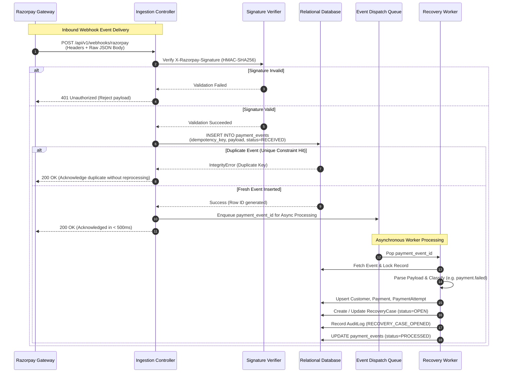

# Razorpay Integration Specification

## 1. Scope

This specification defines the technical integration contract between the **Razorpay Payment Gateway** and **RecoverIQ** (Autonomous AI Revenue Recovery Agent).

RecoverIQ depends on real-time, deterministic ingestion of payment lifecycle events to identify failed payments, calculate recovery probabilities, orchestrate AI-driven recovery actions, validate policy guardrails, and track recovery outcomes. This document details:

- Inbound webhook architecture, transport requirements, and timeout constraints.
- Cryptographic HMAC-SHA256 signature verification.
- Comprehensive catalog of relevant payment, subscription, order, and payment link events.
- Exhaustive payload mapping from Razorpay JSON structures to the canonical RecoverIQ data model.
- Retry schedules, duplicate delivery handling, and idempotency guarantees.
- Network and data security requirements (TLS, IP allowlisting, PII masking).
- Test mode and sandbox simulation strategies.
- End-to-end webhook ingestion sequence flow.

> **Phase Constraint Notice:** This document is an integration design specification only. No production integration code, database migrations, or external API clients are implemented in this phase.

---

## 2. Webhook Architecture

Razorpay utilizes an asynchronous, HTTP-based push notification system to deliver real-time state changes to merchant endpoints.

```
┌────────────────────────┐                    ┌─────────────────────────────────────────┐
│                        │   HTTPS POST Body  │  RecoverIQ Webhook Endpoint             │
│    Razorpay Gateway    ├───────────────────►│  /api/v1/webhooks/razorpay              │
│    Event Dispatcher    │   Headers + JSON   │                                         │
│                        │◄───────────────────┤  Returns HTTP 200 OK (< 1.0s)           │
└────────────────────────┘   HTTP 200 / Retry └─────────────────────────────────────────┘
```

### 2.1 Transport Protocol & Endpoint Requirements
- **Protocol**: HTTPS with TLS 1.2 or TLS 1.3 mandatory. Plain HTTP endpoints are rejected by Razorpay.
- **HTTP Method**: `POST` only.
- **Content-Type**: `application/json; charset=utf-8`.
- **Public Accessibility**: The webhook URL must be publicly accessible on the internet (or tunneled via secure proxy during local testing).

### 2.2 HTTP Headers Delivered by Razorpay

| Header Name | Type | Description |
| :--- | :--- | :--- |
| `X-Razorpay-Signature` | `string` | Hex-encoded HMAC-SHA256 signature generated over the raw request payload using the configured Webhook Secret. |
| `X-Razorpay-Event-Id` | `string` | Unique identifier generated by Razorpay for the specific webhook delivery attempt. |
| `Content-Type` | `string` | `application/json`. |
| `User-Agent` | `string` | Identifies the Razorpay webhook delivery agent. |

### 2.3 Response Status & Timeout Expectations
- **Immediate Acknowledgment**: The endpoint must return an **HTTP 200 OK** status code immediately upon verifying the cryptographic signature and persisting the raw event to the `payment_events` table.
- **Timeout Limit**: Razorpay enforces a strict **5.0-second timeout window**. Any connection timeout, DNS delay, or server execution exceeding 5.0 seconds is recorded as a delivery failure and queued for automatic retry.
- **Asynchronous Decoupling**: Business logic (case creation, ML scoring, AI decisions, customer communication) must **never** execute synchronously inside the webhook request lifecycle. Processing must be dispatched asynchronously to background workers.

---

## 3. Signature Verification

To ensure that incoming webhook payloads originate exclusively from Razorpay and have not been tampered with in transit, RecoverIQ must cryptographically verify the signature of every inbound request.

### 3.1 Cryptographic Algorithm & Inputs
- **Algorithm**: HMAC with SHA-256 (`HMAC-SHA256`).
- **Key**: The Webhook Secret string configured in the Razorpay Merchant Dashboard under *Account & Settings &rarr; Webhooks*.
- **Message**: The **raw, exact byte stream** of the HTTP request body.

```
Expected Signature = HexEncode( HMAC_SHA256( Key = Webhook_Secret, Message = Raw_Request_Body_Bytes ) )
```

### 3.2 Verification Rules & Pitfalls
1. **Raw Body Preservation**: The signature calculation must use the raw HTTP request body bytes before any JSON parsing, whitespace normalization, deserialization, or character set transformations. Parsing JSON into an object and re-serializing to a string alters key ordering and whitespace, causing signature mismatch.
2. **Constant-Time Comparison**: The computed signature must be compared against the `X-Razorpay-Signature` header using a constant-time comparison algorithm (e.g. `hmac.compare_digest` in Python) to prevent timing-attack side-channel vulnerabilities.
3. **Secret Rotation Support**: When rotating webhook secrets in the Razorpay Dashboard, the system must support a grace period where signatures are verified against the primary secret, with a fallback to the secondary (previous) secret for in-flight retried deliveries.

### 3.3 Pseudocode Specification

```python
import hashlib
import hmac

def verify_razorpay_webhook_signature(
    raw_body: bytes,
    received_signature: str,
    webhook_secret: str
) -> bool:
    """
    Cryptographically validates the Razorpay webhook signature.
    """
    if not received_signature or not webhook_secret:
        return False

    computed_signature = hmac.new(
        key=webhook_secret.encode("utf-8"),
        msg=raw_body,
        digestmod=hashlib.sha256
    ).hexdigest()

    return hmac.compare_digest(computed_signature, received_signature)
```

---

## 4. Relevant Events

Razorpay triggers webhooks across multiple business entities. RecoverIQ monitors payment, subscription, order, and payment link events to orchestrate the end-to-end recovery lifecycle.

### 4.1 Payment Failure Events (Primary Ingestion Triggers)

| Event Name | Trigger Condition | RecoverIQ Action |
| :--- | :--- | :--- |
| `payment.failed` | A payment attempt failed due to technical decline, card expiration, insufficient funds, user cancellation, or bank timeout. | **Primary Trigger**: Ingest payment attempt, record error telemetry, open/update `recovery_cases`, queue ML evaluation. |

### 4.2 Payment Success Events (Resolution Triggers)

| Event Name | Trigger Condition | RecoverIQ Action |
| :--- | :--- | :--- |
| `payment.captured` | Payment funds successfully authorized and captured by the acquiring gateway. | **Resolution Trigger**: Update payment status to `CAPTURED`, resolve active `recovery_cases` as `RECOVERED`, record recovered amount. |
| `payment.authorized` | Payment authorized by issuer (two-step capture flow). | Track pending capture; hold recovery escalation while authorization is valid. |
| `order.paid` | Razorpay Order transitioned to fully paid state. | Correlate order payments, update merchant subscription/order status. |

### 4.3 Subscription Lifecycle Events

| Event Name | Trigger Condition | RecoverIQ Action |
| :--- | :--- | :--- |
| `subscription.charged` | Recurring subscription billing cycle charged successfully. | Mark subscription `ACTIVE`, record successful payment, close any overdue recovery cases. |
| `subscription.pending` | Automatic recurring charge attempt failed; subscription entered grace period retries. | Create `recovery_cases` with stage `INITIAL_FAILURE`, track retry schedule. |
| `subscription.halted` | All automated gateway retries exhausted; subscription transitioned to halted state. | Escalate `recovery_cases` to `TERMINAL_RETRY` / `MANUAL_ESCALATION`, trigger alternative channel payment links. |
| `subscription.cancelled`| Subscription cancelled by merchant or customer. | Mark subscription `CANCELLED`, cancel pending scheduled recovery actions. |
| `subscription.paused`   | Subscription paused by merchant/customer. | Suppress automated dunning actions during paused window. |
| `subscription.resumed`  | Subscription resumed active status. | Re-enable monitoring and scheduled charge tracking. |

### 4.4 Payment Link Recovery Events

| Event Name | Trigger Condition | RecoverIQ Action |
| :--- | :--- | :--- |
| `payment_link.paid` | Customer completed payment via a RecoverIQ-generated recovery payment link. | Resolve recovery action as `SUCCESS`, transition recovery case to `RECOVERED`. |
| `payment_link.partially_paid` | Customer made a partial payment on the link. | Update `recovered_amount` on `recovery_cases`, adjust remaining `amount_at_risk`. |
| `payment_link.expired` | Payment link reached expiration deadline without payment. | Record action timeout in `action_results`, trigger next AI recovery decision. |
| `payment_link.cancelled` | Payment link cancelled by merchant or system. | Mark recovery action `CANCELLED`, evaluate alternative recovery path. |

---

## 5. Payment Payload Mapping

In Razorpay webhook payloads, the top-level structure wraps entities inside a `payload` dictionary. The following is the standard schema for a `payment.failed` event:

```json
{
  "entity": "event",
  "account_id": "acc_xxxxxxxxxxxxxx",
  "event": "payment.failed",
  "contains": ["payment"],
  "payload": {
    "payment": {
      "entity": {
        "id": "pay_O123456789abcd",
        "entity": "payment",
        "amount": 499900,
        "currency": "INR",
        "status": "failed",
        "order_id": "order_O123456789order",
        "invoice_id": "inv_O123456789inv",
        "international": false,
        "method": "card",
        "amount_refunded": 0,
        "refund_status": null,
        "captured": false,
        "description": "Subscription monthly charge",
        "card_id": "card_O123456789card",
        "card": {
          "id": "card_O123456789card",
          "entity": "card",
          "name": "Jane Doe",
          "last4": "1111",
          "network": "Visa",
          "type": "debit",
          "issuer": "HDFC",
          "international": false,
          "emi": false,
          "sub_type": "consumer",
          "token_id": "token_O123456789tok"
        },
        "bank": null,
        "wallet": null,
        "vpa": null,
        "email": "jane.doe@example.com",
        "contact": "+919876543210",
        "customer_id": "cust_O123456789cust",
        "token_id": "token_O123456789tok",
        "notes": {
          "merchant_customer_id": "usr_998822",
          "subscription_tier": "enterprise_monthly"
        },
        "fee": null,
        "tax": null,
        "error_code": "BAD_REQUEST_ERROR",
        "error_description": "Payment failed due to insufficient funds in the account.",
        "error_source": "bank",
        "error_step": "payment_authorization",
        "error_reason": "insufficient_funds",
        "created_at": 1724851200
      }
    }
  },
  "created_at": 1724851201
}
```

### 5.1 Granular Failure Diagnostics Fields

| Field Name | Type | Allowed / Typical Values | Meaning in Recovery Engine |
| :--- | :--- | :--- | :--- |
| `error_code` | `string` | `BAD_REQUEST_ERROR`, `GATEWAY_ERROR`, `SERVER_ERROR` | High-level failure classification. |
| `error_source` | `string` | `bank`, `customer`, `gateway`, `business` | Identifies whether the issue is technical, bank-side, or buyer-side. |
| `error_step` | `string` | `payment_initiation`, `payment_authentication`, `payment_authorization` | Pinpoints 3DS failure vs gateway timeout vs debit failure. |
| `error_reason` | `string` | `insufficient_funds`, `expired_card`, `invalid_card_details`, `card_inactive`, `payment_failed`, `issuer_down` | Primary feature for ML recovery model to select optimal retry channel and timing. |
| `error_description`| `string` | Human-readable explanation text | Stored for audit and operator display. |

---

## 6. Customer Mapping

Customer identity resolution correlates payment events to merchant customer profiles.

### 6.1 Available Customer Identifiers in Payload

| Payload Field | Availability | Description | RecoverIQ Transformation |
| :--- | :--- | :--- | :--- |
| `payload.payment.entity.customer_id` | Optional | Razorpay Customer ID (`cust_...`) | Mapped to `customers.razorpay_customer_id`. |
| `payload.payment.entity.notes.merchant_customer_id` | Optional | Merchant's internal user/customer ID passed in metadata notes | Mapped to `customers.external_customer_id`. |
| `payload.payment.entity.email` | Optional | Payer email address | **Masked** before storage &rarr; `customers.email_masked` (e.g. `j***e@example.com`). |
| `payload.payment.entity.contact` | Optional | Payer mobile phone number | **Masked** before storage &rarr; `customers.phone_masked` (e.g. `+91******3210`). |
| `payload.payment.entity.token_id` | Optional | Token ID for saved card/mandate | Stored in `payment_attempts.metadata` for recurring mandate reuse. |

### 6.2 Customer Resolution Hierarchy
1. **Primary Match**: Match by `payload.payment.entity.notes.merchant_customer_id` &rarr; `customers.external_customer_id`.
2. **Secondary Match**: Match by `payload.payment.entity.customer_id` &rarr; `customers.razorpay_customer_id`.
3. **Tertiary Match (Fallback)**: Match by exact normalized email/phone hash or create a new `Customer` record with `external_customer_id = customer_id ?? rzp_payment_id`.

---

## 7. Subscription Mapping

For recurring billing and SaaS billing recovery, Razorpay subscription events map directly to RecoverIQ's contract model:

### 7.1 Subscription Payload Structure

```json
{
  "entity": "event",
  "event": "subscription.halted",
  "payload": {
    "subscription": {
      "entity": {
        "id": "sub_O123456789sub",
        "entity": "subscription",
        "plan_id": "plan_O123456789plan",
        "customer_id": "cust_O123456789cust",
        "status": "halted",
        "current_start": 1724851200,
        "current_end": 1727529600,
        "ended_at": null,
        "quantity": 1,
        "notes": {
          "subscription_id": "sub_internal_445"
        },
        "charge_at": 1724851200,
        "start_at": 1722172800,
        "end_at": 1753708800,
        "total_count": 12,
        "paid_count": 3,
        "remaining_count": 9
      }
    },
    "payment": {
      "entity": {
        "id": "pay_O123456789fail",
        "amount": 499900,
        "status": "failed",
        "error_code": "BAD_REQUEST_ERROR",
        "error_reason": "insufficient_funds"
      }
    }
  }
}
```

### 7.2 Subscription Status Mapping

| Razorpay Subscription Status | RecoverIQ `SubscriptionStatus` | Operational Impact |
| :--- | :--- | :--- |
| `created` | `ACTIVE` | Initial state; awaiting first payment cycle. |
| `authenticated` | `ACTIVE` | Mandate approved; ready for recurring charges. |
| `active` | `ACTIVE` | Regular ongoing billing cycle. |
| `pending` | `PAST_DUE` | Charge failed; in automatic retry grace period. |
| `halted` | `HALTED` | Maximum automated retries exhausted; dunning required. |
| `cancelled` | `CANCELLED` | Contract terminated. |
| `completed` | `EXPIRED` | Final cycle completed. |
| `paused` | `PAUSED` | Billing temporarily suspended. |

---

## 8. Retry & Duplicate Delivery Behavior

### 8.1 Razorpay Webhook Retry Schedule
- **Trigger**: Any non-2xx HTTP status code (`4xx`, `5xx`), network timeout (> 5s), connection reset, or SSL handshake failure.
- **Retry Mechanism**: Progressive **exponential backoff policy**.
- **Retry Window**: Delivery attempts continue across a **24-hour period** from the original event timestamp.
- **Deactivation Threshold**: If the merchant server fails to return HTTP 200 consistently across the 24-hour window, Razorpay **automatically deactivates the webhook endpoint**.
- **Alert Notifications**: When a webhook is deactivated due to persistent delivery failure, Razorpay dispatches an alert email to the configured Webhook Alert Email address. Reactivation requires manual intervention via the Dashboard.

### 8.2 Duplicate Delivery Scenarios (At-Least-Once Delivery)
Because Razorpay guarantees *at-least-once* delivery, duplicate webhooks can occur due to:
1. Network packet delays causing Razorpay to time out and retry before the server's `200 OK` is acknowledged.
2. Gateway-side retry workers re-dispatching in-flight events.
3. Concurrent processing of related webhooks (e.g. `payment.failed` followed by `subscription.pending`).

### 8.3 Deduplication Implementation in RecoverIQ
RecoverIQ enforces idempotency at the database boundary:
1. **Primary Key / Unique Deduplication**: Every event is assigned an `idempotency_key`:
   ```
   idempotency_key = headers.get("X-Razorpay-Event-Id") or sha256(raw_payload_bytes)
   ```
2. **Database Constraint**: The `payment_events.idempotency_key` column is indexed with a `UNIQUE` constraint.
3. **Idempotent Ingestion Handler**:
   - If an insert to `payment_events` succeeds, acknowledge with `200 OK` and dispatch to asynchronous processing queue.
   - If an insert raises a unique constraint violation (`IntegrityError`), recognize the duplicate, log telemetry, and immediately return **`200 OK`** without re-executing downstream recovery logic.

---

## 9. Idempotency Strategy

### 9.1 Verification of Razorpay REST API Idempotency
Official Razorpay documentation confirms that **Razorpay does NOT support a generic `Idempotency-Key` or `X-Razorpay-Idempotency-Key` header across all REST endpoints**.

Specific APIs utilize dedicated custom headers:
- **Payouts API**: Mandatory `X-Payout-Idempotency` header.
- **Transfers API (Route)**: `X-Transfer-Idempotency` header.
- **Refunds API**: `X-Refund-Idempotency` header.
- **Bill Payments API**: `X-Bill-Payments-Idempotency` header.

### 9.2 Idempotency for Payment Links and Recovery Actions
- **Payment Link Creation (`POST /v1/payment_links`)**: Razorpay does **not** accept an idempotency HTTP header for standard payment links. Instead, merchants pass a `reference_id` parameter in the JSON payload to correlate with internal entities.
- **RecoverIQ Authoritative Safeguard**:
  - The RecoverIQ database-level `recovery_actions.action_idempotency_key` unique constraint serves as the **authoritative application safeguard against duplicate execution**.
  - A recovery action (e.g. sending a WhatsApp link or issuing a smart retry) cannot be dispatched twice because duplicate action creation is rejected by the database.
  - Where a downstream Razorpay operation supports an official idempotency header (e.g. issuing a compensatory refund), RecoverIQ supplies `recovery_actions.action_idempotency_key` in the respective header as defense-in-depth.

---

## 10. Security

### 10.1 Transport & Perimeter Security
- **TLS 1.2 / TLS 1.3**: All incoming webhook communication must be served over secure HTTPS.
- **Public IP Allowlisting**: Razorpay dispatches webhooks from designated egress IP addresses:
  - `3.140.215.0`
  - `3.136.42.4`
  - `18.224.88.246`
  
  *Security Note:* While network firewalls (e.g. AWS Security Groups, Cloudflare) may allowlist these IPs, **cryptographic HMAC signature verification remains the primary and mandatory security boundary**.

### 10.2 Payload Validation & Replay Attack Defense
- **Timestamp Tolerance**: Ingested events include `payload.payment.entity.created_at` (epoch timestamp). While initial webhooks arrive within seconds, retried deliveries arrive up to 24 hours later. RecoverIQ validates that incoming events are within the allowable 24-hour window and logs anomalous timestamp drifts.
- **Secret Protection**: Webhook secrets must be injected via environment variables (`RAZORPAY_WEBHOOK_SECRET`) and never hardcoded or checked into source control.

### 10.3 PII and Data Protection
- **Masking at Boundary**: In compliance with data privacy standards (PCI DSS, GDPR), customer email addresses and phone numbers are masked before persisting to relational columns (`customers.email_masked`, `customers.phone_masked`).
- **Raw Payload Access Control**: Raw JSON payloads stored in `payment_events.payload` are isolated to audited system roles and omitted from non-admin dashboard queries.

---

## 11. Test/Sandbox Strategy

Razorpay provides a dedicated Test Mode environment for simulating payment flows and webhook integrations without moving real funds.

### 11.1 Test Mode Credentials & Webhooks
- **API Keys**: Test keys use the prefix `rzp_test_...` paired with a test key secret.
- **Independent Webhooks**: Test Mode webhooks are configured independently from Live Mode webhooks in the Razorpay Dashboard, allowing distinct endpoints and secrets for staging environments.

### 11.2 Failure Simulation Cards & Test Vectors

| Simulation Scenario | Test Card / Input | Expected Razorpay Error Code / Reason | Expected RecoverIQ Behavior |
| :--- | :--- | :--- | :--- |
| **Insufficient Funds** | Standard Test Card with failure OTP `0000` | `BAD_REQUEST_ERROR` / `insufficient_funds` | Case Stage: `INITIAL_FAILURE`; ML recommends WhatsApp payment link with 12h delay. |
| **Expired Card** | Expired MM/YY Date | `BAD_REQUEST_ERROR` / `expired_card` | Case Stage: `INITIAL_FAILURE`; ML recommends payment link requesting updated card details. |
| **Issuer Bank Down** | Specific Bank Simulation Card | `GATEWAY_ERROR` / `issuer_down` | Policy Engine blocks immediate contact; schedules automated gateway retry in 2 hours. |
| **3DS Authentication Failure** | Cancel at OTP screen | `BAD_REQUEST_ERROR` / `payment_authentication_failed` | Case Stage: `INITIAL_FAILURE`; Send instant SMS/WhatsApp recovery reminder. |
| **Successful Recovery** | Valid Test Card with success OTP `1111` | `payment.captured` (Status: `captured`) | Case transitions to `RECOVERED`; updates recovered revenue metrics. |

### 11.3 Dashboard Webhook Simulation Tool
Razorpay provides a **"Send Test Webhook"** utility in the Developer Dashboard to send synthetic `payment.failed`, `payment.captured`, and `subscription.halted` events to test connectivity and signature parsing.

---

## 12. RecoverIQ → Razorpay Data Mapping

The following matrix defines the field-level transformation from Razorpay webhook payloads to RecoverIQ database models:

| Razorpay Webhook Field | RecoverIQ Entity.Field | Transformation / Handling | Required? |
| :--- | :--- | :--- | :--- |
| `headers["X-Razorpay-Event-Id"]` | `payment_events.idempotency_key` | Extracted directly from header; falls back to SHA256 of raw body | **Yes** |
| `event` (e.g. `payment.failed`) | `payment_events.event_type` | String copy | **Yes** |
| `payload.payment.entity.id` | `payment_attempts.razorpay_payment_id` | String copy (e.g. `pay_...`) | Optional |
| `payload.payment.entity.order_id` | `payments.razorpay_order_id` | String copy (e.g. `order_...`) | Optional |
| `payload.payment.entity.invoice_id`| `payments.razorpay_invoice_id` | String copy (e.g. `inv_...`) | Optional |
| `payload.payment.entity.amount` | `payments.amount` / `payment_attempts.amount` | Minor units (paise) stored as `BIGINT` | **Yes** |
| `payload.payment.entity.currency` | `payments.currency` | Uppercase 3-letter ISO code (e.g. `INR`) | **Yes** |
| `payload.payment.entity.status` | `payments.status` / `payment_attempts.status` | Map gateway status to RecoverIQ `PaymentStatus` | **Yes** |
| `payload.payment.entity.error_code`| `payment_attempts.error_code` | Direct copy (e.g. `BAD_REQUEST_ERROR`) | Optional |
| `payload.payment.entity.error_source`| `payment_attempts.error_source`| Direct copy (e.g. `bank`) | Optional |
| `payload.payment.entity.error_step`| `payment_attempts.error_step` | Direct copy (e.g. `payment_authorization`)| Optional |
| `payload.payment.entity.error_reason`| `payment_attempts.error_reason` / `recovery_cases.latest_failure_reason` | Canonical failure reason for ML feature store | Optional |
| `payload.payment.entity.error_description`| `payment_attempts.error_description` | Text copy | Optional |
| `payload.payment.entity.method` | `payment_attempts.payment_method` | String copy (`card`, `upi`, `netbanking`) | Optional |
| `payload.payment.entity.card.type`| `payment_attempts.payment_method_sub_type`| Subtype (`credit`, `debit`, `prepaid`) | Optional |
| `payload.payment.entity.customer_id`| `customers.razorpay_customer_id` | External provider key | Optional |
| `payload.payment.entity.notes.merchant_customer_id` | `customers.external_customer_id` | Merchant customer ID mapping | Optional |
| `payload.payment.entity.email` | `customers.email_masked` | Mask to `u***@domain.com` before persisting | Optional |
| `payload.payment.entity.contact`| `customers.phone_masked` | Mask to `+91******1234` before persisting | Optional |
| `payload.subscription.entity.id`| `subscriptions.razorpay_subscription_id` | External provider key | Optional |
| `payload.subscription.entity.status`| `subscriptions.status` | Map subscription status enum | Optional |
| `payload.payment.entity.created_at`| `payment_attempts.initiated_at` | Convert Unix epoch seconds to UTC timestamp | **Yes** |

---

## 13. Proposed Webhook Processing Flow

The following Mermaid sequence diagram illustrates the lifecycle of an incoming Razorpay webhook through RecoverIQ:



---

## 14. Open Questions & Architectural Risks

### 14.1 Technical Considerations
1. **Customer Identity Linking**: When an inbound `payment.failed` webhook does not include `notes.merchant_customer_id` and has an empty `customer_id`, how should RecoverIQ link the payment to an existing merchant customer?
   *Proposed Strategy:* Resolve via masked email/contact hash matching against existing `Customer` records; if unmatched, create an unlinked provisional customer profile pending merchant reconciliation.
2. **Delayed Webhook Delivery**: During major gateway degradation events, Razorpay webhook retries may deliver failure events hours after the initial attempt.
   *Proposed Strategy:* Compare `created_at` in payload with current UTC time. If payment status was already updated to `captured` via a subsequent event or direct status poll, ignore stale failure signals.
3. **Partial Invoices & Multi-Attempt Correlation**: Subscriptions can generate multiple attempts for a single invoice.
   *Proposed Strategy:* Ensure all `PaymentAttempt` records reference the canonical `Payment` entity via `payment_id` and unique `attempt_number` sequence.

---

## 15. Reference Documentation

- **Research Date**: August 28, 2026
- **Razorpay API Version**: REST API v1
- **Official Documentation References**:
  - [Razorpay Webhooks Overview](https://razorpay.com/docs/webhooks/)
  - [Razorpay Webhook Signature Verification](https://razorpay.com/docs/webhooks/validate-test/)
  - [Razorpay Webhook Events Catalog](https://razorpay.com/docs/webhooks/payloads/)
  - [Razorpay Payments Entity Reference](https://razorpay.com/docs/api/payments/)
  - [Razorpay Subscriptions Lifecycle Webhooks](https://razorpay.com/docs/api/subscriptions/#subscription-events)
  - [Razorpay Payment Links Webhooks](https://razorpay.com/docs/api/payment-links/#payment-link-events)
  - [Razorpay IP Allowlisting & Security](https://razorpay.com/docs/security/whitelists/)
  - [Razorpay Idempotency Guidelines](https://razorpay.com/docs/api/idempotency/)
