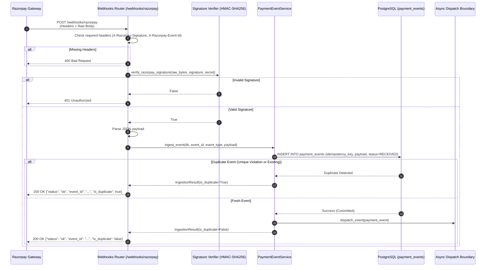

# Razorpay Webhook Ingestion Implementation

## 1. Overview

This document details the implementation of the **Razorpay Webhook Ingestion Layer** in RecoverIQ (Phase 3B). The ingestion endpoint receives raw HTTP POST events from the Razorpay Payment Gateway, cryptographically authenticates them via HMAC-SHA256, deduplicates requests using database-backed uniqueness constraints, persists the raw event to `payment_events`, and dispatches the event to the asynchronous processing boundary.

---

## 2. Endpoint Specification

- **Path**: `POST /webhooks/razorpay`
- **Controller Module**: [`backend/app/webhooks/razorpay.py`](file:///d:/MEDIFLOW/RecoverIQ/backend/app/webhooks/razorpay.py)
- **Service Abstraction**: [`backend/app/services/payment_event_service.py`](file:///d:/MEDIFLOW/RecoverIQ/backend/app/services/payment_event_service.py)
- **Protocol**: HTTPS POST
- **Payload Format**: `application/json`

### HTTP Headers

| Header | Requirement | Description |
| :--- | :--- | :--- |
| `X-Razorpay-Signature` | **Required** | Hex-encoded HMAC-SHA256 signature generated over raw request body. |
| `X-Razorpay-Event-Id` | **Required** | Unique event delivery identifier generated by Razorpay. |
| `Content-Type` | **Required** | `application/json` |

---

## 3. Cryptographic Signature Verification

Signature verification is performed strictly over the **raw request bytes** prior to any JSON parsing or normalization:

```
computed_signature = hmac.new(
    key=secret.encode("utf-8"),
    msg=raw_body_bytes,
    digestmod=hashlib.sha256
).hexdigest()
```

- Constant-time verification is enforced using `hmac.compare_digest(computed, signature)`.
- If the signature is missing &rarr; **HTTP 400 Bad Request**.
- If the signature is invalid &rarr; **HTTP 401 Unauthorized**.
- If the server webhook secret is unconfigured &rarr; **HTTP 500 Internal Server Error**.

---

## 4. Idempotency & Database Interaction

RecoverIQ guarantees idempotency using the relational database as the single source of truth:

1. **Unique Constraint**: The `payment_events.idempotency_key` column is unique (`uq_payment_events_idempotency_key`).
2. **Optimistic Fast-Path Lookup**: The service checks if `idempotency_key == X-Razorpay-Event-Id` exists. If found, it logs `duplicate_event` and immediately returns **HTTP 200 OK** (`is_duplicate: true`).
3. **Race Condition Handling**: If two identical webhook deliveries race concurrently and bypass the initial lookup, one transaction succeeds while the other encounters an `IntegrityError`. The transaction rolls back, fetches the existing record, logs the conflict, and returns **HTTP 200 OK**.
4. **State Machine**: Fresh events are recorded with `processing_status = 'RECEIVED'`.

---

## 5. Security & Observability

- **No Secret Leaks**: Webhook secrets, API keys, and authorization headers are never logged or exposed in HTTP responses.
- **PII Protection**: Customer phone numbers and emails are masked before long-term relational indexing.
- **Structured Logs**:
  - `webhook_received`: Emitted upon receiving payload with event ID and byte size.
  - `signature_verified`: Emitted upon successful cryptographic validation.
  - `event_persisted`: Emitted upon successful DB commit.
  - `duplicate_event`: Emitted when an existing event ID is deduplicated.
  - `processing_dispatch_requested`: Emitted when event is handed to the async boundary.
  - `invalid_signature`: Emitted on signature mismatch.

---

## 6. Mermaid Ingestion Sequence Flow



---

## 7. Local Development & Testing Instructions

### Sending a Test Webhook Locally

You can send a signed test webhook to your local RecoverIQ instance using Python:

```python
import hashlib
import hmac
import json
import requests

WEBHOOK_URL = "http://localhost:8000/webhooks/razorpay"
WEBHOOK_SECRET = "your_local_webhook_secret"
EVENT_ID = "evt_local_test_001"

payload = {
    "entity": "event",
    "event": "payment.failed",
    "payload": {
        "payment": {
            "entity": {
                "id": "pay_test_001",
                "amount": 499900,
                "currency": "INR",
                "status": "failed",
                "error_code": "BAD_REQUEST_ERROR",
                "error_reason": "insufficient_funds",
            }
        }
    },
}

raw_bytes = json.dumps(payload).encode("utf-8")
signature = hmac.new(
    key=WEBHOOK_SECRET.encode("utf-8"),
    msg=raw_bytes,
    digestmod=hashlib.sha256,
).hexdigest()

headers = {
    "X-Razorpay-Signature": signature,
    "X-Razorpay-Event-Id": EVENT_ID,
    "Content-Type": "application/json",
}

response = requests.post(WEBHOOK_URL, data=raw_bytes, headers=headers)
print("Status Code:", response.status_code)
print("Response JSON:", response.json())
```

### Running Automated Test Suite

```powershell
cd backend
pytest tests/test_webhooks.py -v
```
