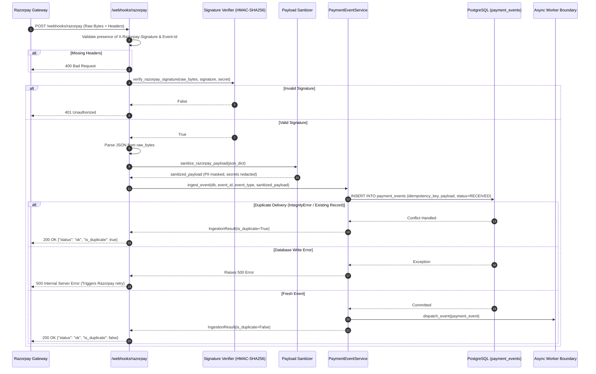

# Razorpay Webhook Ingestion Implementation

## 1. Overview & Architecture

This document details the hardened implementation of the **Razorpay Webhook Ingestion Layer** in RecoverIQ (Phase 3B/3C). The ingestion endpoint receives raw HTTP POST events from the Razorpay Payment Gateway, cryptographically authenticates them via HMAC-SHA256, deduplicates requests using database-backed uniqueness constraints, deterministically sanitizes payload data to minimize PII, persists raw events to `payment_events`, and dispatches to the asynchronous processing boundary.

---

## 2. Endpoint Specification

- **Path**: `POST /webhooks/razorpay`
- **Controller Module**: [`backend/app/webhooks/razorpay.py`](file:///d:/MEDIFLOW/RecoverIQ/backend/app/webhooks/razorpay.py)
- **Sanitizer Module**: [`backend/app/webhooks/sanitizer.py`](file:///d:/MEDIFLOW/RecoverIQ/backend/app/webhooks/sanitizer.py)
- **Service Abstraction**: [`backend/app/services/payment_event_service.py`](file:///d:/MEDIFLOW/RecoverIQ/backend/app/services/payment_event_service.py)
- **Protocol**: HTTPS POST
- **Payload Format**: `application/json`

### HTTP Headers

| Header | Requirement | Description |
| :--- | :--- | :--- |
| `X-Razorpay-Signature` | **Required** | Hex-encoded HMAC-SHA256 signature generated over raw request body. |
| `X-Razorpay-Event-Id` | **Required** | Unique event delivery identifier generated by Razorpay. |
| `Content-Type` | **Required** | `application/json` |

---

## 3. Data Safety, PII Minimization & Payload Retention Policy

### 3.1 Payload Retention Policy
- `payment_events.payload` stores an audit-compliant, sanitized representation of the Razorpay event JSON.
- Raw HTTP request body bytes are used **only in memory** for signature verification and are never persisted in plain unmasked form.
- The stored payload preserves all identifiers, error codes, and state metrics needed for ML and recovery orchestration while strictly stripping secrets and masking PII.

### 3.2 PII Minimization & Sanitization Rules
1. **Email Masking**: Customer emails are masked to `u***@domain.com` (e.g. `john.doe@example.com` &rarr; `j***e@example.com`).
2. **Phone Number Masking**: Mobile numbers are masked, keeping country code and the last 4 digits (e.g. `+919876543210` &rarr; `+91******3210`).
3. **Cardholder Name Masking**: Cardholder names in `payment.entity.card.name` are masked to initials (`Jane Doe` &rarr; `J***e`).
4. **Secret Stripping & Redaction**: Any secret-like keys in metadata or notes (including `cvv`, `pin`, `password`, `secret`, `webhook_secret`, `key_secret`, `auth_token`, `access_token`, `otp`, `card_number`, `pan`) are replaced with `"[REDACTED]"`.
5. **Preserved Telemetry**: Critical non-sensitive telemetry fields are completely preserved:
   - `id`, `amount`, `currency`, `status`, `order_id`, `invoice_id`, `method`
   - `error_code`, `error_source`, `error_step`, `error_reason`, `error_description`
   - `card.network`, `card.type`, `card.issuer`, `card.last4`, `card.token_id`
   - `subscription.id`, `subscription.plan_id`, `subscription.status`, `subscription.charge_at`

---

## 4. Processing Lifecycle: Raw Body vs Stored Payload

A strict boundary is maintained between cryptographic authentication and data persistence:

```
RAW REQUEST BODY BYTES
        ↓
SIGNATURE VERIFICATION (HMAC-SHA256 on Raw Bytes)
        ↓
JSON PARSING (json.loads(raw_body))
        ↓
DETERMINISTIC SANITIZATION (sanitize_razorpay_payload)
        ↓
PERSIST TO DATABASE (payment_events.payload)
        ↓
ASYNC DISPATCH (payment_event_service.dispatch_event)
```

> **Security Mandate**: Signature verification **never** runs on sanitized or re-serialized JSON. Verification executes strictly on the immutable incoming byte stream.

---

## 5. Idempotency & Concurrency Semantics

RecoverIQ relies on the relational database as the single authoritative source of truth:

1. **Database Uniqueness**: `payment_events.idempotency_key` and `payment_events.razorpay_event_id` have `UNIQUE` constraints.
2. **Concurrent Request Handling**:
   ```
   Request A ──┐
               ├── Same Event ID ──► DB Unique Check ──► 1 DB Row, 1 Dispatch, 2x HTTP 200
   Request B ──┘
   ```
   - Request A inserts the row and calls `dispatch_event()`.
   - Request B catches `IntegrityError`, rolls back, retrieves the existing row, logs `duplicate_event`, and skips dispatch.
   - Both requests return **HTTP 200 OK** (`{"status": "ok", "event_id": "...", "is_duplicate": bool}`).

---

## 6. Database Failure Behavior & Error Handling

- **No False 200s**: If a database connection error, transaction crash, or write failure occurs during insertion, the transaction rolls back cleanly and raises an `HTTP 500 Internal Server Error`.
- **Razorpay Retry Engagement**: Returning HTTP 500 ensures that Razorpay's 24-hour exponential retry policy will re-deliver the event once database connectivity is restored.
- **Duplicate Safety**: Already successfully persisted duplicates continue returning **HTTP 200 OK**.

---

## 7. Future Worker & Queue Boundary

In the current phase, `payment_event_service.dispatch_event()` acts as a minimal logging abstraction representing the future async worker queue boundary.

- In Phase 4, `dispatch_event()` will enqueue the `payment_event_id` into a background worker queue (e.g. Redis/Celery/ARQ/background worker).
- Events are persisted with `processing_status = 'RECEIVED'` before dispatch. If a background worker fails or crashes during dispatch, a periodic reconciliation cron will poll unhandled events in `RECEIVED` status and re-queue them.

---

## 8. Mermaid Sequence Flow



---

## 9. Local Development & Testing

### Running Tests

```powershell
cd backend
pytest tests/test_webhooks.py -v
```
