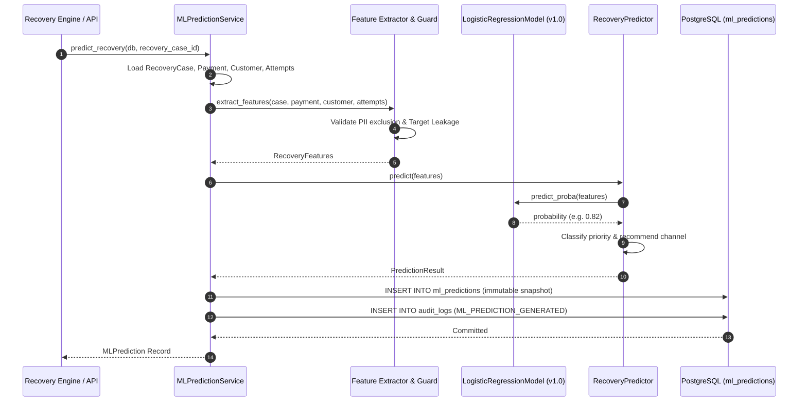
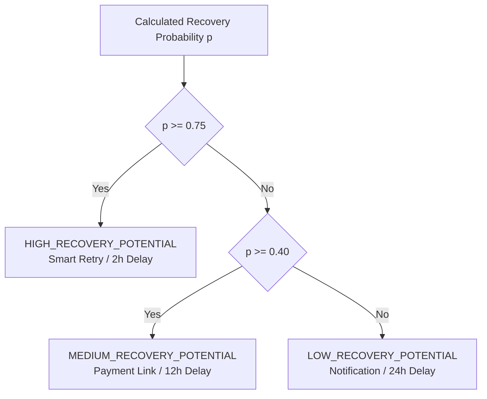

# ML Recovery Prediction Engine (Phase 5)

## 1. Overview & Purpose

The **ML Recovery Prediction Engine** provides deterministic, calibrated scoring of the probability that a failed transaction in an active `RecoveryCase` can be successfully recovered.

The engine produces:
1. `recovery_probability`: Continuous likelihood in `[0.0, 1.0]`.
2. `risk_score`: Inversion metric `(1.0 - recovery_probability)`.
3. `confidence`: Statistical reliability score based on telemetry density.
4. `priority`: Deterministic classification (`HIGH_RECOVERY_POTENTIAL`, `MEDIUM_RECOVERY_POTENTIAL`, `LOW_RECOVERY_POTENTIAL`).
5. `predicted_channel` & `predicted_delay_hours`: Recommended recovery channel and timing.

Crucially:
- **No Direct Action Execution**: Predictions inform decisions but do not initiate retries, payment links, or refunds.
- **No Target Leakage**: Features reflect only historical and transactional telemetry available *before* recovery outcomes.
- **Immutable Append-Only Records**: Every inference run writes a new row to `ml_predictions` without modifying historical scores.

---

## 2. Architecture & Data Flow

---

## 3. Features & Data Governance

### 3.1 Features Used
| Feature | Type | Source | Description |
| :--- | :--- | :--- | :--- |
| `payment_amount` | Integer | `Payment.amount` | Amount in minor currency units (paise). |
| `currency` | String | `Payment.currency` | ISO currency code (e.g. `INR`). |
| `attempt_number` | Integer | `PaymentAttempt` | Current sequential attempt number. |
| `customer_total_payments` | Integer | `Customer` | Total historical payment count. |
| `customer_successful_payments`| Integer | `Customer` | Historical successful payment count. |
| `customer_failed_payments` | Integer | `Customer` | Historical failed payment count. |
| `customer_success_rate` | Float | Calculated | Historical payment success ratio (defaults to `0.50` for new customers). |
| `error_code` | String | `PaymentAttempt` | Gateway error code (e.g. `BAD_REQUEST_ERROR`). |
| `error_source` | String | `PaymentAttempt` | Error origin (`bank`, `customer`, `gateway`). |
| `error_step` | String | `PaymentAttempt` | Step where failure occurred (`payment_authorization`, `otp`). |
| `error_reason` | String | `PaymentAttempt` | Specific reason code (e.g. `insufficient_funds`). |
| `hours_since_failure` | Float | Calculated | Elapsed hours between case `opened_at` and prediction time. |
| `subscription_age_days` | Integer | `Subscription` | Days since subscription origination (or `0` for one-off payments). |
| `total_attempts_count` | Integer | `RecoveryCase` | Total attempt count on active recovery case. |

### 3.2 Features Explicitly Excluded (Leakage & PII Policy)
- **Target Leakage Exclusions**:
  - `RecoveryCase.recovered_amount`
  - `RecoveryCase.status` (terminal states: `RECOVERED`, `EXHAUSTED`, `CLOSED`)
  - `RecoveryCase.resolved_at`
  - `RecoveryCase.closed_reason`
  - Future payment attempts and future action results
- **PII Exclusions**:
  - Raw email addresses, contact numbers, customer names, card numbers, CVVs, PINs, tokens, and gateway API secrets.

---

## 4. Model Architecture & Scoring

### 4.1 Calibrated Logistic Regression Model (`v1.0`)

The baseline model computes a logit score $z$:

$$z = \beta_0 + \sum_{i=1}^n \beta_i x_i$$

Recovery probability $p$ is evaluated using the standard sigmoid function:

$$p = \sigma(z) = \frac{1}{1 + e^{-z}}$$

#### Feature Weights Breakdown:
- **Customer Success Rate** ($\beta = +2.10$): Established reliable payers exhibit higher recovery rates.
- **Customer Failed Payments** ($\beta = -0.30$): Chronic failures penalize probability.
- **Attempt Number & Total Attempts** ($\beta = -0.65, -0.40$): Higher attempt sequences reduce marginal likelihood.
- **Error Reason Taxonomy**:
  - Soft / Transient (`insufficient_funds`, `network_timeout`, `bank_technical_error`): $+0.85$ to $+1.10$.
  - User Friction (`payment_authentication`, `otp_timeout`): $+0.20$ to $+0.35$.
  - Hard / Permanent (`card_inactive`, `card_blocked`, `account_closed`): $-2.10$ to $-3.00$.
- **Temporal Decay** ($\beta = -0.015 / \text{hour}$): Recovery odds diminish as hours elapse.
- **Subscription Tenure** ($\beta = +0.35$): Long-term active subscribers have higher recovery intent.

---

## 5. Deterministic Priority Classification

---

## 6. Training & Evaluation Utilities

[`backend/app/ml/training.py`](file:///d:/MEDIFLOW/RecoverIQ/backend/app/ml/training.py) provides offline evaluation tools:

- **Accuracy, Precision, Recall, F1 Score**
- **ROC-AUC** (Rank-sum formulation)
- **PR-AUC** (Trapezoidal precision-recall integration)
- **Brier Score** (Mean squared calibration error)
- **Confusion Matrix** (`TP`, `FP`, `TN`, `FN`)
- **Synthetic Development Generator**: Generates representative development datasets for offline calibration. *(Note: Synthetic metrics are for testing only and do not represent production empirical performance).*

---

## 7. Model Versioning & Persistence

- Every prediction is persisted in the relational database:
  - Table: `ml_predictions`
  - Model Name: `recovery_probability`
  - Model Version: `v1.0`
  - Column `feature_vector_snapshot`: Stores a frozen JSON copy of inputs, risk score, confidence, and priority for full auditability.
- Multiple evaluations of the same `RecoveryCase` generate separate immutable records, maintaining a historical timeline of recovery potential changes across retry attempts.
