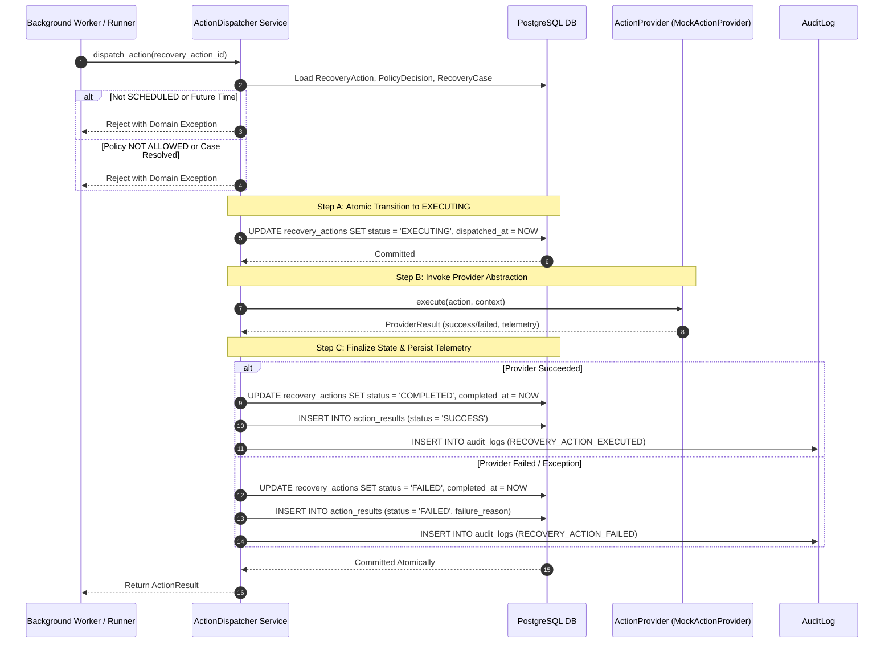
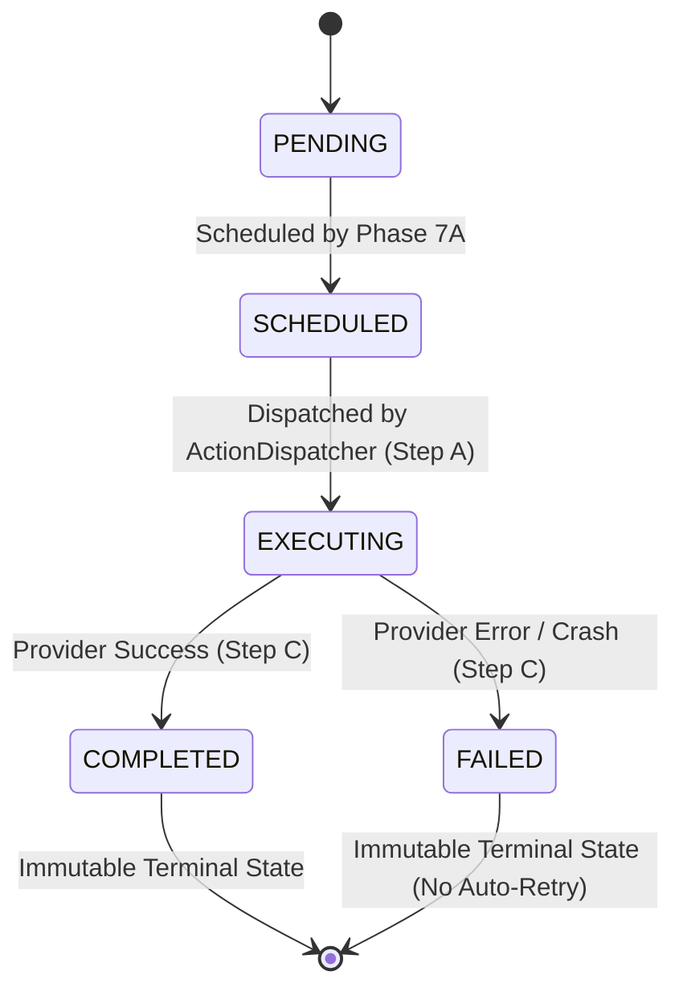

# Phase 7B — Deterministic Action Dispatcher Implementation

## 1. Executive Summary & Objective

The **Deterministic Action Dispatcher** orchestrates the execution of scheduled recovery actions. Positioned downstream from the Recovery Action Scheduler (Phase 7A), the Dispatcher validates execution prerequisites, locks scheduled actions into the `EXECUTING` state, delegates side-effect operations to an abstract `ActionProvider`, and captures immutable execution telemetry in `action_results` and `audit_logs`.

### Core Architectural Invariants
1. **Prerequisite Gating**: An action is executed **if and only if** `status == 'SCHEDULED'` and `scheduled_for <= current UTC time`.
2. **Strict Policy Compliance**: Dispatches only actions backed by `ALLOWED` `PolicyDecision` records on active, non-terminal `RecoveryCase` records.
3. **Zero Direct Financial Movement in Phase 7B**: Execution is performed via the `ActionProvider` abstraction (with `MockActionProvider` for testing/simulation).
4. **Non-Mutating Scope**: The Dispatcher never alters `Payment.status` or `RecoveryCase.status`.
5. **No Automatic Retries**: A `FAILED` action remains `FAILED` in Phase 7B to prevent uncontrolled payment retry loops.

---

## 2. Architecture & Data Flow



---

## 3. Action Lifecycle State Machine



---

## 4. Provider Abstraction & Mock Provider

### 4.1 `ActionProvider` Protocol
Defined in [`backend/app/providers/base.py`](file:///d:/MEDIFLOW/RecoverIQ/backend/app/providers/base.py):
```python
class ActionProvider(Protocol):
    def execute(
        self,
        action: RecoveryAction,
        context: dict[str, Any] | None = None,
    ) -> ProviderResult: ...
```

### 4.2 `MockActionProvider`
Defined in [`backend/app/providers/mock.py`](file:///d:/MEDIFLOW/RecoverIQ/backend/app/providers/mock.py):
- Deterministic simulation of `RETRY_PAYMENT`, `SEND_PAYMENT_LINK`, `SEND_NOTIFICATION`, `ESCALATE_HUMAN`, and `HALT_SUBSCRIPTION`.
- Rejects sensitive payload parameters (`email`, `phone`, `card_number`, `secret`, `api_key`).
- Configurable hooks (`force_failure`, `force_exception`) for testing error branches.

---

## 5. Concurrency, Idempotency & Transaction Strategy

### 5.1 Two-Phase Transaction Boundaries
1. **Phase 1 (Locking)**: Updates `RecoveryAction.status = 'EXECUTING'` and commits immediately. This ensures that another concurrent worker querying `status == 'SCHEDULED'` will see the change and not duplicate execution.
2. **Phase 2 (External Call)**: Calls `provider.execute(action)`.
3. **Phase 3 (Finalization)**: Persists `ActionResult`, updates `RecoveryAction.status = 'COMPLETED' | 'FAILED'`, and writes `AuditLog` in a single atomic transaction.

### 5.2 Idempotent Re-dispatch
If `dispatch_action()` is called on an action that is already `COMPLETED` or `FAILED`, the Dispatcher queries and returns the latest existing `ActionResult` without making any provider calls.

---

## 6. Known Distributed Execution Risks

> [!WARNING]
> **External Side-Effect Isolation**: In a distributed deployment, if a worker process crashes after calling the external payment gateway but before Step C commits to the database, the action remains in `EXECUTING`.
> - Such orphaned actions must be resolved via reconciliation/recheck webhooks (Phase 3) or background audit sweep rather than blind re-dispatch.
> - Exactly-once execution in distributed systems cannot be guaranteed solely by local database locks; payment gateway idempotency keys are strictly required when live APIs are integrated in Phase 7C.
