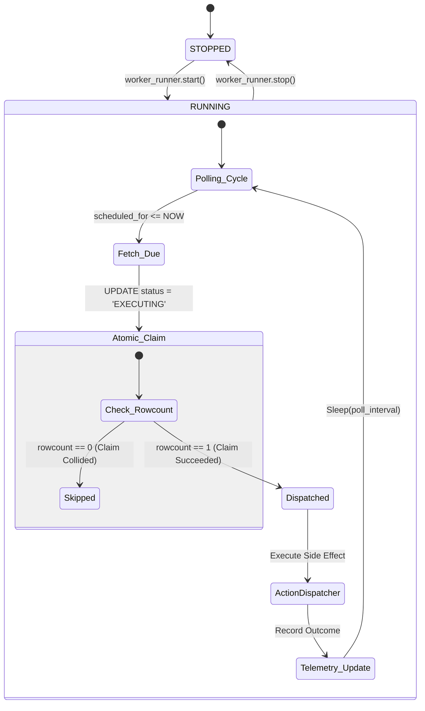
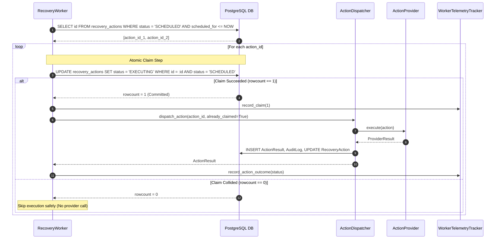

# Phase 8B — Background Worker Engine & Polling Architecture

## 1. Executive Summary & Objective

**Phase 8B** implements the background worker infrastructure for RecoverIQ. It continuously polls due scheduled recovery actions, executes atomic database-level claims to prevent multi-worker concurrency collisions, delegates side-effect dispatches to the `ActionDispatcher` pipeline, periodically reconciles stale `EXECUTING` actions, isolates individual failures, and exposes thread-safe telemetry metrics.

---

## 2. Architecture & Pipeline

```
                       [WorkerRunner]
                             │
            ┌────────────────┴────────────────┐
            ▼                                 ▼
   [RecoveryWorker]                [ReconciliationWorker]
   (Every 10s default)             (Every 300s default)
            │                                 │
   1. Fetch Due Action IDs          1. Query EXECUTING > 15m
      WHERE status = 'SCHEDULED'       dispatched_at <= cutoff
      AND scheduled_for <= NOW                │
            │                       2. Query External Gateway
   2. Atomic Claim Transition          (Reconciliation GET)
      UPDATE recovery_actions                 │
      SET status = 'EXECUTING'      3. Update COMPLETED / FAILED / Defer
      WHERE id = :id                          │
      AND status = 'SCHEDULED'                ▼
            │                         ActionResult + AuditLog
   3. ActionDispatcher
      .dispatch_action()
            │
            ▼
   ProviderFactory → Provider
            │
            ▼
   ActionResult + AuditLog
```

---

## 3. Worker Lifecycle & State Machine



---

## 4. Atomic Claiming Strategy

To guarantee that multiple background workers or processes never dispatch the same `RecoveryAction` concurrently, the worker utilizes an atomic single-statement update:

```sql
UPDATE recovery_actions
SET status = 'EXECUTING',
    dispatched_at = :now_utc
WHERE id = :action_id
  AND status = 'SCHEDULED';
```

- **`rowcount == 1`**: The current worker successfully claimed the exclusive execution lock.
- **`rowcount == 0`**: Another worker claimed the record or its state transitioned out-of-band. The worker immediately skips execution without invoking external providers.

---

## 5. Sequence Diagram: Polling, Claiming & Execution



---

## 6. Failure Isolation & Crash Resilience

1. **Per-Action Try/Except Boundary**: If provider execution throws an unhandled exception on Action A, `RecoveryWorker` logs the sanitized error, records telemetry, and continues seamlessly to Action B.
2. **Crash Before Result Commit**: If the process crashes while an action is in `EXECUTING`, `ReconciliationWorker` scans for actions older than `action_reconciliation_timeout_minutes` (15m default) and resolves the true external state from Razorpay without duplicate charges.
3. **Zero Open Transactions**: Each claim and dispatch operates within strict transactional boundaries with guaranteed commits/rollbacks in `finally` blocks.

---

## 7. Telemetry & Health Monitoring

The worker state is exposed via the API at `GET /health/worker`:
```json
{
  "status": "ok",
  "service": "recoveriq-worker",
  "metrics": {
    "worker_status": "RUNNING",
    "started_at": "2026-08-29T09:40:00Z",
    "last_poll_at": "2026-08-29T09:40:10Z",
    "last_reconciliation_at": "2026-08-29T09:35:00Z",
    "actions_claimed": 42,
    "actions_completed": 38,
    "actions_failed": 2,
    "actions_timed_out": 2,
    "reconciliation_runs": 8,
    "queue_depth": 0
  }
}
```
**Zero-PII / Zero-Secrets Invariant**: Telemetry structures never capture customer names, emails, card PANs, CVVs, or gateway API keys.

---

## 8. Production Deployment Considerations

In containerized production (Docker / Kubernetes):
1. **Runner Process**: Run `python -m app.workers.runner` or invoke `worker_runner.run_polling_loop()` as a dedicated daemon container.
2. **Scaling**: Multiple worker replicas can safely run against the same PostgreSQL database due to atomic claim row locking.
3. **Graceful Shutdown**: The runner traps `SIGTERM`/`SIGINT`, cancels sleeping poll tasks, and allows in-flight HTTP requests to complete before process exit.
