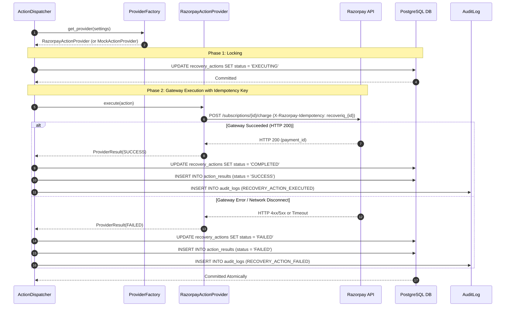
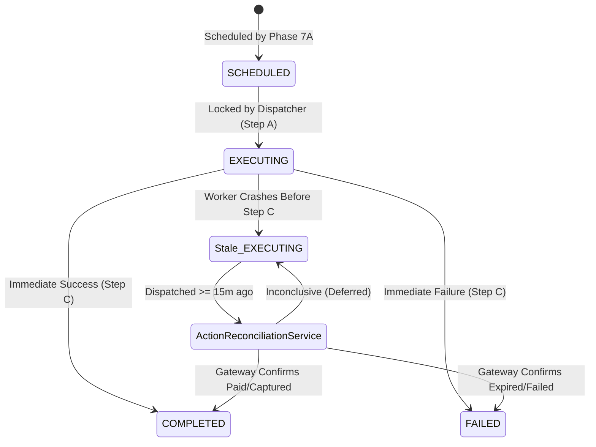

# Phase 7C — Production Provider Integration & Reconciliation

## 1. Executive Summary & Objective

**Phase 7C** introduces the production gateway adapter (`RazorpayActionProvider`), factory routing (`ProviderFactory`), governance controls (`allow_live_financial_actions`), and the background crash-recovery service (`ActionReconciliationService`).

### Architectural Pipeline
```
Agent (Advisory)
      ↓
Policy Engine (Authoritative)
      ↓
RecoveryActionScheduler (Gated on ALLOWED)
      ↓
ActionDispatcher (Two-phase state locking)
      ↓
ProviderFactory (Mock / Razorpay)
      ↓
External Gateway / Reconciler
```

---

## 2. Sequence Diagram: Action Dispatch & Gateway Execution



---

## 3. Reconciliation & Crash Recovery State Machine



---

## 4. Key Components & Implementation Details

### 4.1 Provider Factory (`ProviderFactory`)
- Located in [`backend/app/providers/factory.py`](file:///d:/MEDIFLOW/RecoverIQ/backend/app/providers/factory.py).
- Resolves `recovery_provider == "mock"` &rarr; `MockActionProvider`.
- Resolves `recovery_provider == "razorpay"` &rarr; `RazorpayActionProvider`.
- **Fails Closed**: Raises `LiveActionsDisabledError` if `allow_live_financial_actions` is `False`. Raises `ProviderConfigurationError` if API credentials are missing.

### 4.2 Gateway Idempotency Strategy
- **Deterministic Key Format**:
  ```python
  gateway_idempotency_key = f"recoveriq_{action.id}"
  ```
- Passed via `X-Razorpay-Idempotency` header for charges and orders, and `reference_id` for payment links.
- Guarantees that retries or network replays concerning the same action never create duplicate external charges.

### 4.3 Action Reconciliation Service (`ActionReconciliationService`)
- Located in [`backend/app/services/action_reconciliation.py`](file:///d:/MEDIFLOW/RecoverIQ/backend/app/services/action_reconciliation.py).
- **Threshold Gating**: Ignores recently dispatched actions; only evaluates actions in `EXECUTING` state where `dispatched_at <= now_utc - 15 minutes`.
- **Query Resolution**: Queries Razorpay API to inspect whether the charge or payment link was fulfilled.
- **Idempotency**: Reconciled actions transition to `COMPLETED` or `FAILED`, eliminating them from future reconciliation sweeps.

---

## 5. Security & Isolation Boundaries

1. **Default Disabled Governance**: `ALLOW_LIVE_FINANCIAL_ACTIONS` defaults to `False`. Test and development runs will never trigger live money movement.
2. **Credential Scrubbing**: Authorization headers, API keys, and secret tokens are stripped from `ProviderResult` telemetry and `AuditLog` metadata.
3. **Status Non-Mutation**: The provider and reconciler never alter `Payment.status` or `RecoveryCase.status` directly.

---

## 6. Production Deployment Requirements

To enable live Razorpay payment operations in production:
1. Configure environment variables:
   ```env
   RECOVERY_PROVIDER=razorpay
   ALLOW_LIVE_FINANCIAL_ACTIONS=true
   RAZORPAY_KEY_ID=rzp_live_...
   RAZORPAY_KEY_SECRET=...
   RAZORPAY_WEBHOOK_SECRET=...
   RAZORPAY_TIMEOUT_SECONDS=10.0
   ACTION_RECONCILIATION_TIMEOUT_MINUTES=15
   ```
2. Schedule a recurring cron/worker task to invoke `action_reconciliation_service.reconcile_stale_actions(db)` every 5–15 minutes.
