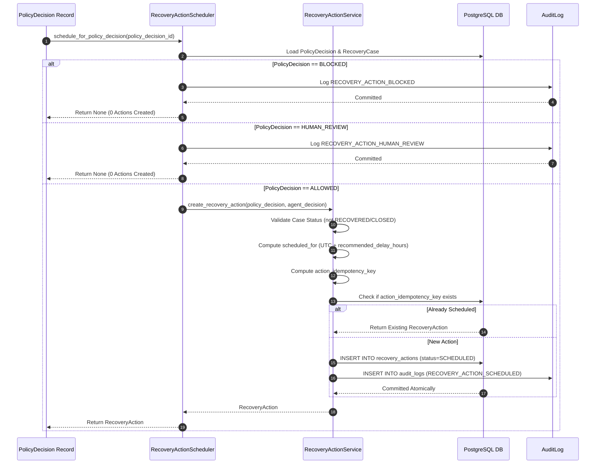

# Phase 7A — Recovery Action Scheduling Engine Implementation

## 1. Executive Summary & Objective

The **Recovery Action Scheduling Engine** bridges the gap between policy validation (Phase 6C) and asynchronous action execution (Phase 7B). It inspects evaluated `PolicyDecision` records, verifies case actionability, calculates delay offsets, generates deterministic idempotency keys, and persists immutable `RecoveryAction(status=SCHEDULED)` records alongside audit logs.

### Core Architectural Invariants
1. **Strict Policy Dependency**: A `RecoveryAction` is created **if and only if** `PolicyDecision.evaluation_result == 'ALLOWED'`.
2. **Zero Actions for Blocked / Human Review**: For `BLOCKED` or `HUMAN_REVIEW` decisions, the scheduler produces exactly **zero** `RecoveryAction` records.
3. **No Financial Execution**: The scheduler never interacts with Razorpay APIs, executes payment attempts, or mutates `Payment.status` / `RecoveryCase.status`.
4. **Deterministic Idempotency**: Repeated scheduling calls for the same case and policy decision are safe, deterministic, and idempotent.

---

## 2. Architecture & Orchestration Flow



---

## 3. Idempotency & Delay Strategy

### 3.1 Idempotency Key Format
The unique idempotency key is constructed deterministically from the domain entity relationships:
```python
action_idempotency_key = f"act_{case.id}_{policy_decision.id}_{action_type}"
```
- Bound to the unique database constraint `uq_recovery_actions_action_idempotency_key`.
- Guarantees that concurrent or duplicate webhook/scheduling triggers cannot spawn duplicate physical actions for the same policy evaluation.

### 3.2 Scheduled Time Calculation
```python
scheduled_for = current_utc_time + timedelta(hours=recommended_delay_hours)
```
- `recommended_delay_hours` is sourced from `AgentDecision.suggested_payload` (bounded in $[0, 168]$).
- When `recommended_delay_hours == 0`, `scheduled_for` equals current UTC time (immediate dispatch).

---

## 4. Transaction Boundaries & Error Handling

- **Atomicity**: `RecoveryAction` and `AuditLog` are written within a single database transaction.
- **Rollback Guarantee**: On any database or persistence failure, the session is cleanly rolled back with zero orphaned rows.
- **Domain Exceptions**:
  - `PolicyNotAllowedError`: Direct scheduling attempted on a non-ALLOWED policy decision.
  - `UnactionableCaseError`: Scheduling attempted on a `RECOVERED` or `CLOSED` case.
  - `InvalidActionTypeError`: Action type does not match `RecoveryActionType`.
  - `PolicyDecisionNotFoundError` / `RecoveryCaseNotFoundError`: Target entities not found.
  - `ActionPersistenceError`: Database write failure.

---

## 5. Security & Isolation Boundaries

- **Untrusted Input Protection**: The scheduler never executes `action_payload` code or interprets AI reasoning.
- **Audit Logging**: All outcomes (`RECOVERY_ACTION_SCHEDULED`, `RECOVERY_ACTION_BLOCKED`, `RECOVERY_ACTION_HUMAN_REVIEW`) generate immutable audit trails with `actor_id="action_scheduler"`.
- **Zero PII**: Payloads and audit logs contain no customer names, unmasked emails, card numbers, or gateway credentials.
