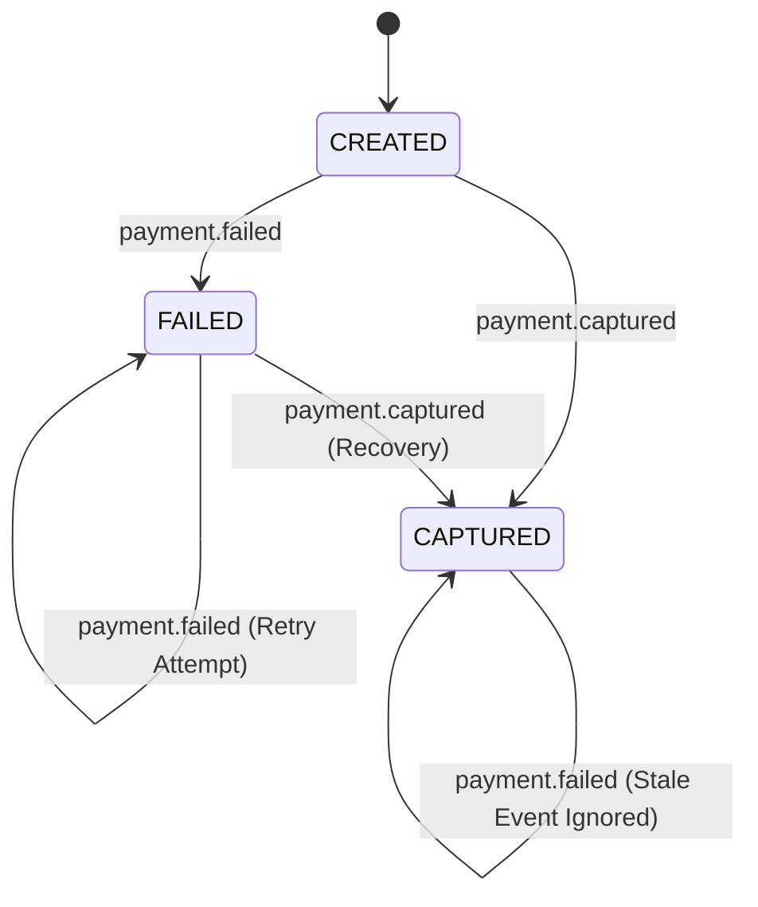
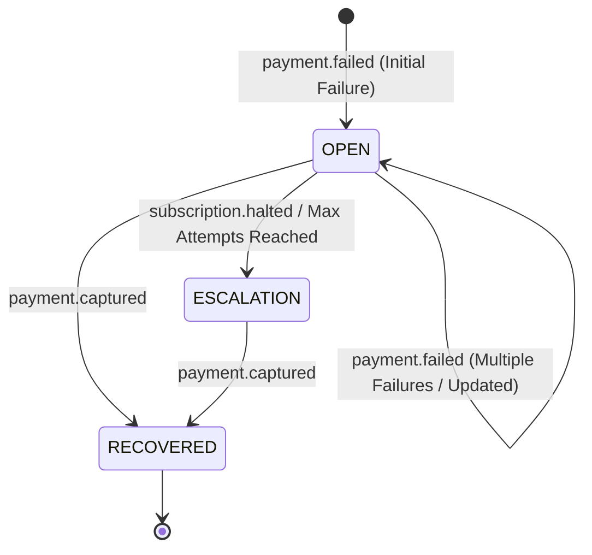

# Deterministic Recovery Case Engine (Phase 4)

## 1. Purpose & Overview

The **Recovery Case Engine** is the deterministic core of RecoverIQ. It consumes persisted, sanitized `PaymentEvent` records from the webhook boundary and transitions the business state of `Customer`, `Payment`, `PaymentAttempt`, and `RecoveryCase` aggregates.

Crucially, Phase 4 is **100% deterministic**: it involves no ML inferences, no LLM queries, and no automated fund movements or external gateway retries. It creates and maintains an accurate, audit-compliant operational representation of all payment failures and recovery outcomes.

---

## 2. Architecture & Data Flow

```
+-------------------+
|   payment_events  |
+---------+---------+
          |
          v
+-----------------------------+
|    PaymentEventProcessor    |
| - Idempotency Check         |
| - Entity Unpacking          |
| - Route to Service Handler  |
+---------+-------------------+
          |
          v
+-----------------------------+
|     RecoveryCaseService     |
| - Customer Resolution       |
| - Payment State Evaluation  |
| - RecoveryCase Open/Resolve |
| - Stale Event Detection     |
+---------+-------------------+
          |
          v
+-----------------------------+
|          Database           |
| - payments                  |
| - payment_attempts          |
| - recovery_cases            |
| - audit_logs                |
+-----------------------------+
```

---

## 3. State Machines

### 3.1 Payment State Machine



- **Stale Event Protection**: If a `payment.failed` event arrives after a `Payment` is already `CAPTURED`, the payment state is **not** regressed to `FAILED`. A `PaymentAttempt` record is stored for gateway telemetry, and a `STALE_PAYMENT_FAILURE_IGNORED` audit log is recorded.

### 3.2 Recovery Case Operational Lifecycle



- **Active Case Deduplication**: Multiple `payment.failed` events for the same payment update the existing active case (`total_attempts_count += 1`), preventing duplicate case creation.
- **Resolution**: A `payment.captured` event resolves the active case (`status = 'RECOVERED'`, `closed_reason = 'PAYMENT_RECOVERED'`), setting `recovered_amount = min(payment.amount, case.amount_at_risk)`.

---

## 4. Event Ordering & Timestamp Protection

Due to asynchronous gateway delivery and exponential retry schedules, events can arrive out of order:

| Scenario | Arrival Order | Engine Behavior |
| :--- | :--- | :--- |
| **Normal Failure** | `payment.failed` &rarr; `payment.captured` | Opens `RecoveryCase` with `amount_at_risk`, then resolves case upon capture with `recovered_amount`. |
| **Direct Success** | `payment.captured` | Updates payment to `CAPTURED`, records `PaymentAttempt`, writes `PAYMENT_CAPTURED` audit log (no recovery case needed). |
| **Delayed Failure** | `payment.captured` &rarr; `payment.failed` (delayed) | Ignores late failure; preserves `CAPTURED` state; records attempt and emits `STALE_EVENT_IGNORED` audit log. Case is never reopened. |
| **Repeated Failures** | `payment.failed` #1 &rarr; `payment.failed` #2 &rarr; `payment.failed` #3 | Updates single active `RecoveryCase`, increments `total_attempts_count`, transitions stage to `ESCALATION` if max attempts reached. |

---

## 5. Monetary Calculation Standards

- All monetary values (`amount`, `amount_at_risk`, `recovered_amount`, `recurring_amount`) are strictly stored as **64-bit integer minor currency units** (e.g. INR paise: ₹499.00 = `49900`).
- **Defensive Constraints**:
  - `amount_at_risk >= 0`
  - `recovered_amount >= 0`
  - `recovered_amount <= amount_at_risk`

---

## 6. Audit Logging & Actor Model

Every state transition writes an immutable `AuditLog` entry:

- **Actor Type**: `AuditActorType.SYSTEM_EVENT.value` (`"SYSTEM_EVENT"`).
- **Actor ID**: `"event_processor"`.
- **Logged Events**:
  - `RECOVERY_CASE_OPENED`: When a new failure opens a recovery case.
  - `RECOVERY_CASE_UPDATED`: When subsequent failures update an active case.
  - `RECOVERY_CASE_RECOVERED`: When payment capture resolves a case.
  - `PAYMENT_CAPTURED`: When direct payments are captured.
  - `STALE_PAYMENT_FAILURE_IGNORED`: When an out-of-order failure arrives for a captured payment.
  - `SUBSCRIPTION_HALTED`: When subscription halting escalates recovery.
  - `NON_RECOVERY_EVENT_IGNORED`: When non-recovery webhook types are received.

---

## 7. Concurrency & Transactional Boundaries

1. **Transactional Atomicity**: Processing a `PaymentEvent` (updating payment, recording attempts, mutating recovery cases, and logging audits) runs within a single atomic database transaction.
2. **Idempotency Guard**:
   - `PaymentEvent.processing_status` transitions: `RECEIVED` &rarr; `PROCESSED`.
   - Re-running `process_payment_event()` on an already `PROCESSED` event is an immediate no-op.
3. **Failure Isolation**: If any error occurs during processing, the business transaction rolls back, and `PaymentEvent.processing_status` is updated to `FAILED` with the exception trace in `processing_error`.

---

## 8. Future Worker & Queue Integration

In Phase 4, `PaymentEventService.dispatch_event()` directly invokes `PaymentEventProcessor.process_payment_event()`.

In future phases:
- `dispatch_event()` will enqueue the `payment_event_id` to an async worker queue (Celery/Redis/ARQ).
- Worker processes will invoke `payment_event_processor.process_payment_event()`.
- Stranded events remaining in `RECEIVED` status will be processed via an automatic polling/reconciliation job.
