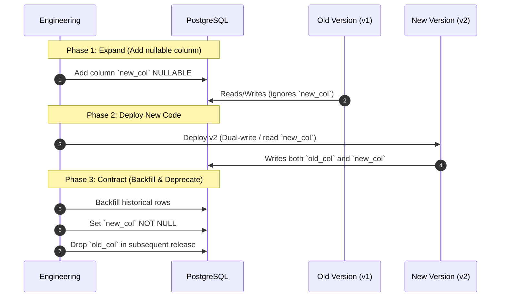

# RecoverIQ Phase 10G: API & Database Contract Compatibility

## 1. Zero-Breaking Changes Invariant

In fintech architectures, breaking API changes or disruptive database migrations risk client downtime, dropped webhooks, or failed reconciliation batches. RecoverIQ mandates:
- **100% Backward Compatibility:** No field removals, renames, or required field additions on existing public or internal endpoints.
- **Zero-Migration Release Operations:** Releases must deploy without requiring destructive DDL alterations. Database migrations must follow the Expand/Contract (Parallel Run) pattern.

---

## 2. API Contract Compatibility Verification

Every release candidate OpenAPI specification is compared against the production baseline:

### Permitted Modifications (Non-Breaking):
- Adding new optional fields to request bodies.
- Adding new fields to response bodies.
- Adding entirely new endpoint paths.
- Adding optional query parameters.
- Relaxing input constraints (e.g., expanding valid string lengths).

### Forbidden Modifications (Breaking):
- Removing or renaming any existing request or response field.
- Changing field data types (e.g., `string` $\rightarrow$ `integer`).
- Adding new required fields to request payloads.
- Altering HTTP response status codes for existing contracts.
- Modifying authentication or authorization requirements on active routes.

---

## 3. Database Compatibility & Expand-Contract Pattern

Database alterations must be structured into independent, backward-compatible phases:

---

## 4. Automated Contract Verification

The Release Governance Control Plane automatically runs contract compatibility checks on release candidate build artifacts:
- Compares OpenAPI v3 JSON diffs.
- Verifies database schema reflection against active SQLAlchemy models.
- Generates `ApiCompatibilityReport` and `DatabaseCompatibilityReport` artifacts.
