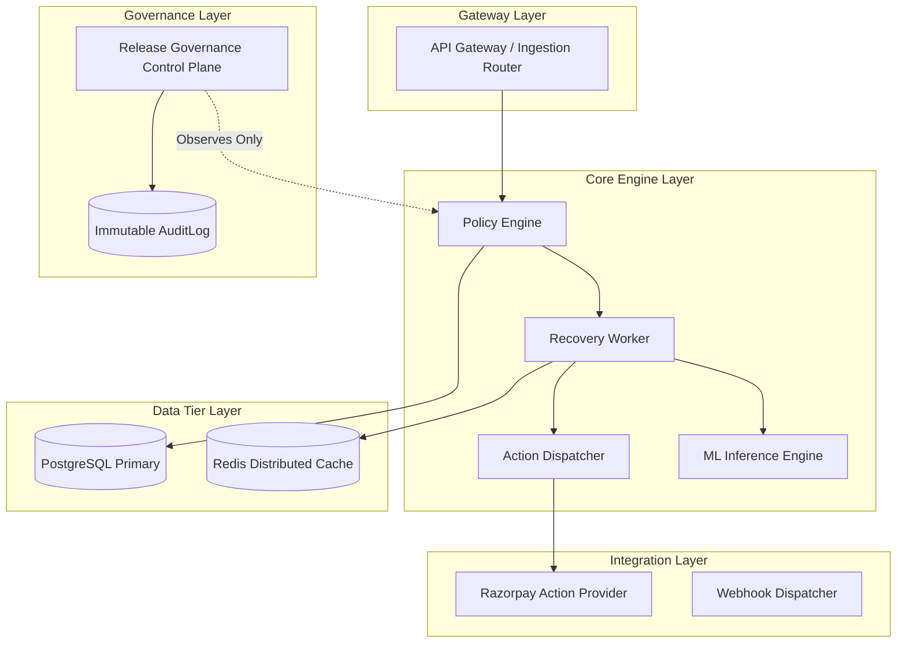

# RecoverIQ Phase 10G: Architecture Governance & Dependency Safety

## 1. Architectural Boundaries & Layering

RecoverIQ maintains strict architectural boundaries to guarantee payment safety, sub-millisecond dispatch performance, and audit immutability.

---

## 2. 11 Core Service Dependency Map

RecoverIQ tracks dependencies across 11 core services:
1. **API Gateway:** Ingestion entry point for payment events and webhooks.
2. **Policy Engine:** Authoritative, immutable decision engine governing all recovery operations.
3. **Recovery Worker:** Distributed task processor executing asynchronous recovery workflows.
4. **Action Dispatcher:** Secure router delivering recovery actions to third-party providers.
5. **Razorpay Action Provider:** External payment gateway connector.
6. **Webhook Dispatcher:** Webhook consumer and broadcaster.
7. **ML Inference Engine:** Real-time propensity and timing prediction model server.
8. **PostgreSQL Primary:** Authoritative relational store with ACID guarantees.
9. **Redis Cache:** High-throughput caching and distributed lock manager.
10. **Audit Engine:** Write-only immutable event log store.
11. **Release Governance Engine:** Observational control plane evaluating release readiness.

---

## 3. Dependency Impact & Blast Radius Analysis

For every proposed modification, the system evaluates:
- **Direct Dependencies:** Services directly called by the modified service.
- **Transitive Blast Radius:** Cumulative downstream services affected by potential latency or failure.
- **Single Point of Failure (SPOF):** Whether the modified component possesses no redundant standby or circuit breaker fallback.
- **Cyclic Dependency Detection:** Strict verification that the dependency graph remains a Directed Acyclic Graph (DAG) with 0 cycles.

---

## 4. Architecture Anti-Patterns & Automated Linting

Automated architectural evaluation flags violations in:
- **Layer Bypassing:** E.g., API Gateway directly calling Razorpay without passing through PolicyEngine and ActionDispatcher (Severity: `CRITICAL`).
- **Unbounded Fanout:** A single service synchronously dispatching to $> 5$ downstream services (Severity: `HIGH`).
- **Synchronous External Blocking:** Blocking synchronous recovery worker threads on third-party webhook acknowledgments (Severity: `HIGH`).
- **Unindexed Foreign Key Cross-Join:** Complex queries bypassing the Redis cache layer (Severity: `MEDIUM`).
