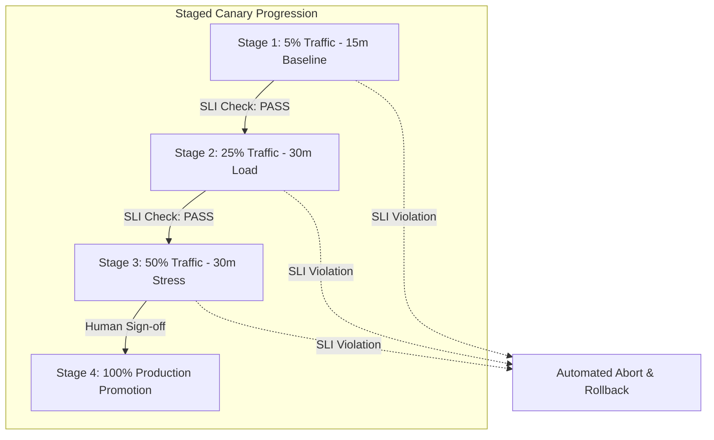

# RecoverIQ Phase 10G: Canary Releases & Safe Progression Intelligence

## 1. Canary Deployment Methodology

RecoverIQ utilizes progressive canary deployments to validate software changes against real-world traffic while minimizing customer blast radius.

---

## 2. Canary Service Level Indicators (SLIs)

The Canary Evaluation Engine continuously tracks telemetry between the **Baseline** (stable production cluster) and the **Canary** (candidate cluster):

| Metric | Baseline Target | Canary Threshold | Action on Breach |
|---|---|---|---|
| **$p95$ Latency** | $\le 120\text{ms}$ | $\le 1.15\times$ Baseline | Hold & Alert |
| **$p99$ Latency** | $\le 350\text{ms}$ | $\le 1.20\times$ Baseline | Hold & Alert |
| **Error Rate** | $< 0.05\%$ | $< 0.10\%$ | Immediate Abort |
| **5xx Server Errors** | 0 per 10k req | $\le 1$ per 10k req | Immediate Abort |
| **Payment Provider Timeout** | $< 0.01\%$ | $< 0.02\%$ | Immediate Abort |
| **Financial Mutation Anomaly** | 0.00% | 0.00% (Strict 0) | Emergency Kill Switch |

---

## 3. Automated Decision Engine

The Canary Intelligence Engine outputs one of four deterministic decisions:
1. **`GO`:** All SLIs healthy; latency and error rates within baseline tolerances. Eligible for progression.
2. **`CONDITIONAL_GO`:** Minor latency fluctuation within non-critical path; requires lead engineer confirmation before progression.
3. **`PENDING_REVIEW`:** Canary stage duration incomplete or sample size under statistical significance threshold ($N < 5,000$ requests).
4. **`NO_GO`:** SLI breach, error rate spike, or financial anomaly detected. Halts progression and triggers instant rollback.
