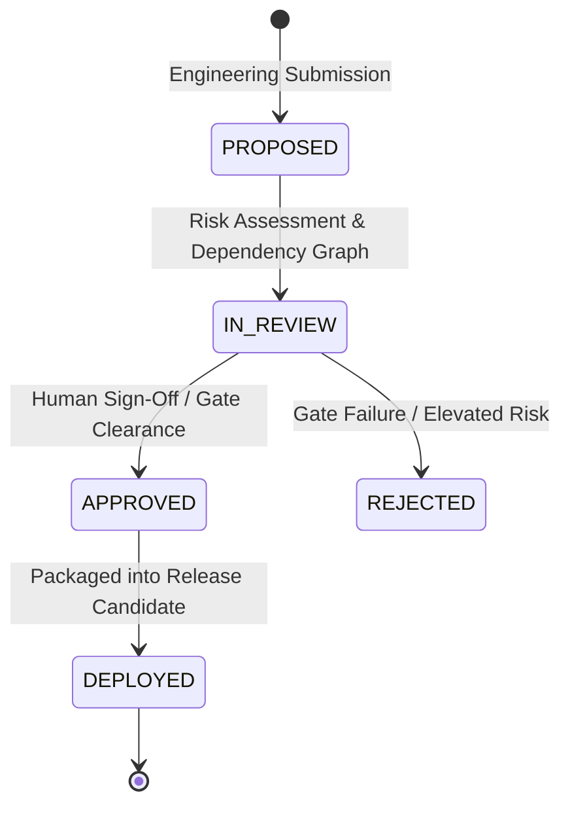

# RecoverIQ Phase 10G: Fintech Change Management Protocol

## 1. Objective & Scope

The RecoverIQ Change Management Protocol governs all modifications to the RecoverIQ codebase, infrastructure, machine learning models, database definitions, and runtime configurations.

Its primary mandate is to enforce **Zero-Uncontrolled-Mutations** in critical fintech and payment recovery operations.

---

## 2. Change Request Lifecycle

### Change Classifications:
1. **FEATURE:** New business capability or UI workflow enhancement.
2. **BUGFIX:** Corrective resolution for non-critical defect.
3. **SECURITY:** Vulnerability mitigation or dependency patch.
4. **DATABASE:** Schema, index, or query plan adjustment (strictly zero-breaking).
5. **API:** Contract enhancement (strictly backward compatible).
6. **CONFIGURATION:** Environment variable or tuning parameter change.
7. **DEPENDENCY:** Upstream library or SDK upgrade.
8. **ML_MODEL:** Inference model weights, hyperparameters, or training dataset update.
9. **HOTFIX:** Expedited emergency fix subject to retroactive audit sign-off.

---

## 3. Financial Path Proximity & Risk Multiplier

Any change request touching services on the financial execution path:
- `API Gateway` (Payment/Webhook Ingestion)
- `Policy Engine`
- `Recovery Worker`
- `Action Dispatcher`
- `Razorpay Action Provider`

is subject to a mandatory **$2.0\times$ Financial Risk Multiplier**:

$$\text{Final Risk Score} = \min(100, \text{Base Risk Score} \times 2.0)$$

Changes with $\text{Risk Score} \ge 60$ or affecting the financial path automatically require:
- Explicit rollback validation script.
- Dual human sign-off (Principal Engineer + Compliance/Security Officer).
- Staged canary deployment of $\le 10\%$ traffic for $\ge 30$ minutes.

---

## 4. Mandatory Change Submission Fields

All change proposals must provide:
- `title` (Human-readable change description)
- `change_type` (`FEATURE`, `BUGFIX`, `CONFIGURATION`, `ML_MODEL`, `DATABASE`, `SECURITY`)
- `affected_services` (List of targeted microservices/components)
- `is_financial_path` (Boolean indicating proximity to transactional flow)
- `requires_downtime` (Boolean indicating maintenance window necessity)
- `rollback_procedure` (Mandatory, actionable, step-by-step reversal plan)
- `description` (Architectural rationale and scope boundaries)

---

## 5. AuditLog Event Sourcing

Every change request submission and state transition generates an immutable `AuditLog` record:
- `entity_type`: `"change_request"`
- `event_type`: `"CHANGE_REQUEST_CREATED"` / `"CHANGE_REQUEST_UPDATED"`
- `actor_type`: `"USER"`
- `actor_id`: Initiator UUID
- `new_state`: Full JSON snapshot of the change request and its evaluated risk assessment
- `metadata_json`: `{"change_id": "CR-...", "risk_score": ..., "financial_path": ...}`
