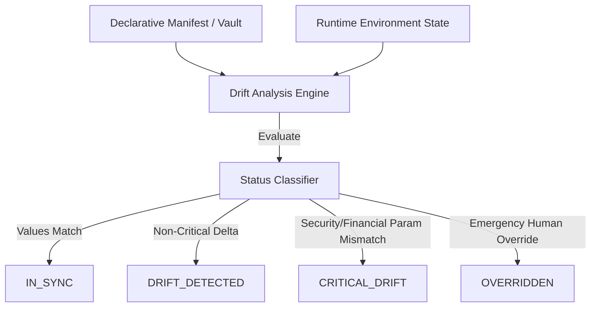

# RecoverIQ Phase 10G: Configuration Governance & Drift Detection

## 1. Objective & Scope

Configuration drift and uncontrolled environment divergence are leading causes of production outages and security vulnerabilities.

The RecoverIQ Configuration Governance Engine ensures that runtime configurations across all environments (`DEVELOPMENT`, `STAGING`, `PRODUCTION`) remain strictly synchronized with authoritative declarative manifests while guaranteeing zero secret leakage.

---

## 2. Configuration Drift Detection Engine

The Configuration Drift Engine continuously validates environment variables, feature flags, and infrastructure parameters:

### Classification Hierarchy:
- **`IN_SYNC`:** Runtime state perfectly matches declared specification.
- **`DRIFT_DETECTED`:** Minor non-critical parameter deviation (e.g., logging verbosity, minor cache TTL).
- **`CRITICAL_DRIFT`:** Discrepancy in security credentials, token lifetimes, database pool sizing, or financial risk limits. Immediately triggers `GATE-REL-13` failure.
- **`OVERRIDDEN`:** Temporary authorized emergency override with active incident tracking.

---

## 3. Mandatory Secret Masking & PII Redaction

Any configuration telemetry transmitted to the UI or stored in `AuditLog` must undergo strict sanitization:
- **Secret Redaction:** Values belonging to keys containing `SECRET`, `PASSWORD`, `KEY`, `TOKEN`, `CREDENTIAL`, or `PRIVATE` are masked as `••••••••[MASKED]••••••••`.
- **Zero-PAN Exposure:** Payment card numbers, CVVs, and customer identity fields are never stored in configuration namespaces.

---

## 4. Feature Flag Governance & Lifecycle

Feature flags enable dynamic rollout control without requiring code re-deployments:

### Lifecycle States:
1. **`CREATED`:** Flag defined in codebase, initial rollout set to 0%.
2. **`ROLLOUT`:** Progressive percentage rollout ($5\% \rightarrow 25\% \rightarrow 50\% \rightarrow 100\%$).
3. **`ACTIVE`:** 100% enabled for all traffic.
4. **`PAUSED`:** Traffic halted at 0% pending investigation.
5. **`ROLLED_BACK`:** Reverted to legacy execution path.
6. **`RETIRED`:** Cleaned up from codebase after full permanent adoption.
