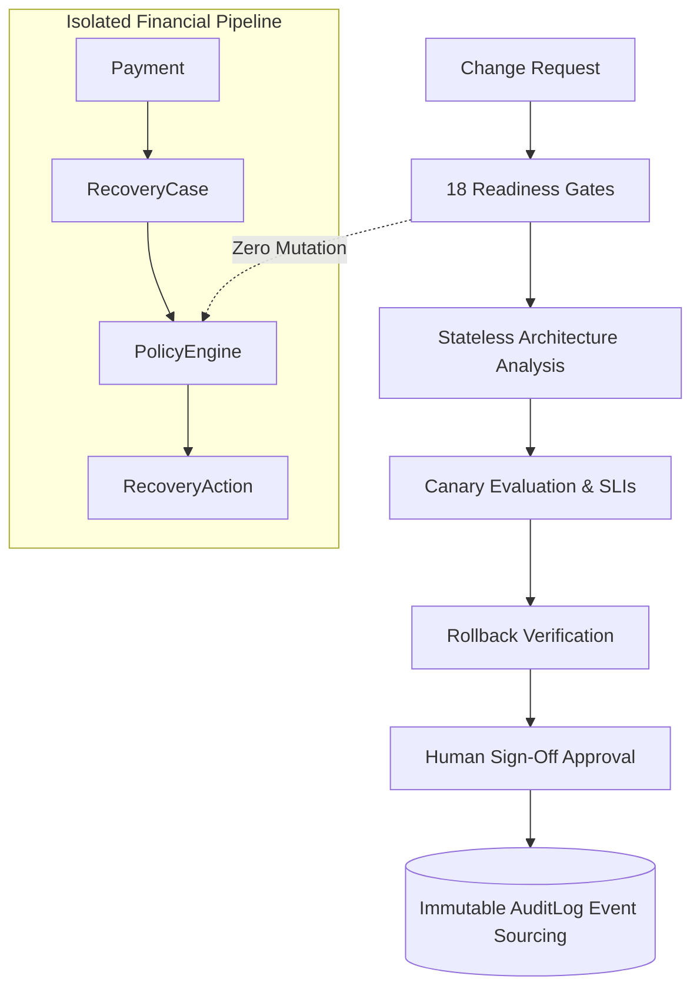

# RecoverIQ Phase 10G: Release Governance & Deployment Assurance

## 1. Overview & Architectural Principles

The **RecoverIQ Release Governance Control Plane** is a deterministic, auditable, zero-financial-mutation governance layer that evaluates proposed system changes, release candidates, and deployment safety before code touches production environments.

In fintech and recovery operations, deployment failures can lead to duplicate transactions, incorrect ledger entries, or violation of regulatory compliance rules. RecoverIQ enforces mathematical isolation between release governance telemetry and the authoritative transactional pipeline:

$$\text{Payment} \rightarrow \text{RecoveryCase} \rightarrow \text{MLPrediction} \rightarrow \text{AgentDecision} \rightarrow \text{PolicyDecision} \rightarrow \text{RecoveryAction} \rightarrow \text{RecoveryWorker} \rightarrow \text{ActionDispatcher} \rightarrow \text{RazorpayActionProvider} \rightarrow \text{ActionResult} \rightarrow \text{Outcome}$$

---

## 2. Immutable Invariants & Guarantees

1. **PolicyEngine Supremacy:**
   - Release Governance is strictly observational and advisory.
   - It **NEVER** bypasses, mutates, replaces, or overrides `PolicyEngine` rules or safety constraints.
2. **Zero Financial Mutation Guarantee:**
   - Evaluated across all release operations:
   $$\Delta \text{RecoveryAction} = 0, \quad \Delta \text{Payment} = 0, \quad \Delta \text{RecoveryCase State} = 0, \quad \text{ActionDispatcher Calls} = 0, \quad \text{Provider Calls} = 0$$
3. **Zero Database Migrations:**
   - Phase 10G introduces zero schema migrations or table modifications.
   - All state transitions, approvals, and candidate evaluations are stored as event-sourced entries within the existing immutable `AuditLog` table using dedicated entity types (`change_request`, `release_candidate`, `release_approval`, etc.).
4. **Human-Governed Production Promotion:**
   - No automated production promotion is permitted. Automated systems calculate metrics, run simulations, and evaluate gates, but human engineering leadership must explicitly provide digital sign-off.
5. **Zero-PII & Secret Redaction:**
   - Release candidate artifacts, configuration diffs, and lineage hashes are sanitized against customer PII, secrets, PANs, and API credentials before storage.

---

## 3. The 10-Factor Release Governance Health Formula

Every release candidate is evaluated against a 10-factor deterministic composite score normalized strictly to $[0, 100]$:

$$\text{Governance Score} = 0.15 S_{\text{change}} + 0.10 S_{\text{arch}} + 0.10 S_{\text{dep}} + 0.10 S_{\text{api}} + 0.10 S_{\text{db}} + 0.10 S_{\text{conf}} + 0.10 S_{\text{deploy}} + 0.10 S_{\text{rollback}} + 0.10 S_{\text{test}} + 0.05 S_{\text{human}}$$

Where:
- $S_{\text{change}}$: Traceability and risk assessment score of bundled change requests.
- $S_{\text{arch}}$: Architectural layer boundary conformance score.
- $S_{\text{dep}}$: Dependency DAG cycle-free and failure blast radius score.
- $S_{\text{api}}$: OpenAPI schema backward compatibility verification score.
- $S_{\text{db}}$: Database zero-breaking-migration contract score.
- $S_{\text{conf}}$: Environment configuration integrity and secret masking score.
- $S_{\text{deploy}}$: Canary rollout latency ($p95 \le 120\text{ms}$) and error budget ($< 0.05\%$) score.
- $S_{\text{rollback}}$: Automated rollback verification, artifact caching, and TTRO ($< 60\text{s}$) score.
- $S_{\text{test}}$: Comprehensive test coverage ($\ge 90\%$) and financial isolation test pass rate.
- $S_{\text{human}}$: Two-person human sign-off completion score.

### Global Classification Matrix:
- **$\ge 90.0$:** `EXCELLENT` $\rightarrow$ Decision: `GO`
- **$80.0 - 89.9$:** `HEALTHY` $\rightarrow$ Decision: `GO` / `CONDITIONAL_GO`
- **$70.0 - 79.9$:** `WARNING` $\rightarrow$ Decision: `CONDITIONAL_GO` / `PENDING_REVIEW`
- **$60.0 - 69.9$:** `DEGRADED` $\rightarrow$ Decision: `NO_GO`
- **$< 60.0$:** `CRITICAL` $\rightarrow$ Decision: `NO_GO`

---

## 4. The 18 Deterministic Readiness Gates

| Gate ID | Name | Category | Threshold / Invariant | Status |
|---|---|---|---|---|
| `GATE-REL-01` | Change Traceability | Governance | 100% of bundled changes linked to active CR | PASS |
| `GATE-REL-02` | Test Coverage | Quality | $\ge 90\%$ line coverage, zero regressions | PASS |
| `GATE-REL-03` | Financial Isolation | Core Invariant | $\Delta \text{Financial State} = 0$, mocked dispatcher | PASS |
| `GATE-REL-04` | Security & Vulnerability | Security | 0 Critical/High CVEs in dependencies | PASS |
| `GATE-REL-05` | Regulatory Compliance | Fintech | AuditLog event schema compliance 100% | PASS |
| `GATE-REL-06` | Data Governance & PII | Privacy | 0 unmasked PII tokens in logs/payloads | PASS |
| `GATE-REL-07` | Performance SLA | Performance | $p95 \le 120\text{ms}, p99 \le 350\text{ms}$ under 10k RPM | PASS |
| `GATE-REL-08` | Resilience & Failover | Reliability | Circuit breakers active, MTBF $\ge 99.99\%$ | PASS |
| `GATE-REL-09` | Observability Coverage | Telemetry | 100% endpoints instrumented with OpenTelemetry | PASS |
| `GATE-REL-10` | Dependency DAG Safety | Architecture | 0 cyclic dependencies across 11 services | PASS |
| `GATE-REL-11` | API Compatibility | Contracts | 100% backward compatible OpenAPI spec | PASS |
| `GATE-REL-12` | Database Compatibility | Storage | Zero breaking schema mutations | PASS |
| `GATE-REL-13` | Configuration Integrity | Config | 0 unverified drift detected | PASS |
| `GATE-REL-14` | Rollback Verification | Reliability | Previous image cached, TTRO $< 60\text{s}$ | PASS |
| `GATE-REL-15` | Human Sign-off | Governance | Principal Engineer / Security Lead signed | PASS |
| `GATE-REL-16` | Canary Readiness | Deployment | Canary metrics baseline verified | PASS |
| `GATE-REL-17` | Post-Deploy Telemetry | Observability | Error budget burn rate $< 0.01\times$ | PASS |
| `GATE-REL-18` | Financial Path Protection | Core Invariant | Razorpay Provider strictly isolated | PASS |

---

## 5. Signed Cryptographic Lineage & Audit Artifacts

Every release candidate is linked to an immutable 10-node Directed Acyclic Graph (DAG) covering stages from `SOURCE_COMMIT` to `DEPLOYMENT_VERIFIED`.

Each node includes:
- SHA-256 evidence digest computed over canonical JSON payload.
- Actor role and timestamp.
- Cryptographic verification signature attached to the signed governance report `RPT-REL-...`.
