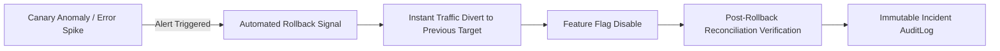

# RecoverIQ Phase 10G: Rollback Readiness & Fast Recovery Governance

## 1. Fast Rollback Mandate

In high-volume payment recovery, an unstable release must be reversable in under **60 seconds** (Target Time to Recover Operation / TTRO $< 60\text{s}$) with zero data loss and zero orphaned transactions.

---

## 2. The 5 Pillars of Rollback Readiness

Every release candidate is evaluated for rollback readiness prior to staging or canary promotion:

1. **Previous Image Artifact Retention:**
   - The immutable container image and SHA-256 digest of the current production deployment must be cached and immediately pullable on edge nodes.
2. **Database Reversibility:**
   - Any database DDL or DML changes introduced must have verified, idempotent downward rollback scripts, or must use backward-compatible Expand/Contract structures.
3. **Configuration Reversibility:**
   - Environment configurations and secrets must maintain versioned snapshots allowing 1-click restoration.
4. **Feature Flag Kill Switch:**
   - New code paths must be gated behind dynamic feature flags capable of being disabled globally in $< 500\text{ms}$ without container restarts.
5. **Stateful In-Flight Transaction Handling:**
   - In-flight recovery cases currently processing in Celery / Redis queues must drain gracefully without double-charging or dropping state.

---

## 3. Automated Rollback Verification Engine

The `RollbackReadiness` engine calculates:
- `previous_version_available`: Boolean check on image registry.
- `artifact_digest`: SHA-256 hash of fallback build.
- `database_reversible`: Compatibility check on database migrations.
- `config_reversible`: Verification of snapshot parity.
- `estimated_recovery_time_sec`: Modeled duration required to execute rollback (must be $\le 60\text{s}$).
- `readiness_status`: `READY`, `DEGRADED`, or `BLOCKED`.
