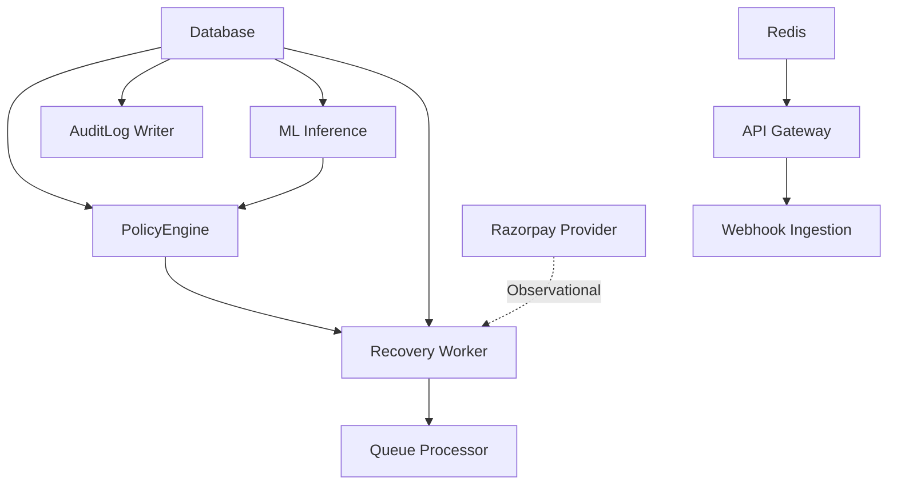

# Disaster Recovery (DR) & Blast Radius Simulation Specification
**RecoverIQ — Phase 10C Specification**

---

## 1. Overview & Objectives

The **Disaster Recovery (DR)** subsystem provides deterministic, pre-flight readiness evaluation across 15 critical gates, non-destructive observational simulation of 11 disaster scenarios, and automated graph-based blast radius calculation.

### Key Guarantees
1. **Zero Financial Mutation:** Disaster simulations evaluate mathematical blast radius models and return observational recommendations. They never dispatch recovery actions or mutate balances.
2. **Deterministic Evaluation:** Identical system telemetry produces identical readiness scores and simulation reports.
3. **Automated Audit Logging:** Every simulation execution is logged as an immutable audit event (`SIMULATION_EXECUTED`) containing parameter snapshots.

---

## 2. The 15 Disaster Recovery Readiness Gates

RecoverIQ continuously evaluates 15 pre-flight gates before declaring the platform disaster-recovery ready:

| Gate Code | Gate Name | Observed Value Metric | Pass Threshold | Remediation / Impact |
| :--- | :--- | :--- | :--- | :--- |
| `DATABASE_RECOVERY_READY` | Database Recovery Readiness | `DB_REACHABLE` / `DB_ERROR` | Database reachable | Restore from snapshot |
| `BACKUP_INTEGRITY_READY` | Backup Artifact Integrity | SHA-256 Checksum | Valid 64-char Hash | Re-run backup pipeline |
| `BACKUP_FRESHNESS_READY` | Backup Artifact Freshness | Backup age in seconds | Age < 24 Hours | Trigger snapshot backup |
| `RESTORE_VALIDATION_READY` | Backup Restore Test | `VERIFIED` / `UNVERIFIED` | Periodic restore test | Execute non-prod restore |
| `RTO_COMPLIANCE` | Recovery Time Objective | Observed RTO seconds | $\le 300\text{s}$ SLA | Optimize failover runbooks |
| `RPO_COMPLIANCE` | Recovery Point Objective | Observed RPO seconds | $\le 60\text{s}$ SLA | Enable WAL replication |
| `RECOVERY_WORKER_READY` | Worker Process Health | Pending action queue depth | Queue Backlog < 100 | Scale worker replicas |
| `POLICYENGINE_GATE_READY` | Policy Engine Gatekeeper | Policy decision latency | Latency < 50ms | Scale policy evaluators |
| `ML_FAILOVER_READY` | ML Inference Fallback | Model fallback availability | Deterministic Fallback Active | Verify fallback rules |
| `WEBHOOK_INGESTION_READY` | Webhook Capture Buffer | Webhook ingestion health | 100% Ingestion OK | Enable queue buffering |
| `API_GATEWAY_READY` | API Gateway Rate Limiting | Rate limiter status | Rate limiter ACTIVE | Verify sliding-window filters |
| `REDIS_CACHE_READY` | Redis Cache Sentinel | Cache ping status | Redis Reachable | Failover to replica node |
| `AUDITLOG_CONTINUITY_READY`| AuditLog Event Stream | Stream continuity count | Audit Stream unbroken | Re-establish write buffer |
| `RUNBOOK_COVERAGE_READY` | Recovery Runbook Coverage | Available runbooks count | 9 / 9 Runbooks Available | Load standard runbook set |
| `HUMAN_ESCALATION_READY` | Human Escalation Pathway | RBAC configuration | Admin Escalation Active | Verify Admin user roles |

---

## 3. Disaster Simulation Engine (11 Scenarios)

The simulation engine models 11 distinct operational failures:

### 1. `DATABASE_OUTAGE`
- **Blast Radius:** 90.9% (Database, Worker, PolicyEngine, AuditLog, API Gateway).
- **Estimated RTO:** 120 seconds | **Estimated RPO:** 30 seconds.
- **Recovery Procedure:** Activate replica database, promote read-replica to primary, reconnect SQLAlchemy pool, verify read/write connectivity.

### 2. `REDIS_OUTAGE`
- **Blast Radius:** 36.4% (Redis, API Gateway rate-limiter, session caching).
- **Estimated RTO:** 45 seconds | **Estimated RPO:** 0 seconds.
- **Recovery Procedure:** Fall back to in-memory sliding-window limiter, restart Redis sentinel, clear stale keys.

### 3. `WORKER_FAILURE`
- **Blast Radius:** 27.3% (Recovery Worker, Queue Processor).
- **Estimated RTO:** 60 seconds | **Estimated RPO:** 0 seconds.
- **Recovery Procedure:** Re-spawn worker processes, reconcile pending `RecoveryAction` records, verify idempotency keys.

### 4. `QUEUE_BACKLOG`
- **Blast Radius:** 27.3% (Recovery Worker, Queue Processor).
- **Estimated RTO:** 90 seconds | **Estimated RPO:** 0 seconds.
- **Recovery Procedure:** Scale worker concurrency, prioritize high-value recovery cases, drain low-priority retry attempts.

### 5. `WEBHOOK_OUTAGE`
- **Blast Radius:** 18.2% (Webhook Ingestion, API Gateway).
- **Estimated RTO:** 30 seconds | **Estimated RPO:** 10 seconds.
- **Recovery Procedure:** Switch to webhook replay buffer, verify HMAC signatures, reconcile missed Razorpay payment events.

### 6. `ML_SERVICE_DEGRADATION`
- **Blast Radius:** 18.2% (ML Inference, PolicyEngine input).
- **Estimated RTO:** 15 seconds | **Estimated RPO:** 0 seconds.
- **Recovery Procedure:** Enable deterministic rule fallback, route scoring to champion heuristic policy, isolate challenger model.

### 7. `POLICYENGINE_DEGRADATION`
- **Blast Radius:** 36.4% (PolicyEngine, Recovery Worker, Case Evaluation).
- **Estimated RTO:** 30 seconds | **Estimated RPO:** 0 seconds.
- **Recovery Procedure:** Re-evaluate safety rules in strict mode, pause autonomous action dispatching, require human operator approval.

### 8. `AUDITLOG_FAILURE`
- **Blast Radius:** 27.3% (AuditLog Writer, Compliance Reporting, Resilience Telemetry).
- **Estimated RTO:** 45 seconds | **Estimated RPO:** 15 seconds.
- **Recovery Procedure:** Flush in-memory audit buffer to disk backup, restore database log write stream, verify event sequence continuity.

### 9. `PAYMENT_PROVIDER_UNAVAILABLE`
- **Blast Radius:** 18.2% (Payment Provider Observational Probe, Worker Dispatch).
- **Estimated RTO:** 60 seconds | **Estimated RPO:** 0 seconds.
- **Recovery Procedure:** Pause external dispatch, queue recovery actions with exponential backoff, monitor provider status page.

### 10. `REGIONAL_OUTAGE`
- **Blast Radius:** 100.0% (All 11 dependencies).
- **Estimated RTO:** 300 seconds | **Estimated RPO:** 60 seconds.
- **Recovery Procedure:** Route DNS traffic to secondary region, restore latest backup snapshot, verify end-to-end telemetry.

### 11. `CASCADING_DEPENDENCY_FAILURE`
- **Blast Radius:** 81.8% (Database $\rightarrow$ Worker $\rightarrow$ Queue $\rightarrow$ PolicyEngine).
- **Estimated RTO:** 180 seconds | **Estimated RPO:** 45 seconds.
- **Recovery Procedure:** Isolate failed downstream services, enable circuit breakers, restore primary database, bring services up sequentially.

---

## 4. Blast Radius Graph Traversal

The blast radius calculation uses deterministic dependency graph traversal:

- **Critical Path Dependencies:** Database, PolicyEngine, AuditLog Writer.
- **Financial Path Dependencies:** PolicyEngine, Recovery Worker, ActionDispatcher (strictly isolated during simulations).
- **Blast Radius %:** Percentage of the 11 dependencies impacted by the direct and secondary failure cascade.
